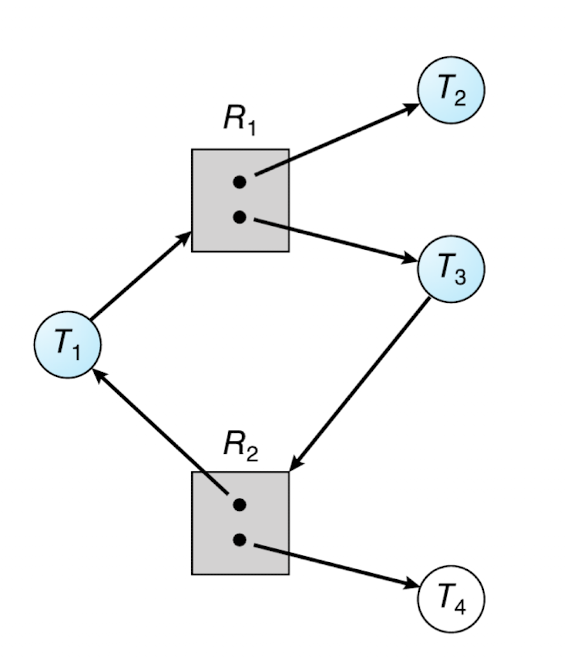
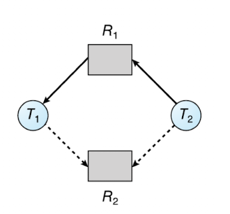

자원 할당 이론에서는 동일 기능의 자원이 몇 개 존재하는가? 즉 대체 가능한 동일 인스턴스가 몇 개 있는가가 중요한데, 이 인스턴스끼리는 완전 일치해야 한다(클래스, 즉 종류 자체가 동일)

하지만 락은 아니다. 락 여러 개가 각각 다른 것을 보호해야 하기 때문에 동일 자원이라고 볼 수 없다.

항상 자원을 [획득 → 사용 → 방출] 하는 것이 중요하다. 무조건 획득 후에는 방출을 해야한다.

## 라이브락

라이브니스 장애의 한 형태로, 교착상태와 다른 케이스.

라이브락은 실패한 작업을 동시에 재시도할 때 발생한다.

아래 두 스레드가 동시에 실행되고 각 단계가(스레드1의 1단계, 스레드2의 1단계..) 계속 동일한 시간이 소요된다면 

**thread_one**

1. first_mutex lock
2. second_mutex trylock
3. 실패하면 → first_mutex unlock 후 다시 시도

**thread_two**

1. second_mutex lock
2. first_mutex trylock
3. 실패하면 → second_mutex unlock 후 다시 시도

이런 로직에서 둘 다 실패해서 동시에 둘 다 다시 시도하게 되면 무한정 서로 재시도를 반복하게 된다. 

봉쇄는 아니지만 작업을 둘 다 끝낼 수 없음

⇒ 임의의 시간을 두고 재시도하면 해결할 수 있음

## 교착상태의 특성

1. 상호 배제: 하나 이상의 자원이 동시에 소비될 순 없는 형태(==비공유 모드)로 공유되어야 함
2. 점유하며 대기: 하나 이상의 자원을 점유한 채 다른 스레드에 의해 점유된 자원을 얻기 위해 대기해야 함
3. 비선점: 자원을 강제로 선점할 수 없어야함. 무조건 대기 후 할당
4. 순환 대기: 대기하고 있는 스레드 집합이 순환적으로 자원을 얻기 위해 대기해야함

사이클이 있어도 교착상태가 생기지 않을 수 있는데 

이 케이스에서는 같은 종류의 자원 인스턴스가 여러 개기 때문..

⇒ 락은 공유할 수 있는 자원이 아니니 교착상태가 발생할 수 있군…

### 교착 상태 처리 방법

1. 절대 시스템 내에서 교착상태가 발생하지 않는 척 하기
    1. Linux, WIndow에서 사용 → 응용프로그램 개발자가 책임져야함
2. 결코 교착상태가 발생하지 않도록 보장하기 위해 예방, 회피하는 프로토콜 사용
3. 교착상태를 허용하고 복구
    1. DB시스템

⇒ 회피나 예방을 안한다면 교착상태가 발생했는지 조사하는 알고리즘과 복구하는 알고리즘을 제공한다

### 교착 상태 예방

상호 배제, 점유하며 대기, 비선점, 순환 대기 중에 적어도 하나 이상 성립하지 않도록 보장

1. 상호 배제: 모든 자원이 공유 가능하면 상호배제를 충족하지 않음 → 락 같은거때매 안됨
2. 점유 대기
    1. 스레드가 실행하기 전에 필요한 모든 자원을 요청
    2. 스레드가 자원을 전혀 갖고 있지 않을 때만 자원을 요청하도록 허용 (자원 요청을 해야 하면 지금 가진 자원 모두 반환)
    
    ⇒ 자원 낭비, 기아 발생
    
3. 비선점: 무조건 선점 가능하게..  CPU 레지스터나 데이터베이스 트랜잭션처럼 상태가 쉽게 저장되고 복원가능한 경우에만 적용됨
4. 순환 대기: 순환적으로 대기 안함
    1. 각 스레드가 오름차순으로만 자원을 요청하게 한다 (마지막과 첫 스레드의 연결고리를 끊을 수 있음)
        1. ex) first_mutex와 second_mutex를 얻기 원하는 여러 스레드가 있다면 모두 first→second 순으로 자원을 요청하게 함 
    2. 특정 유형의 자원을 요청할 때 특정 인스턴스 이하의 인스턴스는 모두 반환되도록 한다
    

## 교착 상태 회피

---

운영체제가 각 스레드가 요청할 자원에 대한 부가적인 정보를 보고 특정 스레드를 지연시킬지, 요청 승인할지 판단하는데, 현재 유효한 자원, 각 스레드에 현재 할당된 자원들, 각 스레드 미래 요청과 방출을 고려해서 교착 상태를 회피할 수 있다.

### **안전 순서**

시스템이 안전하다는건 어떤 순서로든 스레드들이 요청하는 자원을 할당할 수 있는 상태인데

시스템이 안전하도록 실행될 스레드의 순서를 정할 수 있다면 안전 순서라고 한다.

교착상태 회피를 하기 위해서는 자원 이용률이 낮아질 수 밖에 없다. 계속 안전상태를 유지하려면 필요한 자원의 양보다 가용한 자원이 더 많아야만 하기 때문.

### **예약간선**

예약간선을 그려서 교착 상태 회피(미리 감지)를 할 수 있다.

미래에 할당받길 원하는 자원으로의 간선을 예약간선이라고 하는데

이걸 실선으로 그리고 반대 방향으로 실선을 그려봤을 때 사이클을 이루면 교착이 발생할 예정

여기서 T2가 실제로 R2를 할당받는다고 가정하면 사이클이 생기기 때문에 할당할 수 없다.

최대 n^2 차수 연산이 필요하다. (n은 스레드 수)

완전 간소화헤서 생각해보면, 사실 위 그래프에서 사이클이 생겼다고 생각해보면 어느 하나의 스레드는 다른 스레드를 기다리고 있다고 볼 수 있다. (ex. T1 → T2)

그래서 차수 연산은 n(n-1)이 되는데, 자기 자신 빼고 모두를 기다리게 되니까 하나의 프로세스는 n-1 개의 스레드를 기다려야 하고 스레드 개수가 n개니까 n * (n-1)이 나온다.

 

### 은행원 알고리즘

자원을 할당해줬을 때 나중에 모든 프로세스가 끝까지 실행될 수 있는가를 확인하는 알고리즘

**필요 자료구조**

1. **Max** → 최대 필요 자원
2. **Allocation** → 현재 가지고 있는 자원
3. **Need = Max - Allocation**
4. **Available** → 가용 자원

**순서**

1. 남은 자원 Available을 기준으로 Need ≤ Available 인 프로세스를 찾음 (당장 자원을 할당할 수 있는 프로세스)
2. 그 프로세스가 끝난다고 가정하고 그 프로세스가 가진 Allocation을 Available에 반환
3. 또 다른 프로세스에 위 과정 반복

⇒ 모든 프로세스를 다 끝낼 수 있으면 안전 상태

1. **안정성 알고리즘**
    
    지금 남은 자원으로 어떤 순서로든 모든 프로세스를 끝낼 수 있는가
    
    - STEP 1: Finish[i] = false 모든 프로세스를 안끝난 것으로 표시하고 Work=Availalble로 가용 자원을 잠깐 복사해둠
    - STEP 2: Need ≤ Available 인 프로세스를 찾고 그 프로세스가 끝났다고 가정(Finish[i] = true) Work += Allocation 를 한다
    
    → 모든 프로세스를 끝낼 수 있는지 확인
    
    Need[n][m] (* n은 스레드 개수, m은 자원 개수)
    
    각 스레드별로 모든 자원 종류의 필요 자원수를 Work와 다 비교해야 하기 때문에 n*m번
    
    STEP1→2를 모든 프로세스에 대해 진행하니까 n번
    
    ⇒ 총 n^2*m번 연산 필요
    
2. 자원 요청 알고리즘
    
    이 자원 요청을 지금 들어줘도 안전한가?
    
    - STEP 1: ****요청이 원래 필요량을 넘으면 → 오류 (Request ≤ Need)
    - STEP 2: 남은 자원보다 많이 요청하면 기다려야 함 (Request ≤ Available)
    - STEP 3: 일단 줬다고 가정하고 Available -= Request, Allocation += Request, Need -= Request
    - 이 상태로 안정성 알고리즘 돌림

## 교착 상태 탐지

- 교착 상태 발생했는지를 검사하는 알고리즘
- 교착 상태 회복 알고리즘

⇒ 실행 시간과 회복 오버헤드 비용이 든다

순서

- STEP 1: Work = Available, 쓰고있는 자원이 있다면 진행 중인 것으로 Finish[i] = false
- STEP 2: 아직 작업 중이고(Finish[i] == false) && 바로 자원 요청 승인할 수 있는(Request_i ≤ Work) 프로세스를 찾음
- STEP 3: 찾으면 할당했다고 가정하고 Work += Allocation, finish[i] = true → 다시 2로 감
- STEP 4: 못찾았는데 finish == false인게 남아있다면 교착 상태임

⇒ 교착 상태의 빈도와 교착 상태가 발생하면 몇 개의 스레드가 연루되는지에 따라 알고리즘 돌리는 빈도수가 정해진다.

⇒ 지정된 시간 간격으로 돌리는 방법, 즉시 요청이 받아들여지지 않을 때마다 돌리는 방법 등이 있다

## 교착 상태로부터의 회복

교착 상태 해결을 위해서는 사이클 중 하나의 스레드를 중지하거나, 반대로 하나의 스레드를 선점하게 하는 방식이다.

1. 하나의 스레드를 중지시킴
    1. 교착 상태 프로세스를 모두 중지 (오래 연산한 결과일 가능성이 커서 다시 계산하는데 큰 비용이 든다)
    2. 교착 상태가 제거될 때가지 제거하고 ↔ 교착 상태 탐지 알고리즘 호출하고 반복한다 (매우 큰 오버헤드)
        - 보통 중지시켰을 때 유발되는 비용이 적은 프로세스부터 중지시키지만 프로세스 우선순위와 처리 완료까지 남은 시간, 남은 필요 자원 수 등등 고려해서 골라야 한다
2. 하나의 스레드를 선점시킴
    
    중지시키는 것고 같이 선점시킬 프로세스와 자원을 고를 기준이 필요하고, 롤백을 얼마나 시킬거냐(중지 → 재실행? 전체 롤백?) 에 대한 것이 고려되어야 한다.
    
    동일 희생자가 계속 반복해서 희생하게 되지 않기 위해 한정 시간만 이 희생자가 선택된다는 것을 보장해야 한다.
    
