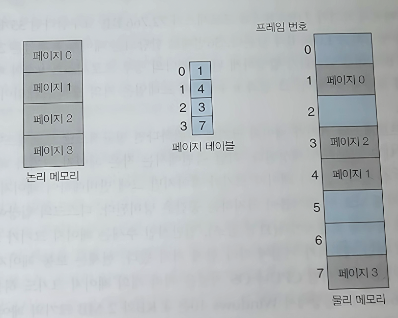
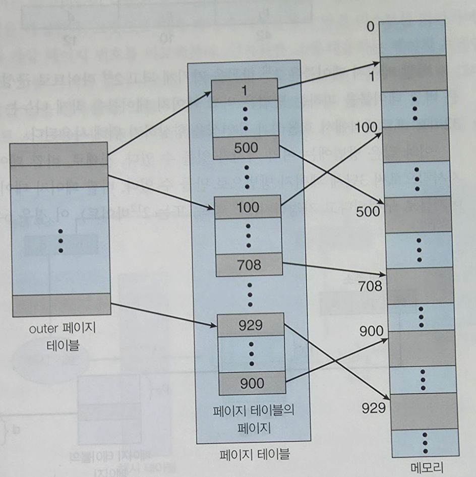
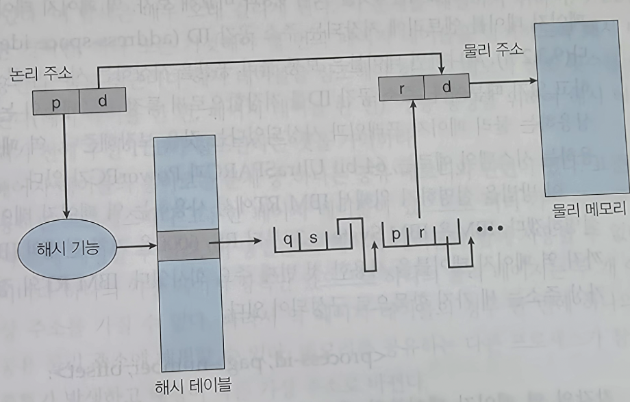
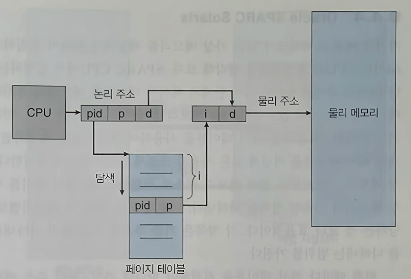

# 운영체제 스터디 11주차

# 9장: Main Memory

- CPU는 메인 메모리와 자체 레지스터에만 직접 접근할 수 있다.
- 레지스터는 1 CPU 클록 사이클 내에 접근 가능하지만, 메인 메모리는 여러 사이클이 걸리므로 그 사이에 캐시를 둔다.
- 다중 프로그래밍 환경에서는 각 프로세스가 별도의 메모리 공간을 가져야 한다.
    - 기준 레지스터와 상한 레지스터를 두어 합법적인 주소 범위를 강제한다.

### 주소 할당(Address Binding)

- 컴파일 시간 바인딩
  : 메모리 위치를 미리 알고 있을 때 절대 코드 생성한다. 시작 위치가 바뀌면 재컴파일이 필요하다.
  - 적재 시간 바인딩
  : 컴파일 시 위치를 모르면 재배치 가능 코드를 생성한다.
  - 실행 시간 바인딩
  : 프로세스가 실행 중에도 메모리 영역이 바뀔 수 있을 때 사용한다. MMU 같은 하드웨어 지원이 필요하다.

### 논리 주소 vs. 물리 주소

- 논리 주소 (가상 주소): CPU가 생성하는 주소를 논리 주소
- 물리 주소: 메모리 장치가 보는 주소
- MMU(Memory Management Unit)가 실행 시간에 두 주소를 변환한다.

### **동적** 적재

- 루틴이 실제로 호출되기 전까지 메모리에 적재하지 않아 메모리 효율을 높인다.

### 동적 연결

- 실행 시점에 라이브러리를 연결하는 방식
- 실행 파일에 작은 stub만 포함해 두었다가 호출 시 라이브러리 루틴을 찾아 실행한다.
- 공유 라이브러리(DLL)는 여러 프로세스가 같은 라이브러리 코드를 공유하므로 메모리를 절약한다.

## 9.2 연속 메모리 할당

### 메모리 보호

- 재배치 레지스터에는 프로세스의 가장 작은 물리 주소를 상한 레지스터에는 논리 주소의 최대 범위를 저장한다.
- CPU가 만드는 모든 논리 주소는 상한 레지스터 값보다 작아야 하며, 통과하면 재배치 레지스터 값과 더해 물리 주소가 된다.

### 메모리 할당

- 최초 적합
  : 처음 만나는 사용 가능한 가용 공간을 할당한다.
  - 최적 적합
  : 사용 가능한 공간 중에서 가장 작은 것을 택한다.
  - 최악 적합(Worst-fit)
  : 사용 가능한 공간 중에서 가장 큰 것을 택한다.

시뮬레이션 결과 최초 적합과 최적 적합이 최악 적합보다 속도와 공간 효율 면에서 우수하며, 최초 적합이 일반적으로 더 빠르다.

### 단편화(Fragmentation)

- 외부 단편화
  : 전체 가용 메모리는 충분하지만, 작은 공간들로 흩어져 있어 연속 할당이 불가능한 상태. 50% 규칙에 따르면, N개의 블록을 할당할 때 평균적으로 0.5N개의 블록이 단편화로 손실된다.
  - 내부 단편화
  : 할당 단위가 요청보다 약간 커서 내부에 남는 미사용 공간을 말한다.

외부 단편화 해결 방법으로 압축이 있으나 동적 재배치가 가능할 때만 사용 가능하고 비용이 크다. → 근본적으로는 비연속 할당(페이징)이 해법이다.

## 9.3 페이징(Paging)

프로세스의 물리 주소 공간이 비연속적이어도 되도록 허용하는 기법으로, 외부 단편화를 근본적으로 제거한다.

### 기본 방법

- 물리 메모리를 고정 크기의 프레임으로 나눈다.
- 논리 메모리를 같은 크기의 페이지로 나눈다.
- 페이지 테이블이 페이지 번호를 프레임 번호로 매핑한다.

페이지 크기가 2ⁿ이면 하위 n비트가 오프셋, 나머지가 페이지 번호다.

페이징은 외부 단편화는 없지만 마지막 페이지에서 내부 단편화가 발생할 수 있다.

### 하드웨어 지원 - TLB

페이지 테이블이 메모리에 있으면 모든 데이터 접근이 두 번의 메모리 접근(테이블 + 실제 데이터)을 요구해 느려진다.

→ 이를 해결하기 위해 TLB(Translation Look-aside Buffer)라는 빠른 연관 캐시에 최근 변환을 저장한다.

### 보호

- 각 페이지 테이블 항목에는 보호 비트와 유효/무효 비트가 있어 접근 권한을 제어한다.
- 재진입 코드는 여러 프로세스가 같은 프레임을 공유할 수 있어 메모리를 크게 절약한다.

## 9.4 페이지 테이블의 구조

### 계층적 페이징(Hierarchical Paging)

- 페이지 테이블을 다시 페이징하는 방식.
- 32비트 시스템은 2단계 페이지 테이블이 보통이며, 64비트는 2단계로도 부족해서 3, 4단계가 필요하지만 메모리 접근 횟수가 많아져 효율이 떨어진다.

### 해시 페이지 테이블

- 가상 페이지 번호를 해시 함수의 입력으로 사용해 해당 항목 체인을 탐색한다.
- 32비트보다 큰 주소 공간에서 흔히 쓰이며, 64비트용 변형으로 클러스터 페이지 테이블이 있다.

### 역 페이지 테이블

- 각 프로세스마다 페이지 테이블을 두는 대신 시스템 전체에 물리 프레임 하나당 항목 하나인 단일 테이블만 둔다.
- 메모리는 크게 절약되지만, 주소 변환 시 테이블 전체 검색이 필요해 느려질 수 있고(해시 테이블로 보완 가능), 공유 메모리 구현이 까다롭다.

### Oracle SPARC Solaris

- 64비트 SPARC 아키텍처 위에서 동작하는 Solaris는 해시 기반 역 페이지 테이블을 사용해 거대한 가상 주소 공간을 효율적으로 관리한다.

- 해시 페이지 테이블은 프로세스마다 하나씩 존재하며, 각 항목은 가상 주소와 프로세스 ID를 해시한 결과로 인덱싱되어 해당 가상 페이지의 매핑 정보를 담는다.
- TSB(Translation Storage Buffer는 최근에 접근된 페이지 테이블 항목들을 모아 둔 소프트웨어 캐시로 TLB와 전체 해시 페이지 테이블 사이의 중간 계층 역할을 한다.

<주소 변환 과정>

1. CPU가 TLB를 먼저 조회 → 적중하면 즉시 변환 완료
2. TLB 미스 발생 → 커널이 트랩을 받아 TSB를 검색
3. TSB에 있으면 해당 항목을 TLB에 적재 후 변환 완료
4. TSB에도 없으면 전체 해시 페이지 테이블을 검색해 항목을 찾고, 이를 TSB와 TLB에 채움

TLB → TSB → 해시 페이지 테이블의 3단계 구조를 두는 이유는 64비트 환경에서 페이지 테이블 전체를 매번 검색하면 비용이 너무 크기 때문에 자주 쓰이는 변환은 TSB라는 빠른 캐시에 머무르게 해 평균 변환 시간을 크게 줄인다.

## 9.5 스와핑(Swapping)

- 프로세스를 일시적으로 메인 메모리에서 백업 저장장치로 내보냈다가 다시 가져오는 기법
- 실제 물리 메모리보다 많은 프로세스의 동시 실행을 가능하게 한다.

- 전통적인 표준 스와핑은 프로세스 전체를 옮기지만, 현대 시스템에서는 비용이 너무 커서 거의 사용하지 않고 페이지 단위 스와핑을 사용한다.
- iOS·Android 같은 모바일 시스템은 플래시 메모리의 쓰기 횟수 제한과 공간 부족 때문에 일반적으로 스와핑을 지원하지 않으며, 메모리 부족 시 앱에 메모리 해제를 요청하거나 강제 종료한다.

## 9.6 사례 아키텍처

- Intel IA-32
    - 세그먼테이션과 페이징을 결합
    - 4KB 또는 4MB 페이지 지원
    - 2단계 페이징(PDE → PTE) 사용. PAE(Physical Address Extension)로 36비트 물리 주소까지 확장
- x86-64
    - 현재는 48비트만 사용
    - 4단계 페이지 테이블 계층 구조
- ARMv8
    - 모바일 환경에 최적화
    - 4KB·16KB·64KB 페이지와 2MB·512MB·1GB의 큰 페이지 지원
    - 2단계 TLB(micro TLB + main TLB) 구조
