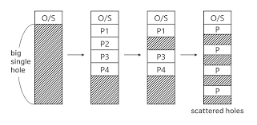

# 9장 메모리 관리 9.3.3 까지
이번 장에서는 메인메모리 관리 알고리즘에 대해 다룬다고 한다.  
메인 메모리 관리 알고리즘은 각각 장단점이 분명 존재하고 하드웨어 설계에 영향을 많이 받는다고 한다.  

### 기본 하드웨어  
🤼처음보는 용어정리!!
<details>
<summary>메모리 스톨 (Memory Stall)이란?</summary>

CPU가 메모리에 데이터를 요청했을 때, **메모리가 응답할 때까지 CPU가 아무것도 못 하고 기다리는 상태**

**발생 원인**: CPU와 메인 메모리 간의 속도 차이
- CPU 처리 속도: ~1ns
- 메인 메모리 접근: ~100ns (약 100배 느림)
- CPU는 응답을 기다리는 동안 수십~수백 사이클을 낭비

**해결책**: 캐시 메모리(Cache) 사용
- L1, L2, L3 캐시가 CPU와 메인 메모리 사이에서 자주 쓰는 데이터를 미리 저장해 스톨을 줄임

</details>

<details>
<summary>트랩 (Trap)이란?</summary>

CPU가 실행 중 특정 이벤트를 감지했을 때, **현재 작업을 멈추고 OS의 핸들러로 강제로 점프하는 것**

**종류 구분**
| 종류 | 발생 원인 | 예시 |
|---|---|---|
| 인터럽트 | 외부 하드웨어 | 키보드 입력, 타이머 |
| **트랩** | 프로그램이 의도적으로 발생 | 시스템 콜 (`read()`, `write()`) |
| 예외(Exception) | 프로그램 오류 | 0으로 나누기, 잘못된 메모리 접근 |

**흐름**
유저 프로그램 실행 → 시스템 콜 호출 → 트랩 발생 → CPU가 커널 모드로 전환 → OS 핸들러 실행 → 유저 모드로 복귀

**메모리 관리와의 연결**: 페이지 폴트(Page Fault)가 대표적인 트랩
- 프로세스가 메모리에 없는 페이지에 접근하면 트랩 발생
- OS가 해당 페이지를 디스크에서 메모리로 올려줌

</details>

<details>
<summary>헷갈리는 특권 명령 vs 시스템 콜</summary>

| | 특권 명령 | 시스템 콜 |
|---|---|---|
| 정체 | 커널 모드에서만 실행 가능한 **CPU 명령어** | OS 기능을 요청하는 **인터페이스** |
| 누가 실행 | OS(커널)만 가능 | 유저 프로그램이 호출 |
| 예시 | 메모리 보호 레지스터 설정, I/O 제어 | `read()`, `write()`, `fork()` |

**관계 요약**: 유저 프로그램은 특권 명령을 직접 실행 불가
→ 시스템 콜(트랩)로 OS에게 요청
→ OS가 커널 모드에서 특권 명령을 대신 실행

> 특권 명령 = 커널만 쓸 수 있는 도구
> 시스템 콜 = 유저가 그 도구를 빌려 쓰는 창구

</details>

</br>

이 대목의 책 내용 자체는 당연한 소리를 한다.  
cpu, 캐시, 메인메모리 관계  
메인메모리 읽어오는 상황(메모리 버스) 는 느려서 메모리 스톨이 많이 일어나고 그래서 캐시 넣고  
이런건 하드에어적인 관점이라고 설명한다.

그리고 보안적인 측면이 나오는데  
우리가 다른 프로세스의 메모리에 접근 못하는건 사실 상식처럼 당연한 이야기로 다가오는데  
그걸 어떤식으로 하는지 방식을 조금 간단하게 설명한다.

각 프로세스 별로 독립된 메모리를 가지도록 보장 하며(합볍적인 메모리 주소 영역)  
어떤 프로세스에게 제한을 줄수 있는 영역을 부여하는 기준으로 기준/상한 레지스터를 이용한다.

- 기준: 이 메모리 주소부터 이 프로세스꺼임
- 상한: 부여된 메모리 크기

그래서 기준~기준+상한 여기 주소가 프로세스가 접근할수 있는 메모리이다.
-> 만약 허가되지 않은 영역을 건드릴시 트랩일어나서 바로 저세상 보낸다.

또한 이 레지스터의 수정은 운영체제가 특권명령을 통해서만 할수있다는 정도를 설명한다.


### 주소의 할당
책에 나와있는 내용들이 들어는 봤고 감은 오는데 솔직히 생소하다.  
빡세서 claude랑 또 핑퐁을 진행했다.  


claude랑 대화해보니까 이미지는 C 기준이라 자바(JVM 기반 언어)라면 조금 달라서  
두가지 모두 정리해달라고 요청했다.

<details>
<summary>Claude의 정리 - C 기준 단계별 처리 과정 (이미지와 매칭됨)</summary>

### C 언어 파일 형식 정리

| 확장자 | 이름 | 설명 |
|---|---|---|
| `.c` | 소스 파일 | 개발자가 작성한 텍스트 코드 |
| `.h` | 헤더 파일 | 함수 선언, 구조체 정의 등 (Java의 interface 느낌) |
| `.o` | **오브젝트 파일** | 컴파일러가 `.c`를 기계어로 번역한 결과물. 아직 완성본 아님 |
| `.a` | 정적 라이브러리 | 여러 `.o`를 묶은 것. 링킹 시 실행파일 안에 통째로 포함됨 |
| `.so` | 동적 라이브러리 (Linux) | 실행 중에 불러오는 라이브러리 |
| `.dll` | 동적 라이브러리 (Windows) | `.so`와 동일한 역할 |
| `.dylib` | 동적 라이브러리 (macOS) | `.so`와 동일한 역할 |
| (확장자 없음) | **실행 파일** (Linux/macOS) | 링커가 만든 최종 완성본. Windows는 `.exe` |

> Java로 비유하면:
> - `.c` ≈ `.java`
> - `.o` ≈ `.class` (중간 산출물, 아직 완성본 아님)
> - `.a` ≈ fat jar (라이브러리 통째로 포함)
> - `.so`/`.dll` ≈ 외부 `.jar` 라이브러리
> - 실행파일 ≈ JVM 위에서 도는 애플리케이션 전체

---

### 1단계: 소스 프로그램

개발자가 작성한 텍스트 코드. 주소는 아직 심볼(변수명, 함수명) 형태로만 존재한다.

```c
int main() {
    int x = 10;
    foo();  // foo가 메모리 어디 있는지 아직 모름
}
```

---

### 2단계: 컴파일러 → 오브젝트 파일 (컴파일 시간)

소스코드를 **기계어로 번역**. 단, 다른 파일의 함수/변수 주소는 모르니까 빈칸(심볼 테이블)을 남겨둔다.

```
[오브젝트 파일 내부]
명령어들: MOV R1, ???  ← foo() 주소 아직 모름 (빈칸)
심볼 테이블: foo → 미결(undefined)
```

이 단계의 주소는 **재배치 가능 주소** (0번지부터 시작하는 상대적 주소)

---

### 3단계: 링커 → 실행 파일 (컴파일 시간)

여러 오브젝트 파일들을 **하나로 합치고 빈칸을 채움**

- `main.o` + `foo.o` + `표준라이브러리.a` → 하나의 실행파일
- 정적 링킹 시 라이브러리 코드가 실행파일 안에 통째로 포함됨

```
[실행 파일]
main: 0x1000번지
foo:  0x2000번지  ← 빈칸이 채워짐
```

---

### 4단계: 로더 → 메모리 적재 (적재 시간)

실행파일을 **실제 메모리에 올림**. OS가 빈 공간을 찾아 배치하고 PCB 생성.

```
실행파일의 0x1000 → 실제 메모리 0x40001000 으로 올라감
```

---

### 5단계: 동적 링크 라이브러리 (실행 시간)

`.dll`, `.so` 같은 라이브러리를 실행 중 필요할 때만 메모리에 올림.
여러 프로세스가 공유 가능해서 메모리 절약.

</details>

<details>
<summary>Claude의 정리 - Java 기준 단계별 처리 과정 (자바 개발자용)</summary>

> Java는 이미지의 C 흐름과 **구조 자체가 다르다.**
> C는 OS가 직접 실행하지만, Java는 **JVM이 중간에 끼어있다.**

```
.java → (javac) → .class(바이트코드) → (JVM) → 메모리에서 실행
                                          ↑
                          링커 + 로더 역할을 JVM이 통합해서 함
```

---

### 1단계: 소스 프로그램 (.java)

C와 동일하게 개발자가 작성한 텍스트 코드.

---

### 2단계: javac (컴파일러) → .class 파일

C의 컴파일러와 다르게 **기계어가 아닌 바이트코드**로 변환한다.

- 바이트코드는 특정 CPU/OS에 종속되지 않는 중간 언어
- C의 `.o`처럼 심볼 미결 상태가 있지만, 해결 방식이 다름

```java
// Foo.java
public class Foo {
    public void bar() { ... }
}

// Main.java
public class Main {
    public static void main(String[] args) {
        Foo f = new Foo();  // Foo 클래스가 메모리 어디 있는지 아직 모름
        f.bar();
    }
}
```

```
javac Main.java → Main.class, Foo.class 생성
```

C와의 차이: 클래스별로 `.class` 파일이 따로 만들어짐. 아직 합쳐지지 않음.

**심볼 미결 상태 비교**

C의 `.o`는 주소가 빈칸(`???`)으로 남아있다.
```
C 오브젝트 파일:
CALL 0x???  ← foo()의 실제 주소를 모름 (숫자 빈칸)
```

Java의 `.class`는 주소 대신 **클래스명/메서드명 문자열**로 남아있다.
```
Java .class 파일 (상수 풀):
INVOKEVIRTUAL "com/example/Foo.bar:()V"  ← 문자열로 참조 (심볼릭 참조)
```

- C: 빈칸을 **링커**가 실행 전에 실제 숫자 주소로 채움
- Java: 문자열을 **JVM(클래스 로더)**이 실행 중에 실제 메모리 주소로 교체 → 이게 Resolve 단계

그래서 Java는 `Foo` 클래스가 어느 jar에 있든, 어느 서버에서 실행하든 JVM이 런타임에 찾아서 연결할 수 있는 것이다.

---

### 3단계: 링킹 — Java엔 별도 링커가 없다

C는 링커가 실행파일을 미리 만들지만, **Java는 링킹을 런타임에 JVM이 처리**한다.

- `Main.class`를 실행하면 JVM이 시작됨
- `Foo` 클래스가 필요해지는 순간 JVM이 `Foo.class`를 찾아서 로드
- 이게 **클래스 로더(ClassLoader)**가 하는 일

```
JVM 실행 중...
Main 클래스 로드 → main() 실행 시작
→ new Foo() 만나는 순간 → ClassLoader가 Foo.class 찾아서 로드
→ Foo의 메모리 주소 확정 → bar() 호출 가능
```

C와의 차이: C는 실행 전에 주소가 다 확정되지만, Java는 **필요한 순간에 그때그때 로드하고 주소를 확정**한다.

---

### 4단계: 클래스 로더의 3단계 과정

JVM의 클래스 로더는 내부적으로 세 단계로 동작한다.

**① 로딩 (Loading)**
`.class` 파일을 찾아서 바이트코드를 메모리에 읽어들임
→ C의 로더가 하는 것과 유사

**② 링킹 (Linking)**
- 검증(Verify): 바이트코드가 JVM 스펙에 맞는지 확인
- 준비(Prepare): static 변수용 메모리 공간 할당 (기본값으로 초기화)
- 해석(Resolve): 심볼릭 참조(`"Foo"` 문자열)를 실제 메모리 주소로 교체
→ C의 링커가 하는 것과 유사

**③ 초기화 (Initialization)**
- static 블록, static 변수 초기화 코드 실행
- `static int count = 0;` 같은 코드가 여기서 실행됨

---

### 5단계: 동적 링크 라이브러리 (런타임)

Java에서는 이게 기본 동작이다.

- **jar 파일** = C의 `.dll`/`.so`에 해당하는 Java 라이브러리
- 외부 라이브러리(Spring, Jackson 등)도 필요한 클래스가 처음 사용될 때 클래스 로더가 로드
- JVM 시작 시 모든 클래스를 올리지 않고, **실제로 쓰이는 클래스만 그때그때 올림**

---

### Java 클래스 로더 종류 (심화)

Java는 클래스 로더가 계층 구조로 되어있다.

```
Bootstrap ClassLoader      ← JVM 핵심 (java.lang.String 등)
    ↓
Extension ClassLoader      ← JDK 확장 라이브러리
    ↓
Application ClassLoader    ← 우리가 만든 클래스 + 외부 jar
```

Spring Boot 같은 프레임워크는 여기에 커스텀 ClassLoader를 추가해서 핫 리로딩 같은 기능을 구현한다.

---

### C vs Java 최종 비교

| | **C** | **Java** |
|---|---|---|
| 컴파일 결과 | 기계어 `.o` | 바이트코드 `.class` |
| 링킹 시점 | **컴파일 시간** (미리 다 합침) | **런타임** (필요할 때 JVM이 처리) |
| 주소 결정 시점 | 실행 전에 확정 | 클래스 로드 시점에 확정 |
| 실행 주체 | OS가 CPU에서 직접 실행 | JVM이 바이트코드 해석/실행 |
| 동적 라이브러리 | 명시적으로 사용 | 기본 동작 |
| 플랫폼 종속 | CPU/OS에 종속 | JVM만 있으면 어디서든 실행 |

</details>


### 논리 대 물리 주소 공간
- 논리주소: cpu가 생성하는 주소  
- 물리주소: 메모리(메모리 주소 레지스터)가 다루는 주소  

가상주소 <-> 물리주소 메모리 변환은 하드웨어 장치인 메모리 관리 장치에 의해 실행  
하드웨어 장치 명칭: MMU (Memeory Management unit)  

사용자 프로그램은 논리주소만 다루며 0~max 범위만을 다루고  
실제메모리는 어떤 방식을쓰던 MMU에 의해 변환되어 물리적인 영역에 저장된다.  
즉 물리 변환이 필수적이라는 뜻이다.

### 동적 적재
기존 내용들은 프로세스가 실행되려면 프로세스 전체가 메모리에 올라와있어야함을 전제  
-> 프로세스 크기가 메모리보다 커서는 안됨

상식적으로 말이 안된다 그래서 동적적재로 부분부분을 메모리에 적재해서 사용하는 형태이다.  

동적루틴에서는 각 루틴을 실제 호출되기 전까지는 메모리에 올라오지 않으며 재배치 가능한 상태로 디스크에 대기한다.  
이후 선행해서 올라간(ex.main함수)루틴이 다른 루틴을 호출하면 이 루틴이 메모리에 적재되었는지 조사가 선행된다.

적재가 안되어있다면 적재는 재배치 가능 연결 적재기(relocatable linking loader)가 루틴을 메모리에 적재하고 테이블에 저장한다.  
이후 cpu제어권이 중단된 루틴으로 다시 제공된다.

이런식으로 프로세스는 쪼개져서 메모리에 적재되는 형태이며 이는 운영체제에의한 것은 아니라고 한다.  
프로그래머가 설계를 통해 진행해야하며 운영체제는 동적 적재를 구현하는 라이브러리 루틴을 제공해줄수는 있다고 책에 나와있는데 사실 나는 동적적재를 신경쓰지 않아도 잘 개발해왔기에 뭔소리인가 싶어서 claude와 실사례를 찾아보았다.

<details>
<summary>claude와 탐구한 실사례</summary>

### 왜 신경쓴 적이 없을까?

결론부터 말하면 **요즘 런타임/프레임워크가 동적 적재를 알아서 해주기 때문**이다.

책에서 말하는 "프로그래머가 설계해야 한다"는 건 1970~80년대 C 시절 이야기다.  
그때는 메모리가 작아서 자주 안 쓰는 루틴(에러 처리, 특수 케이스 핸들러 등)을 디스크에 두고  
실제 호출되는 시점에 직접 `load()` 같은 함수를 짜서 메모리에 올렸어야 했다.

근데 지금은:
- **JVM**이 클래스 단위로 알아서 lazy loading 해줌
- **Node.js/Python**도 `require`/`import`가 사실상 첫 호출 시점에 동적 적재
- **번들러(Webpack, Vite)**가 코드 스플리팅으로 chunk 단위 lazy load 처리
- **OS**도 페이징(demand paging)으로 페이지 단위 적재를 자동화

즉 **"내가 의식하지 않아도 누군가가 대신 해주고 있는 상태"** 라서 못 느꼈을 뿐,  
지금 이 순간에도 모든 프로그램은 동적 적재의 형태로 동작중인거다.

그럼에도 **프로그래머가 직접 동적 적재를 설계해야 하는 케이스**는 여전히 남아있다.

#### 1. JDBC 드라이버 로드 (Java)

Java 개발자라면 한 번쯤 봤을 그 코드.

```java
Class.forName("com.mysql.cj.jdbc.Driver");
```

이게 바로 동적 적재다. MySQL 드라이버 클래스를 **런타임에** 메모리에 올리는 것.  
컴파일 타임엔 어떤 DB를 쓸지 모르니까 클래스 이름만 문자열로 받아서  
실제 호출 시점에 ClassLoader가 적재한다.

> 예전엔 필수였고 지금은 JDBC 4.0부터 자동화됐지만, **개념 자체가 동적 적재의 정석**이다.

----

</details>

### 동적 연결 및 공유 라이브러리

책을 읽었는데 진짜 안와닿는다. 뭔소린지도 잘모르겠고 대충의 감만온다.
그래서 클로드한테 풀어서 설명해달라고 부탁했다.

<details>
<summary>Claude의 정리 - 안드로이드 개발자 관점에서 풀어보기</summary>

앞 절의 동적 적재가 **"내 프로그램 안의 루틴을 필요할 때 메모리에 올린다"** 였다면,
이 절은 **"외부 라이브러리(DLL, .so 등)를 실행 시점에 연결한다"** 는 이야기이다.

### 정적 연결 vs 동적 연결

운영체제 중에는 **정적 연결(static linking)** 만 지원하는 경우가 있다.
이 경우 시스템 라이브러리도 그냥 다른 오브젝트 파일처럼 취급되어,
로더가 실행 이미지를 만들 때 라이브러리 코드가 **실행 파일 안에 통째로 박혀 들어간다**.

반면 **동적 연결(dynamic linking)** 은 라이브러리 연결을 실행 시점까지 미룬다.
실행 파일에는 "이 함수가 필요하다" 는 참조만 남기고,
실제로 그 함수가 호출되는 시점에 OS(로더)가 DLL을 찾아 메모리에 올리고 주소를 꽂아준다.

### 왜 이게 중요한가 (책이 말하는 두 가지 장점)

**1. 메모리/디스크 낭비 방지**
정적 연결만 있으면, 시스템에 깔린 모든 프로그램이 자기가 쓰는 표준 C 라이브러리 사본을
실행 파일 안에 들고 다녀야 한다. 이미지 크기도 커지고 메인 메모리도 낭비된다.

**2. 공유 가능 → 메모리 절약**
동적 라이브러리는 여러 프로세스가 공유할 수 있다.
메인 메모리에 DLL 인스턴스가 **하나만** 올라와 있어도 여러 프로세스가 동시에 사용한다.
이래서 DLL을 **공유 라이브러리(Shared Library)** 라고도 부른다. (Windows의 `.dll`, Linux의 `.so`)

### 안드로이드 개발자 관점에서 보면

처음 책을 읽을 땐 "DLL? 그게 나랑 무슨 상관이지?" 싶었는데,
사실 **안드로이드 앱이야말로 동적 연결의 표본**이다.

#### 1. APK는 정적 연결이 아니다

안드로이드는 OS 차원에서 자바/코틀린 표준 라이브러리, AndroidX, 시스템 프레임워크를
모든 APK 안에 박아 넣지 않는다.

```
[정적 연결처럼 동작한다면]
내 앱 APK = 내 코드 + AndroidX 통째로 + Kotlin stdlib 통째로 + framework.jar 통째로
→ APK 하나가 수백 MB

[실제 안드로이드 동작]
내 앱 APK = 내 코드 + 라이브러리 "참조"
실행 시 → 시스템에 이미 올라와 있는 framework.jar 등을 공유
```

`android.app.Activity`, `android.view.View` 같은 프레임워크 클래스는
디바이스에 **딱 한 벌**만 올라와 있고, 모든 앱이 공유한다.
책에서 말하는 "DLL 인스턴스가 하나만 있어도 여러 프로세스가 사용" 이 이거다.

#### 2. .so 파일 (JNI 네이티브 라이브러리)

안드로이드 개발하다 보면 APK 안에 `lib/arm64-v8a/libxxx.so` 가 들어있는 걸 본 적 있을 것이다.
이게 **그대로 책에서 말하는 동적 연결 라이브러리**이다.

```kotlin
class NativeBridge {
    init {
        System.loadLibrary("native-lib")  // ← 동적 적재 + 동적 연결
    }
    external fun nativeMethod(): String
}
```

- `System.loadLibrary("native-lib")` 호출 시점에 로더가 `libnative-lib.so` 를 찾아 메모리에 올린다.
- `external fun` 으로 선언된 메서드의 실제 주소는 이때 결정된다 (= Resolve).
- 만약 안드로이드가 정적 연결만 지원했다면, OpenCV 같은 거 쓰는 앱은 OpenCV 전체를 APK에 박아야 한다.

#### 3. 라이브러리 버전 관리 (책 후반부 내용)

책에서 *"여러 버전의 라이브러리가 시스템에 적재될 수도 있고, 각 프로그램은 자신의 버전 정보를 이용해 어느 버전을 쓸지 결정해야 한다"* 는 부분이 나오는데,
이게 안드로이드의 **고질적 문제**와 정확히 매칭된다.

- 디바이스마다 안드로이드 버전(API level)이 다르고, 같은 클래스라도 동작이 조금씩 다르다.
- `compileSdk`, `minSdk`, `targetSdk` 가 바로 책이 말하는 **"버전 정보"** 를 명시하는 장치이다.
- 같은 `View` 클래스라도 API 23과 API 34 에서 동작이 다르므로 `Build.VERSION.SDK_INT` 분기가 필요하다.
- 책이 말하는 *"소폭 변경은 동일 버전 번호, 대폭 수정은 버전 번호 증가"* 가 안드로이드의 메이저 API level 정책과 같은 발상이다.

#### 4. Dynamic Feature Module / Play Feature Delivery

안드로이드에서 **가장 동적 연결스러운** 기능이다.

```
앱 설치 시:    base APK만 다운로드 (가벼움)
특정 기능 진입: → SplitInstallManager가 해당 모듈 다운로드
              → DexClassLoader가 런타임에 dex 로드
              → 클래스/메서드 주소 resolve
              → 기능 사용 가능
```

이게 책에서 말하는 *"프로그램이 동적 라이브러리에 있는 루틴을 참조하면, 로더는 DLL을 찾아 필요한 경우 메모리에 적재하고, 함수를 참조하는 주소를 DLL이 적재된 메모리의 위치로 조정한다"* 와 정확히 같은 흐름이다.

### 정리: 결국 우린 매일 동적 연결을 쓰고 있었다

| 책 용어 | 안드로이드에서의 대응 |
|---|---|
| 정적 연결 (static linking) | (드물게) AAR 안의 코드를 APK에 박아 넣는 경우 |
| 동적 연결 (dynamic linking) | 시스템 framework.jar 참조, `.so` 라이브러리 로드 |
| DLL / 공유 라이브러리 | Android framework, `.so` 파일, Dynamic Feature Module |
| 라이브러리 버전 관리 | `compileSdk` / `minSdk` / `Build.VERSION.SDK_INT` 분기 |
| 로더가 주소를 조정 | `System.loadLibrary` 시 JNI 심볼 resolve, ClassLoader의 Resolve 단계 |

동적 적재가 "내 코드 안에서의 lazy 로딩" 이었다면,
동적 연결은 "외부 라이브러리와의 lazy 결합" 이라고 이해하면 깔끔하다.

</details>

클로드가 정리해준 내용도 조금은 더 이해에 도움이 되었지만 사실 아직 명확하지는 않다.  
내가 APK 내부 구성 이런것들에 대해 아직 명확한 학습을 거치지 않아서 그런것 같다.  
하지만 이걸 다깔려면 시간이 오래걸리니 지금은 그냥 학습을 위한 초기단계로 생각하고 넘어간다.

## 연속 메모리 할당
실질적인 메모리 할당 방법에 대해서 다루기 시작한다.  
메인 메모리는 사용자 프로세스뿐만 아니라 운영체제도 수용해야한다.   
일반적으로 운영체제는 높은 메모리 주소에 배치하기 때문에 이책에서는 그걸 전제로 설명한다고 한다.(리눅스,윈도우)

결론적으로 다루는 내용은 다음과 같다.  
메모리에 적재되기 기다리는 프로세스에 사용가능한 메모리를 할당하는 방법

### 메모리 보호
사전에 다룬 기준 레지스터, 상한 레지스터에 대해 한번더 설명한다.
이는 간단한 상황에서 MMU의 기준이되며 이를 통해 다른 프로세스 영역을 침법하지않는 보호가 가능하다.  
또한 cpu가 컨텍스트 스위칭 되는 시점에는 기준 레지스터와 상한 레지스터를 적재하기 떄문에 프로세스별로 변경되며 보호된다.  

이를 통해 운영체제는 크기는 동적으로 변경될수 있음을 보여준다.  
이는 큰이점을 갖는데 뭐예로 장치 드라이버 같은 내용들은 쓸떄만 필요해서 불필요할떄는 적재하지 않아도 되는데  
이런 기준,상한 레지스터로 공간을 동적으로 움직이니 필요할떄만 공간을 조정할 수 있는 것이다.

### 메모리 할당
메모리 영역을 통짜로 있는것을 파티션으로 나누고 그 파티션 단위로 메모리를 제공하는 방법을 설명한다.
-> 가변 크기 파티션 할당이라고 논함

가변 파티션에는 하나의 프로세스만 적재될수 있으며 운영체제에서는 사용가능한 메모리 부분과 사용중인 부분을 나타내는 테이블을 운영한다.



그래서 책의 예시처럼(이미지 보면 기억 날꺼다)  
프로세스를 할당하다보면 메모리 공간에 hole이 생기고 이를 배정하는 알고리즘은 일반적으로 다음과 같다.
(이런 기법을 동적 메모리 할당 문제 라고 한다)

- 최초 적합: 사용가능한 최초 영역이 등장시 배정/ 집합 시작 혹은 마지막 검색지점에서 시작 가능
- 최적 적합: 사용가능한 공간 중 가장 작은것을 선책 리스트가 정렬되있지 않다면 매번 리스트를 전체 순회
- 최악 적합: 사용가능한 공간 중 가장 큰 공간을 선텍(쓰고 남은 영역이 커서 추후 배정가능) 리스트 정렬 없을시 리스트 전체 순회


일반적으로 최초 적합, 최적 적합이 최악 적합보다는 좋다고한다.  
최초, 최적은 우위를 나눌수없지만 일반적으로 최초적합이 빠르다고한다.

### 단편화
- 외부 단편화
  - 메모리 공간을 배정했을떄 쪼개져서 남는 공간
- 내부 단편화
  - 애초에 일부 단위로 쪼개서 배정하는데 그떄 내부적으로 남는 영역
  - ex)5단위로 쪼개서 배정 13이 들어왔다? 2가 내부 단편화

이런것들 생각보다 크다고 한다.  
예를들어서 실험적으로 N개 블록 할당시 0.5개의 블록이 단편화 손실이 나고 그럼 매모리의 1/3을 못쓴다고 한다.

[ 압축 ]  
대응 방법으로 압축이 있는데 압축이란 실제로 한곳으로 메모리 사용하던걸 몰아서 가용공간을 만드는건데
이또한 제약이 있다(프로세스 재배치가 동적으로 일어날 수 있는 환경이여야 함) + 비용이 크다.

그래서 일반적으로 페이징 기법을 통해서 메모리 관리를 한다고 한다.

## 페이징
물리 주소공간이 연속적이지 않아도 되는 방법 외부 단편화와 압축필요성 등의 문제에서 자유롭다.  
이점이 많아서 일반적으로 페이징 기법이 사용되며 운영체제와 컴퓨터 하듸웨어간의 협력을 통해 구성된다.  

### 기본방법
엄청 길게 설명했는데 핵심은 다음과 같다.  
메모리는 일정단위로 나눠서 관리됨

- 물리 메모리를 나누는 단위: 프레임
- 논리메모리를 나누는 단위: 페이지

cpu에서 나오는 주소는 페이지번호와 페이지 오프셋으로 구성  
-> 페이지 번호는 페이지 테이블을 엑세스시 사용  

페이지 테이블: 물리메모리의 각 프레임의 시작주소를 저장 오프셋은 참조되는 프레임 안에서의 위치
(프로세스별로 따로따로 구성)

책에보면 막 페이지 테이블을 통해 논리주소를 물리주소로 매칭하는 예시가 나오는데 뭐 이과정은 솔직히 뭐 그냥 그렇구나 하고 넘기면 될것 같다.(궁금하면 책 다시보는데 그냥 별 영양가없다)

페이징은 일종의 동적 재배치 -> 모든 논리 주소는 페이징 하드웨어에 의해 실제주소로 바인딩  
페이징을 사용하는것은 각메모리 프레임 마다 기준 레지스터를 테이블로 유지하는것과 같음  

-> 페이징쓰면 내부 단편화가 일어남 ex) 논리메모리9 1프레임 4 -> 할당시 3의 내부 단편화

이로인하여 작은 페이지 크기가 바람직하나 페이지 크기가 작아지면 페이지 테이블 크기가 커져서 공간낭비가 일어난다(테이블 관리 공간).  
일반적인 추세는 페이지 크기가 메인메모리 크기가 커짐에의해 같이 켜졌다고함

참고: 특정 cpu나 커널은 페이지 크기를 여러개로 허용 ex)4kb,2mb 페이지 둘다지원

논리주소,물리주소의 변환은 운영체제에 의해 조정된다.  
-> 사용자 프로세스는 자기것이 아닌 메모리에 접근조차 할 수 없다.  
페이지 테이블을 통하지않으면 메모리에 접근일 불가하고 페이지 테이블은 그 프로세스가 소유하는 페이지만 가리키기에 다른 프로세스의 메모리에 접근이 애초에 불가하다.(프로세스별 페이지 테이블이 유지됨)

운영체제는 물리 메모리 관리하기 위해 프레임 테이블을 통해 관리한다.  
-> 어떤 프레임이 할당됐는지, 사용가능한지, 총 몇개의 프레임이 있는지 이런 정보를 관리
즉 메모리 전용 시스템당 하나의 테이블을 운영체제에서 따로 관리

컨텍스트 스위칭에서 pc나 레지스터를 관리하는 것 처럼 프로세스의 페이지 테이블도 이 대상 중 하나다.  
그래서 페이징은 컨텍스트 스위칭 비용을 늘린다. -> TLB 씻겨나가는거

### 하드웨어 지원
해당 장에서는 컨텍스트 스위칭 방면으로 페이지 테이블을 바라본다.

페이지 테이블은 프로세스당 유지되는 자원이라 PCB에 저장된다.

페이지 테이블 저장에 레지스터로 구현하면 빨라서 페이지 주소변환이 매우 효율적일 것이다.  
하지만 이는 컨텍스트 스위칭 시점에 레지스터를 다씻어야해서 컨텍스트 스위칭 비용이 커진다.  
또한 이런 방식은 페이지 테이블이 작은 경우에 적합하다.  

하지만 요즘은 페이지테이블이 크기 떄문에 레지스터를 사용하는것이 부적절하고 페이지 테이블을 메모리에 저장,  
페이지 테이블 기준 레지스터(PTBR)이 테이블을 가리키도록 한다고 한다.  
결국 페이지테이블을 교환하려면 이 테이블 기준 레지스터 값만 변화시키면되고 컨텍스트 스위칭 비용이 적어진다.

#### Translation Look-Aside Buffer (TLB)
옜날에 컨텍스트 스위칭 비용을 학습하면서 본 TLB가 나온다.

