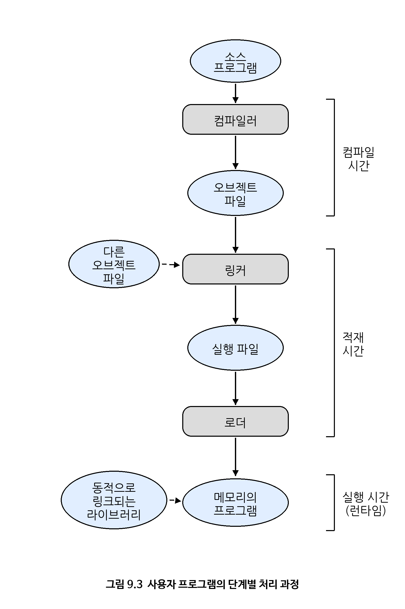

# 9장 메모리 관리 9.3.3 까지
이번 장에서는 메인메모리 관리 알고리즘에 대해 다룬다고 한다.  
메인 메모리 관리 알고리즘은 각각 장단점이 분명 존재하고 하드웨어 설계에 영향을 ㅏㅁㄴ히 받는다고 한다.  

## 기본 하드웨어  
🤼처음보는 용어정리!!
<details>
<summary>메모리 스톨 (Memory Stall)이란?</summary>

CPU가 메모리에 데이터를 요청했을 때, **메모리가 응답할 때까지 CPU가 아무것도 못 하고 기다리는 상태**

**발생 원인**: CPU와 메인 메모리 간의 속도 차이
- CPU 처리 속도: ~1ns
- 메인 메모리 접근: ~100ns (약 100배 느림)
- CPU는 응답을 기다리는 동안 수십~수백 사이클을 낭비

**해결책**: 캐시 메모리(Cache) 사용
- L1, L2, L3 캐시가 CPU와 메인 메모리 사이에서 자주 쓰는 데이터를 미리 저장해 스톨을 줄임

</details>

<details>
<summary>트랩 (Trap)이란?</summary>

CPU가 실행 중 특정 이벤트를 감지했을 때, **현재 작업을 멈추고 OS의 핸들러로 강제로 점프하는 것**

**종류 구분**
| 종류 | 발생 원인 | 예시 |
|---|---|---|
| 인터럽트 | 외부 하드웨어 | 키보드 입력, 타이머 |
| **트랩** | 프로그램이 의도적으로 발생 | 시스템 콜 (`read()`, `write()`) |
| 예외(Exception) | 프로그램 오류 | 0으로 나누기, 잘못된 메모리 접근 |

**흐름**
유저 프로그램 실행 → 시스템 콜 호출 → 트랩 발생 → CPU가 커널 모드로 전환 → OS 핸들러 실행 → 유저 모드로 복귀

**메모리 관리와의 연결**: 페이지 폴트(Page Fault)가 대표적인 트랩
- 프로세스가 메모리에 없는 페이지에 접근하면 트랩 발생
- OS가 해당 페이지를 디스크에서 메모리로 올려줌

</details>

<details>
<summary>헷갈리는 특권 명령 vs 시스템 콜</summary>

| | 특권 명령 | 시스템 콜 |
|---|---|---|
| 정체 | 커널 모드에서만 실행 가능한 **CPU 명령어** | OS 기능을 요청하는 **인터페이스** |
| 누가 실행 | OS(커널)만 가능 | 유저 프로그램이 호출 |
| 예시 | 메모리 보호 레지스터 설정, I/O 제어 | `read()`, `write()`, `fork()` |

**관계 요약**: 유저 프로그램은 특권 명령을 직접 실행 불가
→ 시스템 콜(트랩)로 OS에게 요청
→ OS가 커널 모드에서 특권 명령을 대신 실행

> 특권 명령 = 커널만 쓸 수 있는 도구
> 시스템 콜 = 유저가 그 도구를 빌려 쓰는 창구

</details>

</br>

이 대목의 책 내용 자체는 당연한 소리를 한다.  
cpu, 캐시, 메인메모리 관계  
메인메모리 읽어오는 상황(메모리 버스) 는 느려서 메모리 스톨이 많이 일어나고 그래서 캐시 넣고  
이런건 하드에어적인 관점이라고 설명한다.

그리고 보안적인 측면이 나오는데  
우리가 다른 프로세스의 메모리에 접근 못하는건 사실 상식처럼 당연한 이야기로 다가오는데  
그걸 어떤식으로 하는지 방식을 조금 간단하게 설명한다.

각 프로세스 별로 독립된 메모리를 가지도록 보장 하며(합볍적인 메모리 주소 영역)  
어떤 프로세스에게 제한을 줄수 있는 영역을 부여하는 기준으로 기준/상한 레지스터를 이용한다.

- 기준: 이 메모리 주소부터 이 프로세스꺼임
- 상한: 부여된 메모리 크기

그래서 기준~기준+상한 여기 주소가 프로세스가 접근할수 있는 메모리이다.
-> 만약 허가되지 않은 영역을 건드릴시 트랩일어나서 바로 저세상 보낸다.

또한 이 레지스터의 수정은 운영체제가 특권명령을 통해서만 할수있다는 정도를 설명한다.


## 주소의 할당
책에 나와있는 내용들이 들어는 봤고 감은 오는데 솔직히 생소하다.  
빡세서 claude랑 또 핑퐁을 진행했다.  



claude랑 대화해보니까 이미지는 C 기준이라 자바(JVM 기반 언어)라면 조금 달라서  
두가지 모두 정리해달라고 요청했다.

<details>
<summary>Claude의 정리 - C 기준 단계별 처리 과정 (이미지와 매칭됨)</summary>

### C 언어 파일 형식 정리

| 확장자 | 이름 | 설명 |
|---|---|---|
| `.c` | 소스 파일 | 개발자가 작성한 텍스트 코드 |
| `.h` | 헤더 파일 | 함수 선언, 구조체 정의 등 (Java의 interface 느낌) |
| `.o` | **오브젝트 파일** | 컴파일러가 `.c`를 기계어로 번역한 결과물. 아직 완성본 아님 |
| `.a` | 정적 라이브러리 | 여러 `.o`를 묶은 것. 링킹 시 실행파일 안에 통째로 포함됨 |
| `.so` | 동적 라이브러리 (Linux) | 실행 중에 불러오는 라이브러리 |
| `.dll` | 동적 라이브러리 (Windows) | `.so`와 동일한 역할 |
| `.dylib` | 동적 라이브러리 (macOS) | `.so`와 동일한 역할 |
| (확장자 없음) | **실행 파일** (Linux/macOS) | 링커가 만든 최종 완성본. Windows는 `.exe` |

> Java로 비유하면:
> - `.c` ≈ `.java`
> - `.o` ≈ `.class` (중간 산출물, 아직 완성본 아님)
> - `.a` ≈ fat jar (라이브러리 통째로 포함)
> - `.so`/`.dll` ≈ 외부 `.jar` 라이브러리
> - 실행파일 ≈ JVM 위에서 도는 애플리케이션 전체

---

### 1단계: 소스 프로그램

개발자가 작성한 텍스트 코드. 주소는 아직 심볼(변수명, 함수명) 형태로만 존재한다.

```c
int main() {
    int x = 10;
    foo();  // foo가 메모리 어디 있는지 아직 모름
}
```

---

### 2단계: 컴파일러 → 오브젝트 파일 (컴파일 시간)

소스코드를 **기계어로 번역**. 단, 다른 파일의 함수/변수 주소는 모르니까 빈칸(심볼 테이블)을 남겨둔다.

```
[오브젝트 파일 내부]
명령어들: MOV R1, ???  ← foo() 주소 아직 모름 (빈칸)
심볼 테이블: foo → 미결(undefined)
```

이 단계의 주소는 **재배치 가능 주소** (0번지부터 시작하는 상대적 주소)

---

### 3단계: 링커 → 실행 파일 (컴파일 시간)

여러 오브젝트 파일들을 **하나로 합치고 빈칸을 채움**

- `main.o` + `foo.o` + `표준라이브러리.a` → 하나의 실행파일
- 정적 링킹 시 라이브러리 코드가 실행파일 안에 통째로 포함됨

```
[실행 파일]
main: 0x1000번지
foo:  0x2000번지  ← 빈칸이 채워짐
```

---

### 4단계: 로더 → 메모리 적재 (적재 시간)

실행파일을 **실제 메모리에 올림**. OS가 빈 공간을 찾아 배치하고 PCB 생성.

```
실행파일의 0x1000 → 실제 메모리 0x40001000 으로 올라감
```

---

### 5단계: 동적 링크 라이브러리 (실행 시간)

`.dll`, `.so` 같은 라이브러리를 실행 중 필요할 때만 메모리에 올림.
여러 프로세스가 공유 가능해서 메모리 절약.

</details>

<details>
<summary>Claude의 정리 - Java 기준 단계별 처리 과정 (자바 개발자용)</summary>

> Java는 이미지의 C 흐름과 **구조 자체가 다르다.**
> C는 OS가 직접 실행하지만, Java는 **JVM이 중간에 끼어있다.**

```
.java → (javac) → .class(바이트코드) → (JVM) → 메모리에서 실행
                                          ↑
                          링커 + 로더 역할을 JVM이 통합해서 함
```

---

### 1단계: 소스 프로그램 (.java)

C와 동일하게 개발자가 작성한 텍스트 코드.

---

### 2단계: javac (컴파일러) → .class 파일

C의 컴파일러와 다르게 **기계어가 아닌 바이트코드**로 변환한다.

- 바이트코드는 특정 CPU/OS에 종속되지 않는 중간 언어
- C의 `.o`처럼 심볼 미결 상태가 있지만, 해결 방식이 다름

```java
// Foo.java
public class Foo {
    public void bar() { ... }
}

// Main.java
public class Main {
    public static void main(String[] args) {
        Foo f = new Foo();  // Foo 클래스가 메모리 어디 있는지 아직 모름
        f.bar();
    }
}
```

```
javac Main.java → Main.class, Foo.class 생성
```

C와의 차이: 클래스별로 `.class` 파일이 따로 만들어짐. 아직 합쳐지지 않음.

**심볼 미결 상태 비교**

C의 `.o`는 주소가 빈칸(`???`)으로 남아있다.
```
C 오브젝트 파일:
CALL 0x???  ← foo()의 실제 주소를 모름 (숫자 빈칸)
```

Java의 `.class`는 주소 대신 **클래스명/메서드명 문자열**로 남아있다.
```
Java .class 파일 (상수 풀):
INVOKEVIRTUAL "com/example/Foo.bar:()V"  ← 문자열로 참조 (심볼릭 참조)
```

- C: 빈칸을 **링커**가 실행 전에 실제 숫자 주소로 채움
- Java: 문자열을 **JVM(클래스 로더)**이 실행 중에 실제 메모리 주소로 교체 → 이게 Resolve 단계

그래서 Java는 `Foo` 클래스가 어느 jar에 있든, 어느 서버에서 실행하든 JVM이 런타임에 찾아서 연결할 수 있는 것이다.

---

### 3단계: 링킹 — Java엔 별도 링커가 없다

C는 링커가 실행파일을 미리 만들지만, **Java는 링킹을 런타임에 JVM이 처리**한다.

- `Main.class`를 실행하면 JVM이 시작됨
- `Foo` 클래스가 필요해지는 순간 JVM이 `Foo.class`를 찾아서 로드
- 이게 **클래스 로더(ClassLoader)**가 하는 일

```
JVM 실행 중...
Main 클래스 로드 → main() 실행 시작
→ new Foo() 만나는 순간 → ClassLoader가 Foo.class 찾아서 로드
→ Foo의 메모리 주소 확정 → bar() 호출 가능
```

C와의 차이: C는 실행 전에 주소가 다 확정되지만, Java는 **필요한 순간에 그때그때 로드하고 주소를 확정**한다.

---

### 4단계: 클래스 로더의 3단계 과정

JVM의 클래스 로더는 내부적으로 세 단계로 동작한다.

**① 로딩 (Loading)**
`.class` 파일을 찾아서 바이트코드를 메모리에 읽어들임
→ C의 로더가 하는 것과 유사

**② 링킹 (Linking)**
- 검증(Verify): 바이트코드가 JVM 스펙에 맞는지 확인
- 준비(Prepare): static 변수용 메모리 공간 할당 (기본값으로 초기화)
- 해석(Resolve): 심볼릭 참조(`"Foo"` 문자열)를 실제 메모리 주소로 교체
→ C의 링커가 하는 것과 유사

**③ 초기화 (Initialization)**
- static 블록, static 변수 초기화 코드 실행
- `static int count = 0;` 같은 코드가 여기서 실행됨

---

### 5단계: 동적 링크 라이브러리 (런타임)

Java에서는 이게 기본 동작이다.

- **jar 파일** = C의 `.dll`/`.so`에 해당하는 Java 라이브러리
- 외부 라이브러리(Spring, Jackson 등)도 필요한 클래스가 처음 사용될 때 클래스 로더가 로드
- JVM 시작 시 모든 클래스를 올리지 않고, **실제로 쓰이는 클래스만 그때그때 올림**

---

### Java 클래스 로더 종류 (심화)

Java는 클래스 로더가 계층 구조로 되어있다.

```
Bootstrap ClassLoader      ← JVM 핵심 (java.lang.String 등)
    ↓
Extension ClassLoader      ← JDK 확장 라이브러리
    ↓
Application ClassLoader    ← 우리가 만든 클래스 + 외부 jar
```

Spring Boot 같은 프레임워크는 여기에 커스텀 ClassLoader를 추가해서 핫 리로딩 같은 기능을 구현한다.

---

### C vs Java 최종 비교

| | **C** | **Java** |
|---|---|---|
| 컴파일 결과 | 기계어 `.o` | 바이트코드 `.class` |
| 링킹 시점 | **컴파일 시간** (미리 다 합침) | **런타임** (필요할 때 JVM이 처리) |
| 주소 결정 시점 | 실행 전에 확정 | 클래스 로드 시점에 확정 |
| 실행 주체 | OS가 CPU에서 직접 실행 | JVM이 바이트코드 해석/실행 |
| 동적 라이브러리 | 명시적으로 사용 | 기본 동작 |
| 플랫폼 종속 | CPU/OS에 종속 | JVM만 있으면 어디서든 실행 |

</details>

