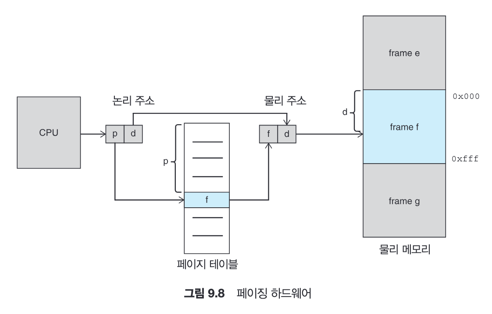
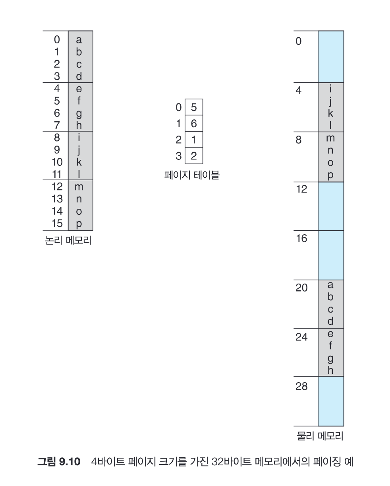
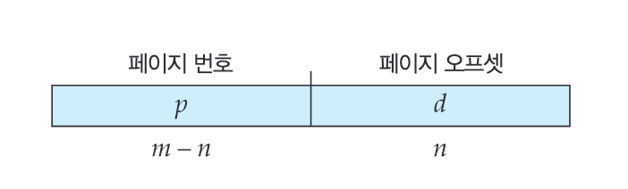
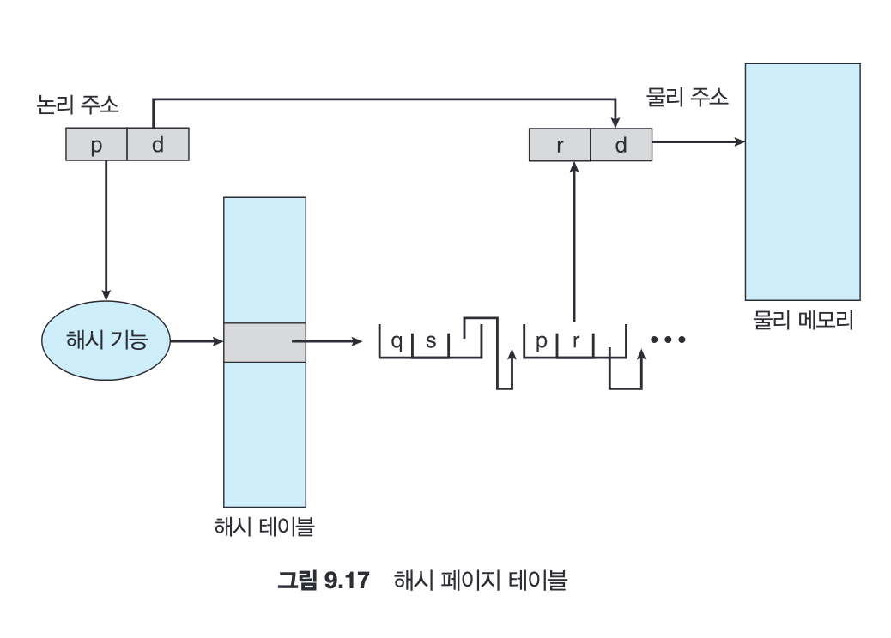
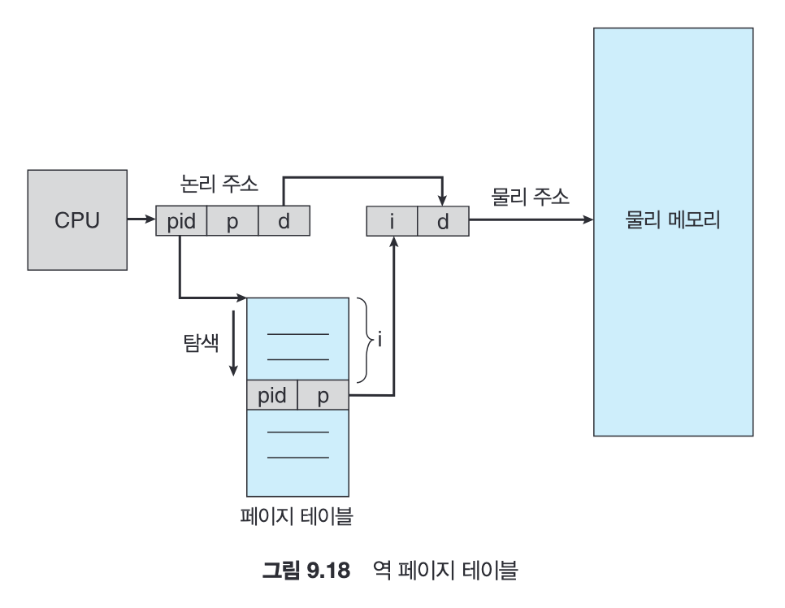

- 베어 머신 방식: OS 없이 프로그램이 직접 하드웨어를 다루는 방식
- MAR: CPU가 접근하려는 메모리 주소를 저장하는 레지스터
- CPU 클록
    - CPU 동작의 최소 시간 단위 / 주기적으로 high/low를 반복하는 전기신호 (CPU 내부에 흐르는 전압 변화)
    - 클록1 → 명령어 가져오기/클록2 → 해석/클록3 → 실행 ⇒ 이런 식.. 이 리듬에 맞춰 움직임
    - 3GHz CPU는 1초에 30억번 틱 → 클수록 빠른 것
    - GHz가 올라가면 발열이 생기는 이유: 클록마다 전기신호를 보내고 CPU는 디지털 회로(트랜지스터)들로 이루어져 있는데, 한번 스위칭할 때 전하를 충전하고 방전한다. 이 과정에서 열이 반환됨
        
        → 여튼 물리적 한계가 클록을 결정짓는다~ 
        

---

사용자 프로그램으로부터 OS영역을 보호하고, 프로그램간 영역도 보호해야 한다.

CPU와 메모리 간의 접근 중에 OS가 개입하면 성능이 떨어지므로 HW가 지원해야 한다.

물리 메모리 주소값을 저장하는데, (기준 레지스터 → 상한 레지스터) 만큼만 각 프로세스가 차지할 수 있다

### MMU (Memory Management Unit): 메모리 관리 장치

- CPU가 사용하는 논리주소를 물리주소로 변환해주는 HW. 물리적으로 CPU안에 있는 유닛
- 프로그램: “나는 0~1000 쓸게”
- OS: “너는 실제로 5000~6000 써”
- MMU: “알아서 매핑해줄게”

기준 레지스터(==재배치 레지스터)  + 논리주소 ⇒ 물리주소

### 동적 적재


프로세스가 메모리 내 어디로 올라오게 될지를 컴파일 타임에 모르면 일단 컴파일러는 이진 코드를 ‘재배치 가능 코드’로 만들어둔다. 이 상태로 디스크에 대기하고 있다가 필요할 때 ‘재배치 가능 적재기’가 불려 메모리로 올라간다.

loading이 실행 시기까지 미뤄지는 것.

### 동적 연결 및 공유 라이브러리 (DLL)

linking이 실행 시기까지 미뤄지는 것

<aside>
💡

Lazy Binding

- 함수를 처음 호출할 때까지 실제 주소를 연결하지 않음

```swift
printf("hello"); -> 실제 실행파일 안에는 printf의 주소가 없음
```

1. call printf → 호출했는데 없다면
2. PLT(Procedure Linkage Table) 로 점프. 연결되었는지 확인, 연결 안됐다면
3. dynamic linker 이 libc에서 찾아서 실제 주소를 알아냄
4. GOT (Global Offset Table)에 실제 주소를 기록함
5. 이제 다시 1로 넘어가서 call printf하면 GOT에서 찾아서 실행함

⇒ 보통 PLT, GOT는 실행파일에 존재하고 dynamic linker는 OS가 로드한 별도 프로그램임

⇒ 실행파일 안에 있는 테이블에서 찾아보고 없으면 OS가 개입해서 찾음, 실행파일 안에 있는 테이블에 실제 주소 저장

</aside>

### 단편화

최초 적합의 경우 N개의 블록이 할당될 때 0.5N개의 블록이 단편화때문에 손실될 수 있다 

→ 50% 규칙

1. 내부 단편화
    1. 내 공간 내부에 남는 공간이 있음 (==내부가 쪼개져있음)
    2. N단위로 공간을 쪼개고 정수배로만 할당함
    3. ex)10단위로 쪼갠다고 할 때 45 만큼의 프로세스가 할당 요청하면 50을 주니 5만큼 손해
2. 외부 단편화
    1. (내 공간이 아닌)밖이 너무 조각나있어서 내가 들어갈 수 없음 (메모리에 프로세스가 적재되고 남은 작은 공간들이 많은 것)
    2. 프로세스 하나가 들어가기에는 남은 공간 조각이 너무 작음
    3. ex) 50 + 50이 남았는데 80이 필요해서 할당 불가
3. 압축
    1. 남은 공간들은 몰아서 큰 공간으로 만듦 → 비용이 많이 든다
4. 페이징
    1. 논리 주소 공간을 여러 개의 비연속적인 공간으로 나누고 필요한 크기의 공간이 가용해지는 경우 물리 메모리를 프로세스에 할당함
    2. 즉 프로세스의 물리공간이 연속적이지 않고 쪼개져있는 것. 근데 생각해보면 굳이 물리적으로 연속적인 공간에 할당될 필요는 없음

## MMU (Memory Management Unit): 메모리 관리 장치

- CPU가 사용하는 논리주소를 물리주소로 변환해주는 HW. 물리적으로 CPU안에 있는 유닛
- 프로그램: “나는 0~1000 쓸게”
- OS: “너는 실제로 5000~6000 써”
- MMU: “알아서 매핑해줄게”

기준 레지스터(==재배치 레지스터)  + 논리주소 ⇒ 물리주소

```swift
int a = 10;
a = a + 1;

-> 컴파일되면..

LOAD 200   ; 주소 200에서 값 가져와
ADD 1
STORE 200  ; 다시 주소 200에 저장

주소 200은 컴파일러가 '프로그램 시작 기준 + 200에 a 변수를 저장해야지' 하는 식으로 정한 것.
즉 프로그램은 '나는 메모리 0부터 1000까지의 공간에 살고 있다'고 생각하고 있음
상대적 주소, 즉 가상주소를 생각함
```

MMU가 시작 위치 + n 해서 실제 물리주소를 가져와주는 것

### 페이징: 메모리 관리 기법 (MMU가 수행하는 단계)

- 논리 메모리: 페이지라고 불리는 같은 크기 불록으로 나누어짐
- 물리 메모리: 프레임이라 불리는 같은 크기 불록으로 나누어짐

(**프레임와 페이지의 크기는 같음**)

CPU에서 나오는 모든 주소는 아래 두 부분으로 나뉨

- 페이지 번호 p: 프로세스의 페이지 테이블을 통해 프레임 번호를 추출
- 페이지 오프셋 d: 프레임 안에서의 위치



<details>
  <summary>페이지 테이블: os가 생성/수정하는 테이블로, 페이지 번호와 프레임 번호가 매칭되어있다</summary>

프로세스마다 존재하기 때문에 문맥 교환 시간에 영향을 미친다

테이블을 메인 메모리에 저장하고 페이지 테이블을 가리키는 페이지 테이블 기준 레지스터(PTBR)를 둬서 다른 페이지 테이블을 사용하려면 이 레지스터만 변경하는 방식을 사용하여 문맥 교환 시간을 줄인다

어떤 데이터를 찾는다면 1. PTBR 을 이용해 페이지 테이블을 찾고 2. 실제 데이터를 찾아야 하기 때문에 총 2번의 메모리 엑세스가 필요하다 → 너무 오래걸림

→ TLB (translation look-aside buffers): 소형 하드웨어 캐시

최근 주소 변환 결과를 캐싱처리함. 한번 조회한 페이지 테이블을 key-value 형태로 저장

간혹 ASIDs (address-space identifier) 즉 그 TLB 항목이 어느 프로세스에 속한 것인지 같이 저장되기도 한다.
</details>

프로세스가 돌아가다가

1. MMU가 페이지에 해당하는 프레임을 찾기 위해 페이지 테이블을 뒤짐
2. 찾다가 없으면 OS가 물리 메모리에서 적당한 프레임을 찾아서 거기에 저장하고 페이지 테이블을 업데이트함



컴퓨터 주소는 결국 101101001010 이런 형태의 비트 형태인데

운영체제는 위 주소를 [페이지 번호][페이지 내부 위치(offset)] 이런 형태로 나눠야 한다



페이지 번호에 m 비트만큼 사용하고 페이지 오프셋에 n 비트만큼 사용하면 

주소만 보고 엄청 빠르게 페이지 번호와 오프셋을 찾을 수 있음

⇒ 페이징은 외부 단편화는 줄일 수 있지만 내부 단편화가 발생할 수 있다. 

페이지의 크기가 커져야 페이지 테이블이 줄어서 디스크에 효율적이다 (11장에서 나온다함)

```swift
$ sysctl -n hw.pagesize
-> 16384 // 16384 byte = 16KB

$ vm_stat
Mach Virtual Memory Statistics: (page size of 16384 bytes)
Pages free:                               19872.
// -> 16kb짜리 페이지가 19872개 있다는 뜻. 약 325MB -> 내 맥에 빈 RAM
Pages active:                            378805.
Pages inactive:                          375576.
Pages speculative:                         2211.
Pages throttled:                              0.
Pages wired down:                        299872.
Pages purgeable:                          52107.
"Translation faults":                7954036267.
Pages copy-on-write:                  254338847.
Pages zero filled:                   3395529261.
Pages reactivated:                    384539847.
Pages purged:                          94132674.
File-backed pages:                       250280.
Anonymous pages:                         506312.
Pages stored in compressor:             1699137.
Pages occupied by compressor:            440616.
Decompressions:                       438755289.
Compressions:                         556902185.
Pageins:                              262275367.
Pageouts:                               1723512.
Swapins:                                2236395.
Swapouts:                               3537274.
```

아무튼 os는 새 프레임 할당을 요청받으면 빈 프레임을 확인해서 할당해줘야 하기 때문에

**프레임 테이블**이라는 자료구조를 관리한다.

### 페이지 테이블 구조

1. 계층적 페이징: 페이지 테이블이 커지면 이 역시 메모리 공간에 연속적으로 존재하지 않아 n단계 페이지 테이블 기법을 사용해야 할 수 있다. 그러나 이것도 매칭하는데 너무 많은 단계를 거치게 되므로 이상적이진 않다
2. 해시 페이지 테이블: 



### 역 페이지 테이블



페이지 테이블은 프로세스마다 존재해야 하고 페이지마다 하나의 항목을 가져야 하는데 그 양이 너무 많아질 수 있다. 

역 페이지 테이블 방식으로 사용해서, 반대로 프레임마다 한 항목씩을 할당하여 프로세스id, 페이지 주소를 포함한다. 이렇게 되면 하나의 테이블만 존재해도 된다. 하지만 탐색이 오래걸리기 때문에 해시 페이지 테이블 + TLB
