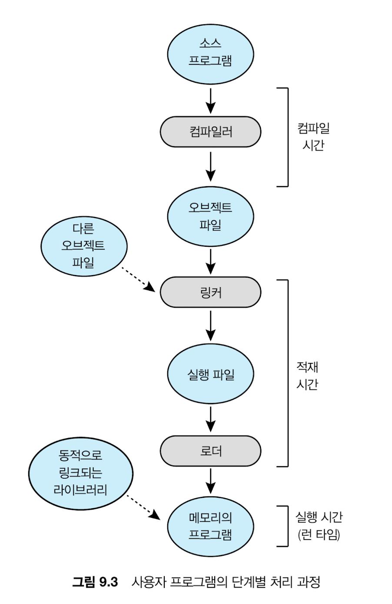

- 베어 머신 방식: OS 없이 프로그램이 직접 하드웨어를 다루는 방식
- MAR: CPU가 접근하려는 메모리 주소를 저장하는 레지스터
- CPU 클록
    - CPU 동작의 최소 시간 단위 / 주기적으로 high/low를 반복하는 전기신호 (CPU 내부에 흐르는 전압 변화)
    - 클록1 → 명령어 가져오기/클록2 → 해석/클록3 → 실행 ⇒ 이런 식.. 이 리듬에 맞춰 움직임
    - 3GHz CPU는 1초에 30억번 틱 → 클수록 빠른 것
    - GHz가 올라가면 발열이 생기는 이유: 클록마다 전기신호를 보내고 CPU는 디지털 회로(트랜지스터)들로 이루어져 있는데, 한번 스위칭할 때 전하를 충전하고 방전한다. 이 과정에서 열이 반환됨
        
        → 여튼 물리적 한계가 클록을 결정짓는다~ 
        

---

사용자 프로그램으로부터 OS영역을 보호하고, 프로그램간 영역도 보호해야 한다.

CPU와 메모리 간의 접근 중에 OS가 개입하면 성능이 떨어지므로 HW가 지원해야 한다.

물리 메모리 주소값을 저장하는데, (기준 레지스터 → 상한 레지스터) 만큼만 각 프로세스가 차지할 수 있다

### MMU (Memory Management Unit): 메모리 관리 장치

- CPU가 사용하는 논리주소를 물리주소로 변환해주는 HW. 물리적으로 CPU안에 있는 유닛
- 프로그램: “나는 0~1000 쓸게”
- OS: “너는 실제로 5000~6000 써”
- MMU: “알아서 매핑해줄게”

기준 레지스터(==재배치 레지스터)  + 논리주소 ⇒ 물리주소

### 동적 적재

프로세스가 메모리 내 어디로 올라오게 될지를 컴파일 타임에 모르면 일단 컴파일러는 이진 코드를 ‘재배치 가능 코드’로 만들어둔다. 이 상태로 디스크에 대기하고 있다가 필요할 때 ‘재배치 가능 적재기’가 불려 메모리로 올라간다.

loading이 실행 시기까지 미뤄지는 것.

### 동적 연결 및 공유 라이브러리 (DLL)

linking이 실행 시기까지 미뤄지는 것

