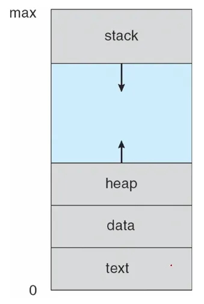
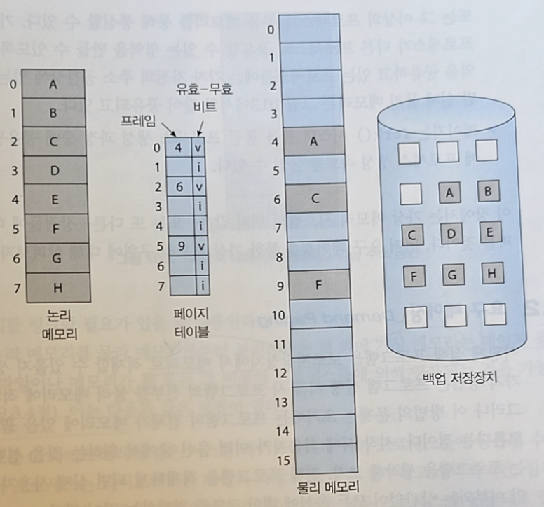
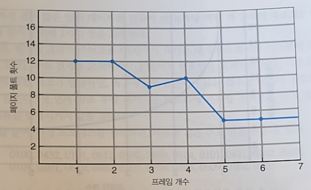

# 운영체제 스터디 12주차 정리

10장 가상 메모리 ~ 10.4.3 최적 페이지 교체

이전에는 메모리에 프로세스 전체가 올라가 있다는 것을 가정함.

→ 가상 메모리: 프롤세스 전체가 메모리 내에 올라가지 않더라도 실행 가능 (프로그램이 물리 메모리보다 클 수 있음.)

<메모리에 올리지 않아도 되는 예시>

- 잘 발생하지 않는 오류 상황
- 배열, 리스트, 테이블 등 공간을 많이 점유하는 데이터들
- 프로그램 내의 동작에 따른 특정 옵션이나 기능들

<프로그램 일부만 메모리에 올렸을 때 이점>

- 프로그램은 물리 메모리 크기에 제약받지 않으므로 구현이 더 간단해진다.
- 각 프로그램이 더 작은 메모리를 차지하므로 더 많은 프로그램을 동시에 처리 가능하다.
  → 응답 시간인데, CPU 이용류, throughput(처리율)이 높아진다.
- 메모리에서 스왑하는데 필요한 I/O 횟수가 줄어들어 프로그램 실행 시간이 줄어든다.

### 가상 주소 공간

- 물리 메모리는 page frame들로 구성되며 프로세스에 할당된 page frame 들이 실제로 연속적인 것은 아닐 수 있다.
  → 메모리 관리 장치에 따라 결정됨.
- sparse 주소 공간: 스택과 힙 사이의 공간 → 힙이나 스택이 확장될 때만 실제 물리 페이지를 요구하게 된다.



### 페이지 공유

- 가상 메모리에서 물리 메모리와 분리해준다는 것 외에 페이지 공유라는 장점도 있음.
- 파일이나 메모리가 여러 프로세스들에 의해 공유되는 것을 가능하게 함.
- 페이지는 fork() 시스템 콜을 통한 프로세스 생성 과정에서 공유될 수 있으므로 프로세스 생성 속도를 높일 수 있다.

<페이지 공유 예시>

- 표준 C 라이브러리와 같은 시스템 라이브러리
- 프로세스 간의 공유 메모리

## 10.2 요구 페이징 (Demand Paging)

필요한 페이지만 적재하는 전략

- 프로세스가 실행되는 동안 일부 페이지는 메모리에 있고, 일부는 보조저장장치에 있다.
  → 이를 구분하기 위해 하드웨어 지원이 필요하며, valid-invalid 비트 기법을 사용할 수 있다.
  → 메모리에 있으며 valild, 페이지가 유효하지 않거나 유효하지만 보조저장장치에 있으면 invalid로 표시
- page-fault trap
  : 페이징 하드웨어가 페이지 테이블을 이용한 주소 변환 과정에서 invalid 비트를 발견하면 운영체제에 trap을 건다.



<페이지 폴트를 처리하는 과정>

1. 프로세스 내부 테이블에서 메모리 참조가 유효한지 확인한다.
2. 무효한 페이지에 대한 참조라면 프로세스를 중단한다. 또한 유효한 참조인데 페이지가 메모리에 올라오지 않았다면 보조저장장치로부터 가져와야 한다.
3. 가용 프로임을 찾는다.
4. 보저장장치에 새로 할당된 프레임으로 해당 페이지를 읽어 들이도록 요청한다.
5. 보조저장장치 읽기가 끝나면 페이지 테이블을 갱신하고, 프로세스가 유지하고 있는 내부 테이블을 수정한다.
6. 트랩에 의해 중단됐던 명렁어를 다시 수행한다.

### 순수 요구 페이징

어떤 페이지가 필요해지기 전에는 결코 그 페이지를 메모리로 적재하지 않는 방법

- 한 명령어에도 여러 개의 페이지 폴트를 일으킬 수 있고, 시스템 성능 저하를 발생시킬 수 있다.
- 참조의 지역성 성질을 이용해 해결 가능하다. → 뒤에서 나옴.

<요구 페이징을 위해 하드웨어에서 필요한 것>

페이징, 스와핑에서 필요한 것과 동일하다.

- 페이지 테이블
  : 가상 페이지가 현재 물리 메모리에 올라와 있는지를 알려주는 자료구조
  - 보조저장장치 (swap space)
  : 메모리에 없는 페이지를 보관해 두는 공간

페이지 폴트 오류 처리 후에 명령어 처리를 다시 시작할 수 있어야 함.

→ 중단된 프로세스 상태를 보관해 두면 된다.

<페이지 폴트 발생시 동작 예시>

(예시) C = A + B

1. 명령어를 fetch해서 해독
2. A fetch
3. B fetch
4. A와 B를 더한다.
5. 합을 C에 저장

C에 저장할 때 페이지 폴트가 발생하면 C가 속한 페이지를 메모리로 가져오고 페이지 테이블을 수정

→ 명령어를 처음부터 다시 시작 (1번부터)

```c
❓왜 처음부터 다시 실행하지?

CPU, OS가 명령어의 중간 지점부터 안전하게 재개하는 것보다
페이지 폴트가 난 명령어의 시작 주소를 저장해뒀다가 그 명령어를 다시 실행하는 방식이 훨씬 단순하고 안정적이기 때문

단, 재실행이 가능한 restartable instruction이어야 한다.
-> 페이지 폴트가 나기 전에 이미 일부 메모리 값을 바꿔버렸다면 다시 실행했ㅇ르 때 결과가 달라지는 문제가 발생할 수 있기 때문
```

<restartable instruction이 아닌 경우>

1. 마이크로코드로 명령어를 더 작은 단계로 쪼갠다.
2. 임시 레지스터를 사용해서 결과를 바로 메모리에 쓰지 않는다. → 페이지 폴트 발생하면 임지 저장 값을 날리고 다시 처음부터 다시 실행

### 가용 프레임 리스트 (Free-Frame List)

- 빈 물리 메모리 프레임 목록을 관리하기 위함.
- zero-fill-on-demand 기법
    - 할당되기 전에 0으로 모두 채워져 이전 내용을 지운다.
    - 보안적으로 문제가 되지 않도록 이전 프로세스가 쓰던 데이터를 지워준다.

### 요구 페이징의 성능

- 페이지 폴트율을 낮게 유지하는 것이 중요하다.
- 스왑공간의 관리
    - 스왑 공간에서의 디스크 I/O는 파일 시스템에서의 입출력보다 빠름. → 파일 시스템보다 스왑 공간을 사용하는 것이 이득
    1. 프로세스 시작 시 전체 파일 이미지를 스왑 공간에 복사한 후 스왑 공간에서 요구 페이징을 수행
    2. 프로그램을 처음 시작시킬 때는 파일 시스템으로부터 요구 페이징을 처리하지만, 그 페이지들이 교체될 때는 스왑 공간에 페이지를 기록함. → Linux, Windows 등 많은 OS에서 사용하는 방식

### Copy-on-Write (COW)

- fork() 시스템 콜을 통해 프로세스를 생성할 때는 페이지 공유와 비슷한 기법으로 첫 요구 페이징조차 생략하는 것이 가능하다.
- 자식 프로세스가 만들어질 때 fork() 후에 바로 exec() 시스템 콜을 한다.
  → 복사해온 페이지들은 모두 쓸모없는 것들이 된다.
  → 부모의 페이지들을 다 복사해오는 대신 copy-on-wirte 방식을 사용하는 것이 중요하다.

<동작 방법>

1. fork() 할 때 부모 프로세스의 페이지들을 모두 복사해오지 않고 cow라고 표시만 한다. (read-only)
2. 읽기를 할 때는 상관 없으나, 부모 프로세스나 자식 프로세스 중 한 곳에서 수정을 하는 경우 그 프로세스의 복사본을 만들고 복사본에 수정을 한다.
3. 나머지 페이지들에 대해서는 여전히 cow로 남아 같은 페이지를 공유한다.

```c
❓ 페이지에 대해 부모 프로세스에서 변경이 있어 A1이 만들어졌다.
	 그 후에 자식 프로세스에서 A 페이지에 수정을 하려면 A2가 만들어지나?

A 페이지를 참조하는 프로세스가 더이상 없는 경우 복사본을 새로 만들지 않는다.

OS에서는 보통 물리 페이지마다 reference count를 관리해서 count가 1이면 writable로 바꾸고 바로 수정하도록 한다.
```

<vfok() 에서는 cow를 사용하지 않아야 한다.>

- vfork()
    - fork() 후 exec()이 바로 실행된다는 것을 가정으로 자식 프로세스가 부모 프로세스의 물리 페이지를 공유하는 것
- vfork()는 cow가 나오기 전에 fork() 후 exec()으로 복사한 메모리가 모두 새 프로그램으로 교체되는 낭비되는 것을 줄이기 위해 추가된 명령
- vfork()에서 cow를 사용하는 경우 프로세스에서 수정이 발생하더라도 같은 물리 페이지에 그대로 수정을 한다.

---

## 페이지 교체

### 페이지 과할당

- 실제 물리 메모리보다 더 많은 메모리를 프로세스들에게 할당한 상태
  → 페이징 시스템에서는 가상 메모리 덕에 물리 메모리보다 더 큰 메모리를 가상 메모리로 할당할 수 있기 때문에 발생 가능
- 페이징에서 이 특성이 장점이었는데 문제가 되나?
  → 항상 문제가 되는 것은 아님. 다만 각 프로세스가 동시에 많은 페이지를 필요로 할 때 문제 발생

<해결 방법>

1. 프로세스를 종료
    - 페이징 시스템은 OS에서 체택한 것으로 프로그램에서는 인지하고 있으면 안 되므로 적절하지 않다.
2. 페이지 스와핑
    - 표준 스와핑을 사용할 수 있지만, 메모리와 스왑 공간 사이에 전체 프로세스를 복하하는 오버헤드로 인해 잘 사용하지 않는 방법
3. 페이지 교체

### 기본적인 페이지 교체

1. 보조저장장치에서 필요한 페이지의 위치를 알아낸다.
2. 빈 페이지 프레임을 찾는다.
    1. 비어 있는 프레임이 있다면 그것을 사용
    2. 비어 있는 프레임이 없다면 victim 프레임을 선정하기 위해 페이지 교체 알고리즘을 가동
       → 디스크를 두 번 접근해야 함.
    3. 필요한 경우 victim 페이지를 보조저장장치에 기록하고, 관련 페이지 테이블을 수정한다.
3. victim 프레임에 새 페이지를 읽어오고 테이블을 수정한다.
4. 페이지 폴트가 발생한 지점에서부터 프로세스를 계속한다.

<2-b 에서의 오버헤드 - 변경 비트>

1. 페이지가 디스크에서 메모리로 올라옴.
   → 변경 비트 = 0
2. CPU가 그 페이지에 write 수행
   → 변경 비트 = 1
3. 그 페이지가 victim page 로 선정됨.
    1. 변경 비트 = 1 이라면, 디스크에 write-back 해야 함.
    2. 변경 비트 = 0 이라면, 디시크에 다시 저장하지 않고 그냥 버림.

<요구 페이징 시스템에서 해결되어야 하는 문제>

- 프레임 할당 알고리즘: 각 프로세스에 얼마나 많은 프레임을 할당해야 할지
- 페이지 교체 알고리즘: 어떤 페이지를 교체해야 할지 결정 → 페이지 폴트율이 가장 낮은 것을 선정

### FIFO 페이지 교체

- 메모리에 올라온 지 가장 오래된 페이지를 내쫓는 방식
- 장점
    - 이해하기 쉽고, 프로그램하기도 쉽다.
- 단점
    - 성능이 항상 좋지는 않다.
    - 교체된 페이지가 오래전 사용된 뒤 더는 사용되지 않았던 초기화 모듈일 수도 있다.
    - 반대로 교체된 페이지가 초기화된 뒤 계속해서 자주 사용되는 변수를 포함하고 있을 수도 있다.
      → 잘못된 실행을 야기하지는 않지만, 페이지 폴트율을 높이고 프로세스 실행 속도를 떨어뜨린다.

<Belady의 모순>

- 프로세스에 프레임을 더 주었는데 오히려 페이지 폴트율이 더 증가하는 현상이 발생
- 프레임의 수가 증가한다고 항상 페이지 폴트 발생 횟수가 줄어드는 성능 개선이 일어나는 것은 아니다.



### 최적 페이지 교체 (OPT, MIN)

- 앞으로 가장 오랫동안 사용되지 않을 페이지를 찾아 교체한다.
- Belady 모순이 발생하지 않으며, 가장 낮은 페이지 폴트율을 보장한다.
- 프로세스가 앞으로 메모리를 어떻게 참조할 것인지를 미리 알아야 하기 때문에 실제 구현은 어렵다.
  → 비교 연구 목적을 위해 사용됨.