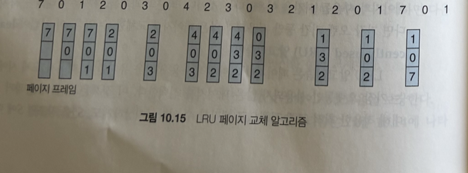
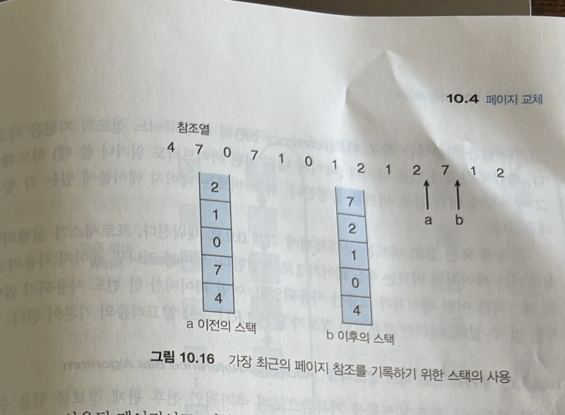
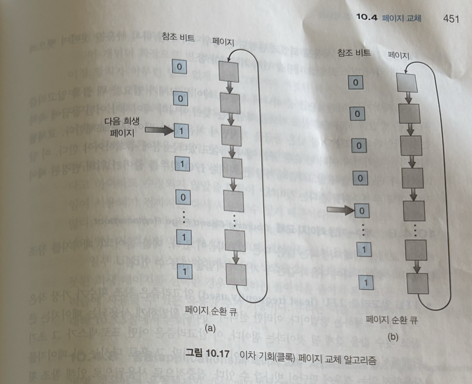
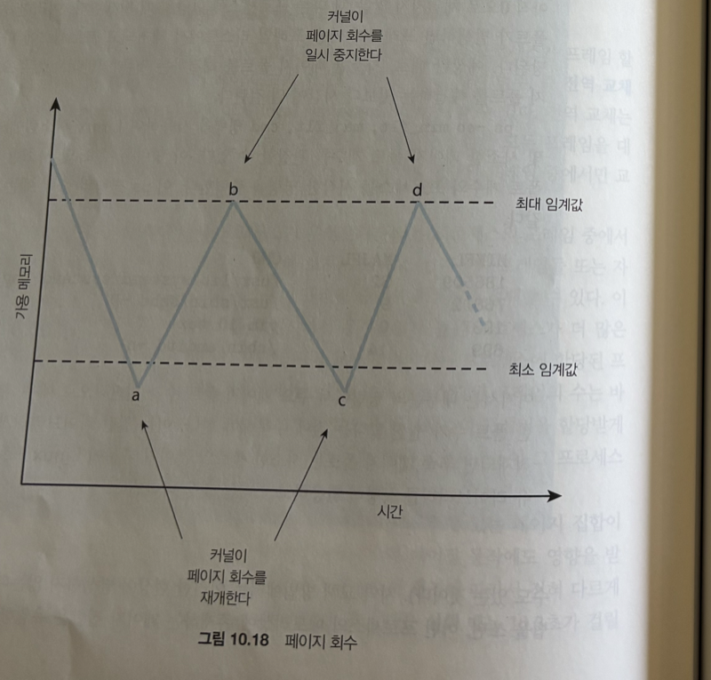
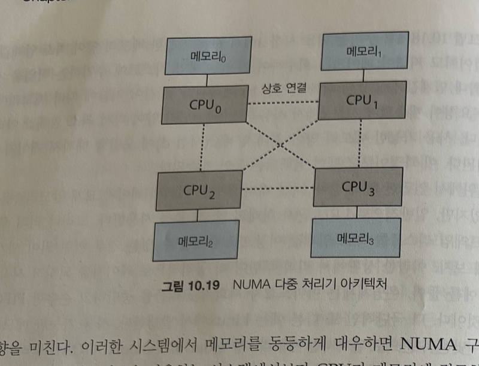
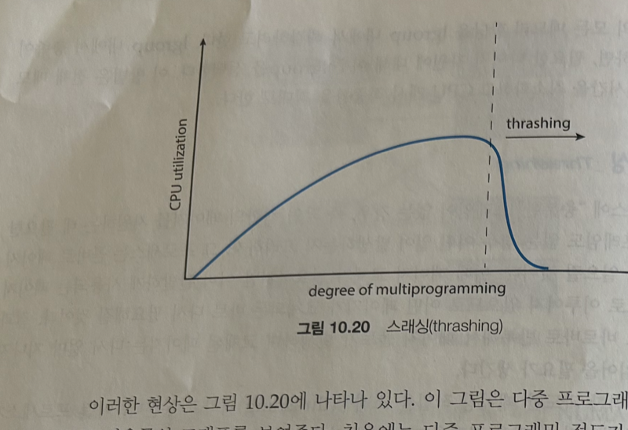
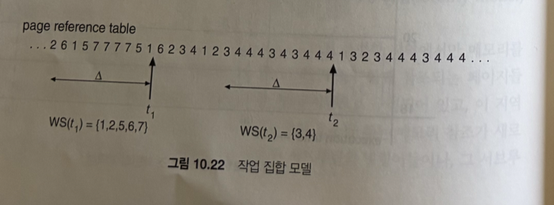
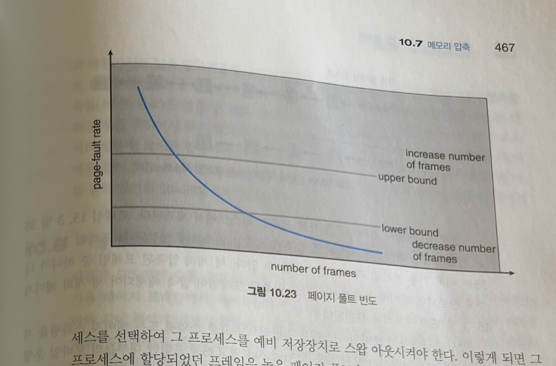

# 가상 메모리 (10.4.4 ~ 10.6.4)

> **이어지는 맥락**
> 앞 정리(10.4.3 최적 페이지 교체)에서 OPT는 "앞으로 가장 늦게 쓸 페이지"를 내쫓으면 폴트가 최소가 된다는 걸 보여줬다.
> 하지만 그러려면 **미래의 참조 순서를 미리 알아야** 해서 실제로는 못 만든다.
>
> → 그래서 현실의 모든 교체 알고리즘은 결국 **"과거 기록을 보고 미래를 추측"** 하는 게임이다.
> 그 추측을 *어떤 근거로* 하느냐 — 이게 10.4.4부터의 주제다.

---

## 10.4.4 LRU 페이지 교체 (Least Recently Used)

### 핵심 아이디어

미래를 모른다면, 가장 합리적인 대안은 **과거를 거울로 삼는 것**이다.

LRU는 **"가장 오래전에 쓰인(= 가장 오랫동안 안 건드려진) 페이지"** 를 victim으로 고른다.
- 깔린 가정: *"최근까지 안 쓰였으면, 앞으로도 한동안 안 쓰일 것이다."*

OPT와는 방향만 정반대다.
- OPT → **미래**에 가장 먼 페이지를 본다
- LRU → **과거**에 가장 먼 페이지를 본다

### 성능

- 같은 참조열(`7,0,1,2,0,3,0,4,2,3,0,3,2,1,2,0,1,7,0,1`) + 3프레임 → **폴트 12회**
- OPT(9회)에는 못 미치지만 FIFO(15회)보다 확실히 낫다.
- 즉 **"구현 가능한 알고리즘 중 꽤 좋은 축"**.

**Belady의 모순이 없다 — 왜?**

LRU는 *스택 알고리즘(stack algorithm)* 이라는 부류에 속한다. 스택 알고리즘이란, 프레임이 n개일 때 메모리에 들어있는 페이지 집합이 프레임이 n+1개일 때의 페이지 집합에 **항상 통째로 포함되는** 성질을 가진 알고리즘을 말한다. 쉽게 말해 프레임을 한 칸 늘리면, 원래 갖고 있던 페이지는 하나도 쫓겨나지 않고 그 위에 페이지가 더 얹히기만 한다.

이 포함 관계 덕분에 **"프레임을 늘렸는데 폴트가 늘어나는" 일이 원리적으로 불가능**하다. LRU가 victim을 고르는 기준("가장 오래 안 쓰인 것")은 프레임 수가 몇 개든 똑같이 적용되므로 이 관계가 절대 깨지지 않기 때문이다. 반대로 FIFO는 "큐에 들어온 순서"가 기준인데, 프레임 수가 달라지면 같은 참조열이라도 교체 타이밍이 어긋나 포함 관계가 깨진다. 그래서 FIFO에서만 Belady의 모순이 나타났던 것이다.

### 진짜 문제는 "어떻게 구현하느냐"

정의는 간단한데, 구현하려면 **매 메모리 참조마다 "방금 이 페이지 썼다"는 시간 정보를 갱신**해야 한다.
메모리 참조는 1초에 수억 번 → 이 갱신이 조금만 무거워도 시스템 전체가 느려진다.

두 가지 하드웨어 구현이 있다:

| 방식 | 동작 | 비용/단점 |
|---|---|---|
| **계수기(counter)** | 참조할 때마다 논리 시계값을 그 페이지의 "사용 시각" 필드에 복사. 교체 시 **값이 가장 작은(가장 옛날)** 페이지를 victim으로 | ① 참조마다 메모리 쓰기 추가 ② victim 찾으려면 페이지 테이블 전체 탐색 ③ 시계 overflow 처리 필요 |
| **스택(stack)** | 페이지 번호를 스택으로 관리. 참조되면 그 번호를 중간에서 빼 **맨 위(top)** 로 이동 → top=최근, bottom=가장 오래 | 이중 연결 리스트로 구현, 한 번 갱신에 포인터 최대 6개 수정. 대신 **탐색 불필요**(bottom이 곧 victim) |

> 페이지 7을 참조하면 7을 스택 중간에서 빼 맨 위로 올린다.
> 갱신 비용은 들지만, 교체할 땐 맨 아래만 보면 되니 탐색이 0이다.

### 왜 하드웨어가 꼭 필요한가

두 방식 **모두 매 참조마다** 자료구조를 갱신해야 한다.
→ 이건 표준 TLB 수준으론 부족하고 전용 하드웨어 지원이 있어야 한다.

만약 소프트웨어(인터럽트)로 처리하면 → **매 메모리 참조가 최소 10배 이상 느려진다.**
그런 오버헤드를 감당할 시스템은 사실상 없다.

**결론:** 그래서 현실에선 "진짜 LRU"를 포기하고 **LRU를 적당히 흉내 낸 근사 알고리즘**을 쓴다. (= 다음 절)

📖 책에 없는 내용 — 안드로이드 개발자가 매일 쓰는 LRU

LRU는 OS 페이지 교체 이론이지만, **안드로이드 앱 레벨에서 거의 똑같이 재현**된다.

- **`androidx.collection.LruCache`** — 비트맵·객체 메모리 캐시의 표준.
  - 용량 초과 시 **가장 오래 안 쓴 항목(`eldest`)을 자동 evict**.
  - 내부는 `LinkedHashMap(accessOrder=true)` → 책의 "스택 구현"과 완전히 같은 발상. (`get()`으로 접근하면 맨 뒤로 이동, 넘치면 맨 앞을 버림)

- **Glide / Coil** 메모리 캐시도 LRU → 스크롤하다 화면 밖으로 나간 이미지가 먼저 버려진다.

정리하면, 책의 "마지막 사용 시각으로 victim을 고른다"가
앱에서는 **"`get()` 호출 순서대로 캐시를 비운다"** 로 나타난다.
→ `LruCache`의 `maxSize`/`sizeOf()` 튜닝은 사실상 "이 프로세스에 프레임 몇 개 줄까"를 앱 안에서 다시 정하는 일이다.

---

## 10.4.5 LRU 근사 페이지 교체

완전한 LRU 하드웨어는 드물다. 대신 대부분의 CPU가 **참조 비트(reference bit)** 라는 최소한의 힌트를 준다.

- 페이지를 한 번이라도 읽거나 쓰면 → 하드웨어가 참조 비트를 **자동으로 1로** 켠다. (OS는 처음에 전부 0)
- 이 비트 하나로 알 수 있는 것: **"쓰였는가?"** (O)
- 알 수 없는 것: **"언제, 몇 번째로 쓰였는가(순서)"** (X)

이 부분적인 정보로 LRU를 흉내 낸다.

### 10.4.5.1 부가적 참조 비트 알고리즘

참조 비트 1개로는 순서를 모르니, **이력을 누적**해서 순서를 추정한다.

- 각 페이지에 **8비트 시프트 레지스터**를 둔다.
- 일정 간격(예: 100ms)마다 타이머 인터럽트 → 현재 참조 비트를 **MSB로 밀어넣고 나머지는 오른쪽으로 시프트**.
- 결과: 이 8비트 = **"최근 8구간의 사용 이력"**

해석 예시:
- `00000000` → 최근 8구간 한 번도 안 쓰임
- `11111111` → 매 구간 꾸준히 쓰임
- `11000100`(192) vs `01110111`(119) → **정수로 큰 쪽이 더 최근**

→ **값이 가장 작은 페이지 = LRU 페이지** → 그걸 교체.
(비트를 0개로 줄이면 참조 비트 하나만 남음 = 다음의 2차 기회 알고리즘)

### 10.4.5.2 2차 기회 알고리즘 (클록, Clock)

기본 골격은 **FIFO**, 단 쫓아내기 직전에 **참조 비트를 한 번 본다.**

- 참조 비트 **0** → 그대로 교체
- 참조 비트 **1** → 교체 안 함. 비트를 **0으로 지우고** 다음 후보로 넘어감 = **"한 번 더 기회"**

- 구현: **순환 큐 + 시계 바늘처럼 도는 포인터** → 별명이 **클록(clock)**.
  - 포인터가 돌며 1을 만나면 0으로 바꾸고 통과, 0을 만나면 거기서 교체.
- **최악의 경우(모두 1):** 한 바퀴 다 돌며 전부 0으로 만든 뒤 처음 걸 교체 → 사실상 **순수 FIFO**.

**이 단순한 트릭이 왜 LRU의 근사가 될까?**
포인터가 어떤 페이지를 지나가며 참조 비트를 0으로 지운다는 건, "지금부터 이 페이지가 다시 쓰이는지 지켜보겠다"는 뜻이다. 만약 포인터가 한 바퀴 돌아 그 페이지에 다시 왔을 때까지 비트가 0 그대로라면 → 그 한 바퀴 동안 **한 번도 안 쓰인** 페이지이므로 버려도 안전하다. 반대로 그사이 누가 그 페이지를 건드렸다면 비트가 1로 켜져 다시 살아남는다. 즉 정확한 "마지막 사용 시각"은 모르지만, **"최근 한 바퀴 안에 쓰였나 아니냐"** 라는 거친 최근성 정보만으로 LRU를 흉내 내는 것이다. 참조 비트 하나와 포인터 하나로 끝나니 비용도 거의 0이다.

### 10.4.5.3 개선된 2차 기회 알고리즘

참조 비트에 **변경 비트(dirty bit)** 를 더해, (참조, 변경) **두 비트로 4등급**을 매긴다. 낮은 등급부터 victim:

| 등급 | (참조, 변경) | 의미 | 교체 매력도 |
|---|---|---|---|
| 1 | (0, 0) | 안 쓰임 + 안 바뀜 | **최고** — 그냥 버리면 끝 |
| 2 | (0, 1) | 안 쓰임 + 바뀜 | 보통 — 버리려면 디스크 기록(I/O 1회) |
| 3 | (1, 0) | 쓰임 + 안 바뀜 | 낮음 — 곧 다시 쓸 듯 |
| 4 | (1, 1) | 쓰임 + 바뀜 | **최악** — 곧 쓸 데다 기록까지 필요 |

핵심은 **변경 비트로 디스크 쓰기를 아낀다**는 것:
- 똑같이 "안 쓰인" 페이지라도 **clean을 dirty보다 먼저** 버린다.
- clean → 원본이 디스크에 있어 그냥 버리면 됨 / dirty → 버리기 전 반드시 디스크에 써야 함(비쌈).
- 대신 가장 낮은 등급을 찾느라 순환 큐를 여러 바퀴 돌 수 있다(그래도 I/O 절약이 이득).

📖 책에 없는 내용 — 리눅스/안드로이드의 진짜 페이지 회수

안드로이드(=리눅스 커널)는 위 **2차 기회/클록을 한 단계 발전**시킨 방식을 쓴다.

- 페이지를 **active list / inactive list** 두 리스트로 나눠 관리 (사실상 "두 손 클록").
  - 접근되면 active로 승격, 오래 방치되면 inactive로 강등 → 회수 후보.
  - `PG_referenced` / `PG_active` 플래그가 책의 참조 비트 역할.

- "**dirty는 비싸니 나중에**"라는 발상도 그대로:
  - clean한 file-backed 페이지(앱 코드·리소스) → 즉시 버림
  - dirty한 anonymous 페이지 → 더 보호
  - 안드로이드는 스왑이 없어 dirty anonymous를 못 버림 → `onTrimMemory()`로 앱에 정리 요청, 안 되면 종료 (아래 10.5.3)

---

## 10.4.6 계수 기반 페이지 교체

참조 **횟수(빈도)** 로 victim을 고른다. 두 변종이 정반대 가정:

- **LFU (Least Frequently Used)** — 횟수가 **가장 적은** 페이지를 교체
  - 가정: "많이 쓰인 건 앞으로도 많이 쓰일 것"
  - 약점: 초기에 잔뜩 쓰이고 안 쓰이는 페이지가 큰 횟수를 안고 눌러앉음
  - 보정: 횟수를 주기적으로 시프트(÷2)해 옛 사용량을 지수적으로 잊게 함(aging)

- **MFU (Most Frequently Used)** — 횟수가 **가장 적은** 페이지를 살림
  - 가정: "이제 막 들어와서 앞으로 한창 쓸 페이지"

> 둘 다 **구현 비용 크고 OPT 근사도 나빠** 실제론 거의 안 쓴다. 개념용.

## 10.4.7 페이지 버퍼링 알고리즘

교체 알고리즘을 **대체가 아니라 곁들여서** 폴트 지연을 줄이는 보조 기법.

- **가용 프레임 풀(pool) 유지**
  - 빈 프레임 몇 개를 미리 확보 → 폴트 시 victim 기록을 *기다리지 않고* 새 페이지를 풀에 먼저 읽어 **즉시 재개**.
  - victim 기록은 나중에 한가할 때.
- **변경 페이지 리스트**
  - 디스크 한가할 때 dirty 페이지를 미리 써내고 clean으로 전환 → 막상 교체될 땐 쓰기 불필요.
- **원래 임자 기억**
  - 풀에 넣은 프레임이 "누구 페이지였는지" 기록 → 다시 찾으면 디스크 안 거치고 풀에서 바로 복구.

## 10.4.8 응용과 페이지 교체 (raw I/O)

때로는 **응용이 OS보다 자기 접근 패턴을 더 잘 안다.** 이땐 OS의 친절(버퍼링/페이징)이 오히려 방해다.

- **이중 버퍼링 낭비**
  - DB처럼 자체 캐시가 있는 응용에 OS가 또 캐싱 → 같은 데이터가 메모리에 두 벌 → 2배 낭비.
- **LRU가 손해인 경우**
  - 대량 순차 읽기(데이터 웨어하우스)는 오래된 페이지를 곧 다시 읽음 → "오래된 걸 버리는" LRU가 불리, MFU가 유리.
- **해법: raw disk / raw I/O**
  - 보조저장장치를 파일 시스템(디렉토리·잠금·요구 페이징)을 거치지 않고 **논리 블록 배열**로 직접 사용 → 응용이 캐싱을 직접 책임.

---

## 10.5 프레임의 할당 (Allocation of Frames)

질문이 바뀐다 → **"가용 프레임 m개, 프로세스 n개일 때 누구에게 몇 개씩 줄까?"**

### 10.5.1 최소로 할당해야 할 프레임 수

할당엔 위·아래 한계가 있다.
- **위:** (페이지 공유가 없다면) 가용 프레임 수를 못 넘음
- **아래:** 반드시 보장해야 하는 **최소 개수**가 있음

**최소가 필요한 이유 = 성능이 아니라 "정확성" 때문이다**

페이지 폴트가 나면 OS는 그 명령어를 처음부터 다시 실행한다. 그런데 한 명령어가 동시에 참조하는 페이지 수보다 프레임이 적다면 어떻게 될까? 명령어를 실행하다 페이지 A를 올리고, 이어서 페이지 B를 올리려고 방금 올린 A를 쫓아내고, 명령어를 재실행하니 또 A가 필요해 폴트가 나고… 이렇게 **같은 명령어가 영영 완료되지 못하는** 교착이 생길 수 있다. 즉 "조금 느려지는" 수준이 아니라 아예 **프로그램이 진행 불가능**해진다. 그래서 한 명령어가 동시에 건드릴 수 있는 페이지 수만큼은 반드시 프레임으로 보장해 줘야 한다.

**간접 주소 지정이 끼면 더 늘어난다**
- 예: 프레임 16의 `load` → 프레임 23을 간접 참조 → 그게 또 프레임 0을 가리킴…
- 체인 길이만큼 프레임이 동시에 필요 → 어떤 아키텍처는 프로세스당 최소 6개를 요구.

→ **최소값은 CPU 아키텍처가, 최대값은 물리 메모리가 정한다.** 그 사이에서 선택.

### 10.5.2 할당 알고리즘

- **균등 할당(equal)** — m개를 n개로 똑같이 m/n씩
  - 예: 93프레임 / 5프로세스 = 각 18개 (남는 3개는 버퍼 풀)
  - 단점: 1KB 프로세스와 127KB 프로세스에 똑같이 주면 작은 쪽은 그 절반이 낭비

- **비례 할당(proportional)** — 크기에 비례해서
  - 크기 sᵢ, 전체 S = Σsᵢ → 각자 **aᵢ = (sᵢ / S) × m**
  - 예: 62프레임을 10페이지·127페이지에 → 약 **4개 / 57개**
  - 다중 프로그래밍 정도가 변하면 할당량도 자동 조정됨

- 둘 다 **우선순위는 무시** → 필요하면 크기 대신 우선순위로 비례 할당하거나 둘을 섞음.

### 10.5.3 전역 대 지역 할당

victim을 **어느 범위에서 고르느냐**의 차이:

| | 전역 교체 (global) | 지역 교체 (local) |
|---|---|---|
| victim 후보 | **모든 프로세스**의 프레임 | **자기 할당분** 안에서만 |
| 내 프레임 수 | **변동**(뺏고 뺏김) | **고정** |
| 장점 | 처리량↑, 많이 쓰임 | 실행 시간 안정·예측 가능 |
| 단점 | 내 성능이 **남의 페이징에 휘둘림** | 노는 프레임도 못 빌려줌 |

전역 교체의 가장 까다로운 점은 **내 프로세스의 성능이 내 코드와 무관하게 결정된다**는 것이다. 내가 들고 있는 페이지 집합이 나 혼자만의 행동이 아니라, 그 순간 다른 프로세스들이 메모리를 얼마나 공격적으로 쪼아대는지에 따라 달라지기 때문이다. 그래서 똑같은 입력으로 똑같은 프로그램을 돌려도 어떤 때는 0.5초, 어떤 때는 10.3초가 걸리는 **재현 불가능한 성능**이 나온다. 지역 교체는 각자 자기 프레임 안에서만 교체하니 이런 외부 간섭이 없다. 그럼에도 전체 처리량은 보통 전역 교체가 더 높아서, 현실에서는 전역 교체가 더 널리 쓰인다.

**전역 교체의 현실 구현 — 리퍼(reaper)**

가용 프레임이 0이 될 때까지 기다리면 늦다 → 가용 메모리가 **임계값 아래로 떨어지면 미리 회수 시작.** 이 커널 루틴이 **리퍼**.

- **최소 임계값** 아래로(a) → 리퍼가 회수 시작
- **최대 임계값** 도달(b) → 멈춤
- 다시 줄면(c) → 재개
- 리퍼가 못 따라가면 점점 공격적으로 → 2차 기회 중단·순수 FIFO → 극단엔 **OOM 킬러**가 프로세스를 죽임
- OOM 킬러는 **`oom_score`**(메모리 사용 비율, 높을수록 먼저 죽음)로 대상 선정. `/proc/<pid>/oom_score`에서 확인.

📖 책에 없는 내용 — 리퍼·OOM이 곧 안드로이드의 LMK

책의 reaper / OOM 킬러 = 안드로이드의 **lmkd(Low Memory Killer Daemon)**.

- 메모리가 임계값 아래로 → lmkd가 **`oom_score_adj`가 높은(덜 중요한) 프로세스부터** 종료.
- 점수는 앱 **상태**로 정해짐:
  - 포그라운드(낮음, 잘 안 죽음) → 보이는 액티비티 → 실행 중 서비스 → 캐시된 백그라운드(높음, 먼저 죽음)
- 그래서 `onTrimMemory(TRIM_MEMORY_*)`에서 캐시를 비워 **USS를 낮추면 oom_score가 내려가 사망 순번에서 뒤로 밀린다.**

→ 책의 "리퍼가 임계값 아래에서 회수 시작"이, 앱 입장에선 **"메모리 압박 콜백이 온다 → 안 비우면 강제 종료"**. 그래서 `onTrimMemory()`를 무시하면 안 된다.

### 10.5.4 비균등 메모리 접근 (NUMA)

지금까지 "메모리는 어디 있든 접근 비용 동일"로 가정했지만, **CPU마다 로컬 메모리를 가진 NUMA** 에선 거짓이다.
→ CPU는 **자기 로컬 메모리를 남의 것보다 훨씬 빠르게** 접근(상호 연결을 안 거치니까).

- 핵심 정책: **실행 중인 CPU에 "가장 가까운"(지연 최소) 프레임을 할당** + 스케줄러는 그 프로세스를 **직전 CPU에 다시 배치**
  - → 캐시 적중률↑, 접근 지연↓
- 스레드까지 고려하면 복잡:
  - 리눅스는 **스케줄링 도메인**으로 스레드의 노드 이주를 막고, **노드별 가용 프레임 리스트**로 자기 노드에서 할당받게 함.
  - Solaris의 `lgroups`(locality groups)도 같은 발상.

---

## 10.6 스래싱 (Thrashing)

### 스래싱이란

프로세스에게 **현재 지역성(작업 집합)을 담을 최소 프레임조차 없으면?**
- 페이지 하나 올리면 그게 곧 또 victim → 쫓겨남 → 즉시 다시 필요 → 또 폴트…
- **실제 연산은 거의 못 하고 페이지를 들이고 내보내는 데만 시간을 다 씀** = 스래싱
- 정의: "실행보다 페이징에 더 많은 시간을 쓰는 상태"

### 10.6.1 스래싱의 원인 — 스케줄러의 잘못된 호의

초기 시스템에서 실제로 벌어진 악순환:

1. CPU 이용률 낮네? → 스케줄러가 **프로세스를 더 투입**(다중 프로그래밍 정도↑)
2. 전역 교체라 새 프로세스가 **남의 프레임을 뺏음** → 뺏긴 쪽도 폴트 → 또 남의 걸 뺏음
3. 다들 페이징 장치 큐에서 대기 → 준비 큐는 텅 빔 → **CPU는 더 논다**
4. 스케줄러: "아직도 노네?" → **또 프로세스 추가** → 폴트 폭증 → **처리량 붕괴**

이 악순환이 무서운 이유는 **스케줄러가 증상을 정반대로 해석**하기 때문이다. "CPU가 논다"는 신호를 보고 스케줄러는 "일거리(프로세스)가 부족하구나" 하고 더 투입하지만, 사실 CPU가 노는 진짜 원인은 일이 부족해서가 아니라 모두가 디스크에서 페이지를 기다리느라 실행될 게 없어서다. 즉 **필요한 약(부하 감소)과 정반대의 약(부하 증가)을 처방**하니, 누르면 누를수록 더 깊이 빠진다. 그래서 그래프에서 보듯 다중 프로그래밍을 올리면 CPU 이용률이 오르다가 어느 **임계점에서 절벽처럼 추락**하고, 그 이후가 스래싱 구간이다.

- 벗어나려면 **직관과 반대로 프로세스 수를 오히려 낮춰야** 한다.
- **지역 교체**를 쓰면 전염은 막지만 완전 해결은 아님(페이징 장치 큐가 길어져 멀쩡한 프로세스도 느려짐).

**근본 해법 → 각 프로세스에 "꼭 필요한 만큼" 프레임 보장.** 그럼 그 "만큼"을 어떻게 알까?

이 답의 토대가 **지역성 모델(locality model)** 이다. 프로그램은 아무 페이지나 무작위로 접근하지 않는다. 어느 순간에는 **특정 지역(locality)** — 즉 함께 집중적으로 참조되는 페이지들의 작은 집합 — 안에서만 맴돌다가, 시간이 지나면 다른 지역으로 옮겨간다. 예를 들어 어떤 함수에 들어가면 한동안 그 함수의 코드 페이지와 지역 변수 페이지들만 계속 참조하다가, 그 함수를 빠져나가면 그 지역을 떠나 새로운 지역으로 이동하는 식이다. 그래서 **"지금 이 프로세스가 머무는 지역을 통째로 담을 만큼"** 의 프레임만 보장해 주면 스래싱이 사라진다. 캐싱·요구 페이징이 애초에 잘 작동하는 이유도 전부 이 지역성 덕분이다.

### 10.6.2 작업 집합 모델 (Working-Set Model)

지역성을 **수치로 측정**하려는 모델.

- **최근 Δ개의 참조**를 보는 창(window)을 둔다.
- 그 창 안의 **서로 다른 페이지 집합** = **작업 집합(working set)**, 크기 = **WSS**.

- 예(Δ=10): t₁의 작업 집합 = {1,2,5,6,7}, t₂ = {3,4}
- **Δ 선택이 정확도를 좌우**
  - 너무 작으면 → 현재 지역을 다 못 담음
  - 너무 크면 → 여러 지역을 과하게 포함 (Δ=∞면 "지금까지 본 모든 페이지")

**핵심 부등식 — 스래싱을 숫자로 정의하다**

각 프로세스가 "지금 머무는 지역"을 메모리에 올리려면 자기 작업 집합 크기(WSSᵢ)만큼의 프레임이 필요하다. 그러니 시스템 전체가 진짜로 요구하는 프레임의 총량은 **D = Σ WSSᵢ** 다. 이 D가 실제 가용 메모리 m보다 커지는 순간(**D > m**), 누군가는 자기 작업 집합조차 다 올리지 못하게 되고 — 바로 그게 스래싱이다. 앞에서 말로 풀던 "지역을 담을 프레임이 부족하면 스래싱"이라는 현상을, 이 부등식 하나로 정량화한 것이다.

**활용법**
- OS가 각 작업 집합 크기만큼 프레임을 주고, 여유 있으면 새 프로세스 시작
- **D가 m을 넘기려 하면** → 프로세스 하나를 **스왑아웃(중단)** 했다 나중에 재개
- → 스래싱 없이 다중 프로그래밍을 최대로
- (실제 추적은 참조 비트 + 주기적 타이머로 근사)

### 10.6.3 페이지 폴트 빈도 (Page-Fault Frequency, PFF)

작업 집합은 간접적·투박 → PFF는 **우리가 진짜 신경 쓰는 "폴트율" 자체를 직접 겨냥**.

- 논리:
  - 폴트율 **높다 = 프레임 부족**
  - 폴트율 **낮다 = 프레임을 너무 많이 쥠**
- 그래서 폴트율에 **상한·하한** 두 선을 긋고:
  - 상한 초과 → **프레임을 더 준다**
  - 하한 미만 → **프레임을 회수한다**
- 줄 프레임이 없는데 폴트율이 치솟으면 → **프로세스 하나를 스왑아웃**해 그 프레임을 폴트율 높은 쪽에 분배.

### 10.6.4 현재 관행 (Current Practice)

결론은 다소 허무하지만 현실적이다.

- 스래싱·스와핑은 성능에 치명적 → 정교한 알고리즘으로 다스리기보다 **애초에 RAM을 충분히 다는 게** 가장 확실.
- 극단적 경우만 빼면, **스마트폰부터 대형 서버까지 모든 작업 집합을 동시에 올릴 만큼 RAM을 넉넉히** 주는 게 최선.
- 즉 "스래싱 제어 알고리즘"은 메모리가 빠듯하던 시절의 유산에 가깝고, 현대의 1차 방어선은 **그냥 충분한 메모리**.

📖 책에 없는 내용 — 모바일에서의 스래싱과 "현재 관행"

- 모바일은 **스왑이 없어** 데스크탑식 스래싱이 잘 안 생기는 대신, 메모리 압박이 곧바로 **`onTrimMemory()` → lmkd 앱 종료**로 직행.
  - → 스래싱의 종착지가 "느려짐"이 아니라 **"앱이 죽음"**.

- 비슷한 현상: **GC 스래싱**
  - 힙이 빠듯하면 GC가 쉴 새 없이 돌며 메인 스레드를 멈춤 → **프레임 드랍(jank)**
  - "할 일은 못 하고 관리 작업만 반복" → 페이지 스래싱과 구조가 똑같음.

- 10.6.4의 "그냥 RAM 충분히"는 모바일엔 안 통함(물리적으로 못 늘리고 기기마다 제각각).
  - → 앱 개발자에겐 **자기 작업 집합(USS)을 작게 유지하는 것**이 곧 생존 전략:
    - 화면 밖 비트맵 해제 / `LruCache` 크기 적정화 / 백그라운드 진입 시 캐시 비우기 / 큰 객체 누수 방지
  - 책의 "프레임 적게 쓰는 프로세스가 살아남는다" = 모바일의 "메모리 적게 쓰는 앱이 백그라운드에서 안 죽는다".

