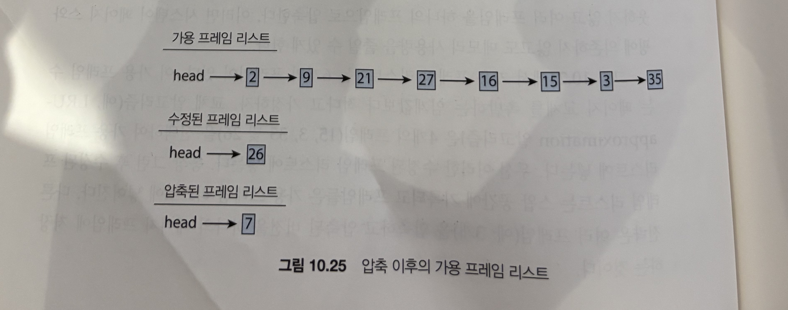
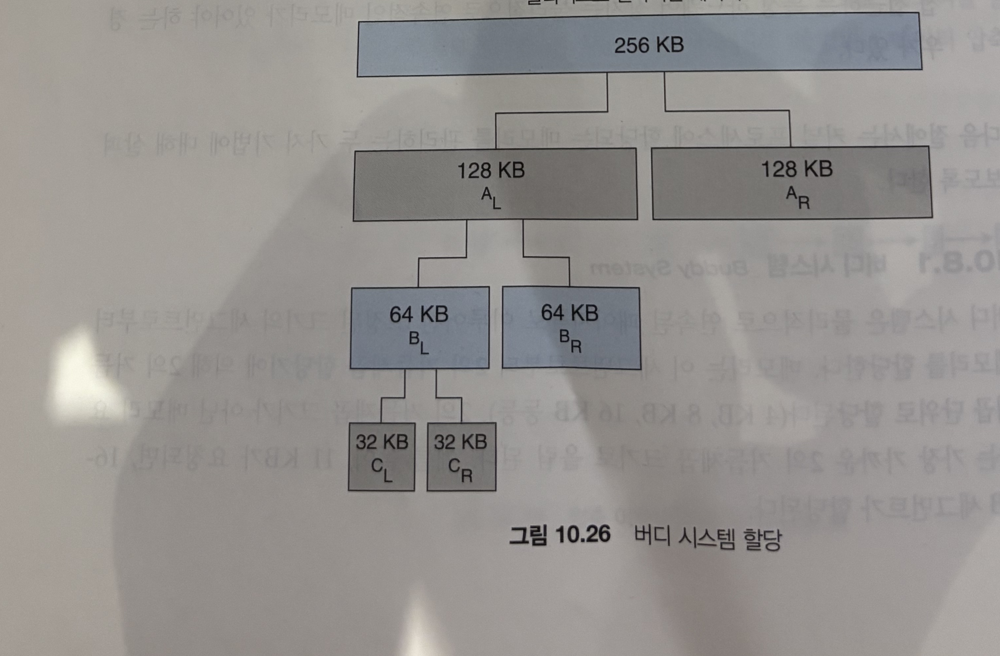
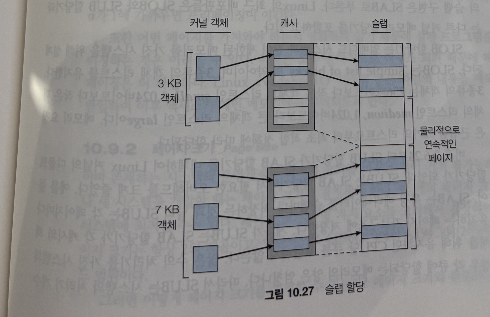
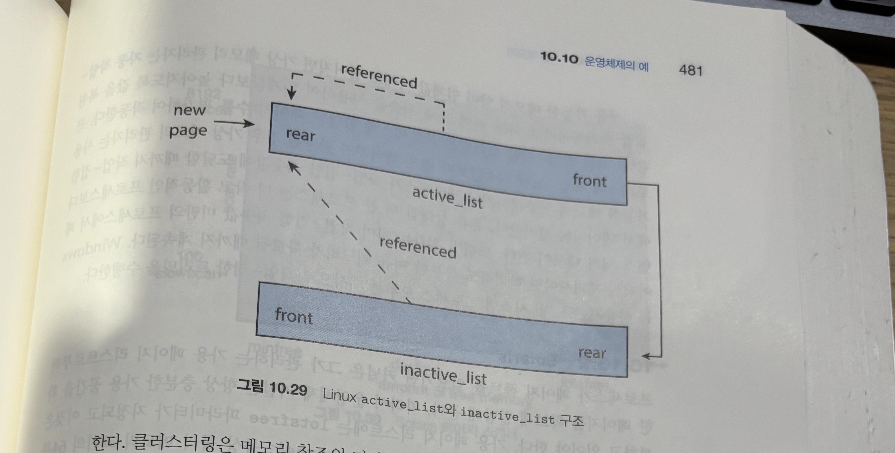
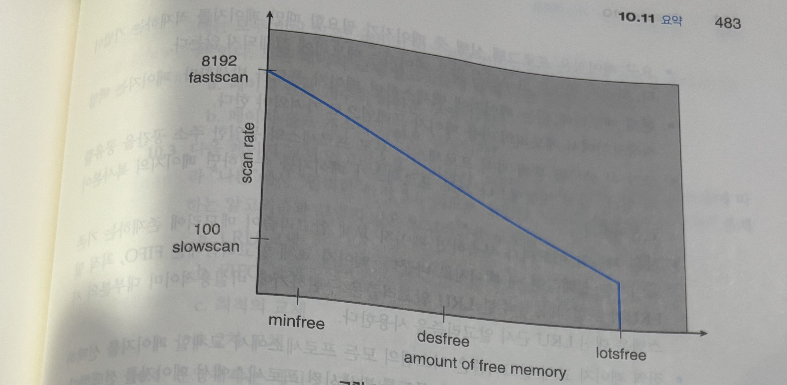

# 가상 메모리 (10.7 ~ 10.10.2)

> **이어지는 맥락**
> 앞 정리(10.6.4 현재 관행)의 결론은 다소 허무했다 — "스래싱은 정교한 알고리즘으로 다스리기보다 **그냥 RAM을 충분히 다는 게** 최선"이라는 것.
> 하지만 RAM을 더 못 다는 상황(특히 **스왑이 없는 모바일**)이라면? 그때 쓰는 게 **10.7 메모리 압축**이다.
> 그리고 지금까지는 *사용자 프로세스*에 페이지를 어떻게 줄지만 봤다. **커널 자신이 쓸 메모리**는 또 다른 문제다(10.8).
> 마지막으로 페이지 교체·할당 외에 실무에서 성능을 가르는 자잘하지만 중요한 결정들(10.9)과, 실제 OS들이 이 모든 걸 어떻게 조합했는지(10.10)를 본다.

---

## 10.7 메모리 압축 (Memory Compression)

### 핵심 아이디어 — "디스크로 내보내지 말고, 메모리 안에서 쥐어짜라"

스래싱·스와핑의 진짜 비용은 **디스크 I/O**다. 그렇다면 victim 페이지를 **스왑 공간(디스크)으로 페이지 아웃하는 대신**, 여러 페이지를 **압축해서 하나의 프레임에 욱여넣으면** 어떨까? 디스크를 한 번도 안 건드리고 메모리 사용량을 줄일 수 있다.

이게 **메모리 압축(memory compression)** 이다. 페이지 스와핑에 의존하지 않고도 가용 메모리를 회복하는, 페이징의 **대안**이다.

### 동작 — 그림 10.24 → 10.25

상황: 가용 프레임 리스트에 프레임이 몇 개 안 남아(페이지 교체를 촉발하는 임계값 아래로) 떨어졌다.

1. LRU 근사 같은 페이지 교체 알고리즘이 victim들을 고른다 — 예: 프레임 **15, 3, 35, 26**.
2. 이 victim들을 우선 **수정된(modified) 프레임 리스트**에 모은다.
3. 원래라면 → 이 수정된 페이지들을 **스왑 공간(디스크)에 기록**하고 프레임을 회수. (느린 디스크 I/O)
4. 메모리 압축이라면 → 여러 프레임(예: **15, 3, 35** 세 개)을 **압축해 단 하나의 프레임(예: 7)** 에 저장하고, 그 프레임을 **압축된 프레임 리스트**에 넣는다. 원본 프레임 15, 3, 35는 그대로 **가용 프레임 리스트로 반환**된다.



> 위 그림에서 **세 개의 페이지(15·3·35)가 한 프레임(7)으로** 줄었다 — 원래 크기의 약 **1/3**. 나중에 이 페이지들이 다시 필요해 폴트가 나면, 프레임 7의 압축 데이터를 **풀어서(decompress)** 메모리에 복원한다. 핵심은 이 모든 과정이 **디스크를 거치지 않는다**는 것.

### 왜 중요한가 — 모바일의 1순위 메모리 회수 전략

- 모바일 시스템은 일반적으로 **표준 스와핑(디스크로의 페이지 스왑)을 쓰지 않는다.** 그래서 메모리 압축이 **Android·iOS 같은 모바일 OS의 핵심 부분**이다.
- 데스크톱도 채택: **Windows 10**(UWP 아키텍처용), **macOS**(10.9부터)도 메모리 압축을 지원한다.
- 성능상 이유는 단순하다 — **SSD에 페이지를 스왑하는 것보다, 메모리에서 압축/해제하는 게 더 빠르다.** 압축에 쓸 CPU·약간의 프레임은 필요하지만, 절약되는 메모리가 훨씬 크다.

<details>
<summary>📖 책에 없는 내용 — 안드로이드의 zram, 이게 바로 메모리 압축이다</summary>

10.6.4 정리에서 "모바일엔 스왑이 없다"고 했는데, 정확히는 **디스크 스왑이 없을 뿐 압축 스왑은 있다.** 그게 **zram**이다.

- **zram** = RAM의 일부를 떼어 **"압축된 블록 디바이스"** 로 만들고, 거기에 anonymous 페이지를 압축해 넣는다. 디스크가 아니라 **RAM 안에서 압축**하는 것 → 책의 메모리 압축 그 자체.
- 안드로이드는 부팅 시 zram을 스왑 장치로 등록한다 (`/proc/swaps`에서 보임). lmkd가 앱을 죽이기 전에, dirty anonymous 페이지를 **zram에 압축**해 메모리를 먼저 확보한다.
- 압축 알고리즘은 보통 **lz4**(빠름) 또는 **zstd**(압축률 높음). 책이 말한 "압축에 CPU를 쓰지만 디스크 I/O보다 싸다"가 그대로다.

→ 즉 "스왑이 없어서 바로 앱을 죽인다"는 절반만 맞다. 실제 순서는 **zram 압축(메모리 압축) → 그래도 부족하면 `onTrimMemory()` → lmkd 종료**. 메모리 압축이 앱 사망을 **한 단계 미뤄주는 방어선**인 셈이다.

</details>

---

## 10.8 커널 메모리의 할당 (Allocating Kernel Memory)

### 왜 커널 메모리는 따로 다루나

사용자 프로세스가 메모리를 더 달라고 하면, 커널은 가용 페이지 프레임 리스트에서 페이지를 떼 준다. 이때 그 페이지들은 **물리적으로 흩어져 있어도(연속적이지 않아도) 무방**하다 — 페이지 테이블이 알아서 이어 붙여 주니까.

그런데 **커널 자신이 쓸 메모리**는 보통 **별도의 메모리 풀**에서 할당받는다. 이유는 두 가지:

1. **단편화를 극도로 아껴야 한다.** 커널이 만드는 자료구조(세마포어, 프로세스 디스크립터 등)는 대부분 **페이지 크기보다 훨씬 작다.** 페이지 단위로 뭉텅뭉텅 주면 낭비가 심하다. 게다가 많은 OS가 **커널 코드·데이터는 페이징하지 않으므로**(스왑 아웃 안 함) 낭비가 그대로 물리 메모리 손실이 된다.
2. **물리적으로 연속된 메모리가 필요할 때가 있다.** 가상 메모리 인터페이스를 거치지 않고 **물리 메모리에 직접 접근하는 하드웨어 장치**(DMA 등)는 연속된 물리 메모리를 요구하기도 한다.

→ 그래서 커널 메모리 할당기는 **① 단편화 최소화**와 **② 연속 물리 메모리 확보**라는 두 목표를 함께 노린다. 그 두 가지 대표 기법이 버디 시스템과 슬랩이다.

### 10.8.1 버디 시스템 (Buddy System)

**물리적으로 연속된** 고정 크기 세그먼트에서, **2의 거듭제곱 단위**(4 KB, 8 KB, 16 KB …)로만 할당한다. 2의 거듭제곱이 아닌 요청은 **가장 가까운 거듭제곱으로 올림** — 11 KB 요청 → 16 KB 할당.

**할당 과정 (그림 10.26): 256 KB에서 21 KB를 요청**

- 256 KB를 반으로 쪼갠다 → 128 KB 짜리 버디 둘: A_L, A_R
- A_L을 또 반으로 → 64 KB 버디 둘: B_L, B_R
- 21 KB보다 큰 가장 가까운 거듭제곱은 32 KB이므로, B_L을 또 반으로 → 32 KB 버디 둘: C_L, C_R
- 이 중 **C_L**을 21 KB 요청에 할당.



**최대 장점 — 합침(coalescing)이 빠르다**

인접한 두 버디는 **순식간에 더 큰 세그먼트로 합쳐진다.** C_L이 반환되면 → C_L+C_R = 64 KB(B_L) → B_L+B_R = 128 KB(A_L) → … → 원래 256 KB로 복원. 짝(buddy)이 주소상 딱 정해져 있어 합치기가 단순 비트 연산으로 끝난다.

**최대 단점 — 내부 단편화**

거듭제곱으로 올림하니 **할당받은 블록 안이 남는다.** 33 KB를 요청하면 64 KB가 통째로 나가고 → 최악의 경우 33~64 KB 사이, 거의 **50%까지 내부 단편화**가 생길 수 있다. 이 낭비를 줄이는 게 다음의 슬랩.

### 10.8.2 슬랩 할당 (Slab Allocation)

**용어부터**

| 용어 | 정의 |
|---|---|
| **슬랩(slab)** | 하나 이상의 **연속된 페이지**들 |
| **캐시(cache)** | 하나 이상의 **슬랩**으로 구성. **커널 자료구조 종류마다 하나씩** 존재 |
| **객체(object)** | 캐시가 표현하는 자료구조의 **인스턴스** (그 캐시 안을 채운다) |

예: 세마포어용 캐시는 세마포어 객체로, 프로세스 디스크립터용 캐시는 디스크립터 객체로 채워진다.



**동작 — 미리 만들어 두고 꺼내 쓴다**

- 캐시가 생성되면 객체들을 미리 만들어 전부 **free**로 표시해 둔다. (캐시 안 객체 수는 슬랩 크기에 의존)
- 커널이 자료구조 하나가 필요하면 → free 객체를 하나 꺼내 **used**로 표시.
- 다 쓰고 해제하면 → 다시 **free**로 돌려 캐시에 반환. 다음 요청에 즉시 재사용.

예: Linux의 프로세스 디스크립터 `struct task_struct`(약 1.7 KB). 새 프로세스를 만들 때마다 캐시의 free 객체를 꺼내 used로 쓰고, 끝나면 free로 반환한다.

**슬랩의 세 가지 상태**

| 상태 | 의미 |
|---|---|
| **Full** | 슬랩 내 모든 객체가 used |
| **Empty** | 슬랩 내 모든 객체가 free |
| **Partial** | used와 free가 섞임 |

할당 순서: **partial 슬랩의 free 객체 우선** → 없으면 empty 슬랩 → 그것도 없으면 **연속 페이지로 새 슬랩을 만들어** 캐시에 붙인다.

**두 가지 이점**

1. **내부 단편화가 없다.** 캐시가 자료구조 크기에 딱 맞는 슬랩으로 나뉘어 있어, 객체 요청 시 **정확히 필요한 만큼만** 나간다. (버디의 약점을 정면 해결)
2. **할당이 빠르다.** 객체가 미리 만들어져 free로 대기 중 → 생성/소멸 비용 없이 꺼내고 돌려놓기만 하면 된다.

**구현 변종 — SLAB / SLOB / SLUB**

- 슬랩 할당기는 **Solaris 2.4**에서 처음 도입. Linux는 원래 버디 시스템을 쓰다 2.2부터 슬랩 채택.
- **SLOB** ("Simple List Of Blocks"): **임베디드 등 메모리가 적은** 시스템용. 객체를 small / medium / large 세 리스트로 나눠 **first-fit**으로 할당.
- **SLUB**: 2.6.24부터 Linux **기본** 할당기. SLAB 대비 ① 슬랩별 메타데이터를 **각 슬랩의 page 구조에 저장**해 블록당 오버헤드를 줄이고, ② SLAB이 가졌던 **per-CPU 큐를 제거**. → **처리기(코어) 수가 많을수록** SLAB보다 유리하다.

<details>
<summary>📖 책에 없는 내용 — 슬랩 = 앱 레벨의 "객체 풀(Object Pool)"</summary>

슬랩의 발상("객체를 미리 만들어 두고 꺼내 쓰고 돌려놓는다")은 안드로이드 앱에서 **객체 풀링**으로 매일 재현된다.

- **`RecyclerView`의 `RecycledViewPool`** — ViewHolder를 매번 `new` 하지 않고 풀에서 꺼내 재바인딩, 화면 밖으로 나가면 풀에 반환. 책의 "free 객체 꺼내 used → 끝나면 free 반환"과 동일.
- **`Message.obtain()` / `Handler`** — 안드로이드 메시지 객체도 풀에서 재사용(`obtain`/`recycle`). 빈번히 생성·소멸되는 작은 객체의 GC 압박을 없애려는 것.
- **`Bitmap` 재사용(`inBitmap`)** — 같은 크기 비트맵 메모리를 슬랩처럼 재활용.

핵심 공통점: **"같은 크기·종류의 작은 객체를 끊임없이 생성/소멸하는" 상황에서 매번 할당하면 단편화+오버헤드가 폭증** → 미리 만들어 둔 캐시에서 꺼내 쓰는 게 답. 커널이든 앱이든 동기가 똑같다.

</details>

---

## 10.9 기타 고려 사항 (Other Considerations)

페이지 교체 알고리즘과 할당 정책 선택이 가장 중요하지만, 실제 성능을 가르는 자잘한 결정들이 더 있다.

### 10.9.1 프리페이징 (Prepaging)

**문제:** 순수 요구 페이징은 프로세스가 **처음 시작될 때 페이지 폴트가 폭발한다.** 초기 지역성을 하나도 메모리에 안 올려놨으니, 필요할 때마다 폴트를 내며 하나씩 끌어와야 하기 때문.

**해법:** **요구되기 *전에* 필요할 페이지들을 미리 한꺼번에 메모리로 올린다.** 예를 들어 작업 집합 모델을 쓰면, 프로세스를 중단(스왑아웃)할 때 그 **작업 집합을 기억**해 뒀다가, 재개할 때 그 페이지들을 **한 번에 통째로** 올려준다.

**비용-편익이 핵심 — 헛수고일 수도 있다**

미리 가져온 페이지를 **안 쓰면 그냥 낭비**다. 정량화하면:

- s개를 프리페이징, 그중 실제 사용 비율 a (0 < a < 1)
- **이득**: s·a 번의 폴트 절약 vs **비용**: s·(1−a) 개의 불필요한 페이지를 끌어온 낭비
- **a가 1에 가까우면 이득, 0에 가까우면 손해.**

→ 어떤 페이지가 필요할지 불확실한 일반 프로그램엔 적용이 어렵지만, **파일은 보통 순차 접근**이라 예측이 쉽다. Linux의 **`readahead()`** 시스템 콜이 파일 내용을 미리 메모리로 프리페이징해, 이후 접근이 메모리에서 처리되게 한다.

### 10.9.2 페이지 크기 (Page Size)

새 시스템을 설계할 때 페이지 크기를 정해야 한다(보통 2의 거듭제곱, 4 KB(2¹²) ~ 4 MB(2²²) 범위). **하나의 크기가 모든 상황에 최선일 수 없고**, 서로 반대 방향으로 당기는 요인들이 있다:

| 요인 | 작은 페이지 | 큰 페이지 |
|---|---|---|
| **페이지 테이블 크기** | 페이지 수↑ → 테이블 커짐 ✗ | 페이지 수↓ → **테이블 작음** ✓ |
| **내부 단편화** | 마지막 페이지 낭비 적음 ✓ | 평균 절반 페이지 낭비 ✗ |
| **디스크 I/O(seek+latency)** | 자주 읽어 비효율 ✗ | 한 번에 많이 → **seek/latency 분할상환** ✓ |
| **지역성(resolution)** | 진짜 필요한 것만 정밀히 → **총 I/O↓** ✓ | 안 쓸 데이터까지 끌어옴 ✗ |

- **작은 페이지**: 단편화 적고, 프로세스가 실제 필요한 메모리만 정밀하게 가져와 **전체 I/O를 줄일 수 있다**(resolution이 좋다).
- **큰 페이지**: 페이지 테이블이 작고, 디스크의 비싼 탐색 시간을 큰 덩어리로 분할상환하며, 페이지 폴트 **횟수**가 준다.
- 역사적 추세는 **점점 커지는 쪽**이다 — CPU·메모리가 빨라지며 페이지 테이블·폴트 횟수 쪽 이득이 더 커졌기 때문.

### 10.9.3 TLB Reach

> 배경(9장): **TLB 적중률(hit ratio)** = 전체 가상 메모리 참조 중 페이지 테이블까지 안 가고 TLB에서 바로 변환된 비율. 높을수록 좋지만, **TLB 항목 수를 늘리는 건 비싸다**(전용 연관 메모리라서).

**TLB reach** = TLB로부터 접근 가능한 메모리의 양 = **(TLB 항목 수) × (페이지 크기)**.

이상적으로는 프로세스의 **작업 집합이 통째로 TLB에 들어오면** 최고다. 못 들어오면 페이지 테이블을 뒤지느라 시간을 쓴다. 항목 수를 못 늘린다면, **TLB reach를 늘리는 두 방법**:

1. **페이지 크기를 키운다.** 4 KB → 16 KB면 TLB reach가 **4배**. 단, 모든 앱이 큰 페이지를 원하진 않으므로 **내부 단편화 낭비**가 따라온다.
2. **여러 페이지 크기를 동시에 제공한다.** 큰 페이지를 원하는 앱만 골라 쓰게. 예) **Linux는 기본 4 KB + 거대 페이지(huge page, 2 MB)** 지원. **ARMv8**은 TLB 항목에 **연속 비트(contiguous bit)** 를 둬 인접한 여러 페이지를 **단일 TLB 항목**으로 묶어(예: 16×4 KB = 64 KB 항목) reach를 키운다.

### 10.9.4 역 페이지 테이블 (Inverted Page Table)

> 배경(9장): **역 페이지 테이블**은 페이지 테이블이 잡아먹는 물리 메모리를 줄이려고, (process-id, page-number) 쌍을 **물리 프레임마다 하나씩만** 둔다. → **메모리에 실제 올라온 페이지 정보만** 유지하니 테이블이 작다.

**그런데 요구 페이징과 충돌한다.** 역 페이지 테이블은 "메모리에 있는 페이지" 정보만 갖는데, **페이지가 메모리에 없을 때(폴트 시)** "그게 디스크 어디에 있나"를 알려줄 정보가 거기엔 **없다.**

**해결책 — 확장 페이지 테이블(extended page table)을 프로세스마다 따로 둔다.** 이건 원래의(논리 주소 순서) 페이지 테이블과 같은 구조라 "역 테이블로 아낀 메모리"가 도로 무너지는 것 아니냐? **반은 맞다.** 하지만 이 확장 테이블은 **폴트가 났을 때만 참조**되므로 빠른 메모리에 둘 필요가 없다. 그래서 **필요할 때만 메모리로 페이지인**된다 — 즉 확장 테이블 자체가 또 폴트를 일으킬 수 있고, 이 특수 케이스를 커널이 처리하느라 **lookup 지연**이 생긴다.

### 10.9.5 프로그램 구조 (Program Structure)

요구 페이징은 사용자가 몰라도 되게 설계됐지만, **특성을 이해하면 성능을 크게 끌어올릴 수 있다.**

**예 — 같은 이중 루프, 폴트 16,384 vs 128**

`int data[128][128]`에서 **각 행(row)이 한 페이지**에 저장된다고 하자.

```c
// (A) 열 우선 — 나쁨
for (j = 0; j < 128; j++)
    for (i = 0; i < 128; i++)
        data[i][j] = 0;
```
data[0][j], data[1][j] … 는 **매번 다른 페이지**다. 한 단어 건드리고 다음 페이지로 점프 → 128개 페이지를 동시에 건드린다. 프레임이 부족하면 **128 × 128 = 16,384번 폴트.**

```c
// (B) 행 우선 — 좋음
for (i = 0; i < 128; i++)
    for (j = 0; j < 128; j++)
        data[i][j] = 0;
```
한 페이지(한 행)를 **다 채운 뒤** 다음 페이지로 → **폴트 128번**으로 끝.

**더 넓게**

- **자료구조·언어 선택이 지역성을 좌우한다.** 스택(항상 한쪽 끝)은 지역성↑, 해시 테이블(흩뿌려 참조)은 지역성↓. 단 지역성은 자료구조 효율의 한 척도일 뿐(탐색 속도·총 참조 수도 본다).
- **컴파일러·로더도 영향.** 코드를 분리하고 **재진입 가능(read-only)** 코드로 만들면 절대 변경되지 않아 디스크에 다시 쓸 필요가 없다. 로더는 데이터가 **페이지 경계를 걸치지 않게** 배치하고, 함께 자주 불리는 루틴을 **같은 페이지에 모은다**(일종의 **bin-packing 문제** — 큰 페이지일수록 효과 큼).

### 10.9.6 I/O 상호 잠금(I/O Interlock)과 페이지 잠금(locking)

**문제:** 사용자 메모리의 버퍼로 I/O가 진행 중인데, 그 버퍼 페이지가 페이지 교체 알고리즘에 의해 **victim으로 뽑혀 페이지 아웃**되면? I/O 처리기(I/O channel)는 엉뚱해진 프레임에 데이터를 쓰게 된다 → 재앙.

**해결책 두 가지**

1. **커널(시스템) 메모리로만 I/O를 한다.** 그 뒤 사용자 메모리로 **추가 복사** → 복사 오버헤드.
2. **페이지를 메모리에 잠근다(lock).** 프레임에 **잠금 비트(lock-bit)** 를 두고, 켜진 프레임은 **교체 대상에서 제외**한다.

**잠금 비트의 다른 용도 — 갓 가져온 페이지 보호**

시나리오: **낮은 우선순위** 프로세스가 폴트를 내 디스크에서 페이지를 가져오는 중이다. 그사이 **높은 우선순위** 프로세스가 실행돼 페이지를 교체하려 한다. 잠금이 없으면, 방금 디스크에서 올라와 **아직 한 번도 안 쓴** 그 페이지가 victim으로 뽑혀 도로 쫓겨날 수 있다 — 디스크 I/O가 완전 헛수고. → 페이지가 **최소 한 번 사용될 때까지** 잠금 비트로 보호한다.

**잠금 비트의 위험**

잠금이 **버그로 안 풀리면** 그 페이지는 **영원히 메모리를 점유**한다. 그래서 Solaris는 잠금을 강제가 아닌 **"힌트(hint)"** 로 제공하고, **가용 페이지 풀이 너무 작아지면 이 힌트를 무시**한다.

---

## 10.10 운영체제의 예 (Operating-System Examples)

지금까지의 개념들을 실제 OS가 어떻게 조합했는지 — Linux, Windows, Solaris.

### 10.10.1 Linux

- **커널 메모리**: 슬랩 할당(10.8). **가상 메모리**: 페이지 교체로 관리.
- 핵심은 **두 개의 리스트**로 LRU를 근사하는 것:

| 리스트 | 의미 |
|---|---|
| **active_list** | 사용 중으로 간주되는 페이지 |
| **inactive_list** | 최근 참조되지 않은 페이지 → **회수 후보** |



**동작 (그림 10.29)**

- 각 페이지는 **accessed 비트**를 가진다. 접근되면 비트가 켜진다.
- 시간이 지나면 가장 오래 참조 안 된 페이지가 **active_list의 앞(front)** 으로 밀려나고, 거기서 **inactive_list의 뒤(rear)** 로 강등된다.
- inactive_list에 있다가 다시 참조되면(`referenced`) → **active_list 뒤로 승격**.
- 두 리스트는 **상대적 균형**을 유지한다. active_list가 너무 커지면 앞부분을 inactive로 내려보낸다.
- **kswapd**(커널 데몬)가 가용 프레임을 감시하다, 가용 메모리가 임계값 아래로 떨어지면 **inactive_list에서 페이지를 회수**한다.

> 이건 10.4.5의 **클록(2차 기회)** 을 "두 손 클록(active/inactive 두 리스트)"으로 발전시킨 형태다 — accessed 비트가 곧 참조 비트 역할.

### 10.10.2 Windows

- **아키텍처/주소 공간**: Windows 10은 Intel(IA-32, x86-64)·ARM에서 32/64비트 모두 지원.
  - 32비트: 프로세스 가상 주소 공간 기본 **2 GB**(최대 3 GB로 확장), 물리 메모리 **4 GB**.
  - 64비트: 가상 주소 공간 **128 TB**, 물리 메모리 최대 **24 TB**(서버 버전은 128 TB).
- 공유 라이브러리, 요구 페이징, **COW(copy-on-write)**, 페이징, **메모리 압축** 등 대부분의 기법을 구현.
- **클러스터링이 가미된 요구 페이징**: 폴트난 페이지뿐 아니라 **그 주변 페이지 여러 개를 함께** 가져온다(클러스터 크기는 페이지 타입에 따라 다름) — 일종의 프리페이징.

**작업 집합 기반 관리**

- 프로세스 생성 시 **작업-집합 최소값(working-set minimum, 최소 50페이지)** 과 **작업-집합 최대값(working-set maximum, 최대 345페이지)** 을 지정.
- 메모리가 충분하면 최대값까지(때로 **hard working-set limit이 없으면 그 이상도**) 페이지를 가질 수 있다.
- 페이지 교체는 **지역+전역을 조합한 LRU 근사 클록 알고리즘**(10.4.5.2). 가상 메모리 관리자가 **가용 프레임 리스트**와 **최소 임계값**을 유지하며, 각 프로세스가 작업-집합 최소값 아래로 떨어지지 않게 한다.
- 가용 메모리가 최소 임계값 밑으로 가면 **자동 작업-집합 가지치기(automatic working-set trimming)**: 작업-집합 최소값을 초과해 가진 프로세스들에서 **초과분 페이지를 회수**. 메모리가 회복되면 다시 최대값까지 늘려준다.

### 10.10.2 Solaris

> (책 한국어판에서 Windows와 Solaris가 둘 다 "10.10.2"로 인쇄되어 있다. 여기서는 인쇄 그대로 표기.)

**언제 회수를 시작하나 — 임계값 사다리**

프로세스가 폴트를 내면 커널이 가용 리스트에서 페이지를 준다. 그래서 커널은 늘 충분한 가용 메모리를 유지해야 한다.

| 임계값 | 의미 |
|---|---|
| **lotsfree** | 이 아래로 떨어지면 **페이징(pageout) 시작**. 통상 물리 메모리의 **1/64** |
| **desfree** | 커널이 매초 4번 확인. 이보다 적으면 pageout 본격화 |
| **minfree** | 더 떨어지면 스캔 속도 최대. 여기서도 1초 이상 못 벗어나면 **스와핑(프로세스 통째 제거) 시작** |

**Pageout 프로세스 — 두 손 시계(two-handed clock)**

10.4.5.2의 **2차 기회(클록)** 와 유사하되 **바늘이 두 개**다:

- **앞 바늘**: 지나가며 페이지의 **참조 비트를 0으로** 만든다("이제부터 지켜보겠다").
- **뒤 바늘**: 일정 간격(**handspread**) 뒤따라오며 검사 — 그사이 **참조 비트가 여전히 0**이면(= 안 쓰임) 그 페이지를 **가용 리스트에 추가**(dirty면 보조저장장치에 기록 후).

**scanrate — 메모리가 빠듯할수록 더 빨리 돈다**



- 스캔 속도(scanrate, 초당 페이지 수)는 가용 메모리에 따라 **선형으로** 변한다.
- 가용 메모리 = **desfree**일 때 → **slowscan**(기본 100 page/초)
- 가용 메모리 = **minfree**로 떨어지면 → **fastscan**(기본 물리 페이지 수/2, 최대 8,192 page/초)
- pageout은 평소 **매초 4번** 깨어나지만, 메모리가 정말 부족하면 **매초 100번**까지 깨어나 공격적으로 회수한다.

> Solaris의 페이지 스캐너는 공유 라이브러리에 속한 페이지(여러 프로세스가 공유)는 회수에서 건너뛰고, 일반 데이터 파일에 할당된 페이지를 구분해 다룬다(**우선순위 페이징**, 14.6.2절).
