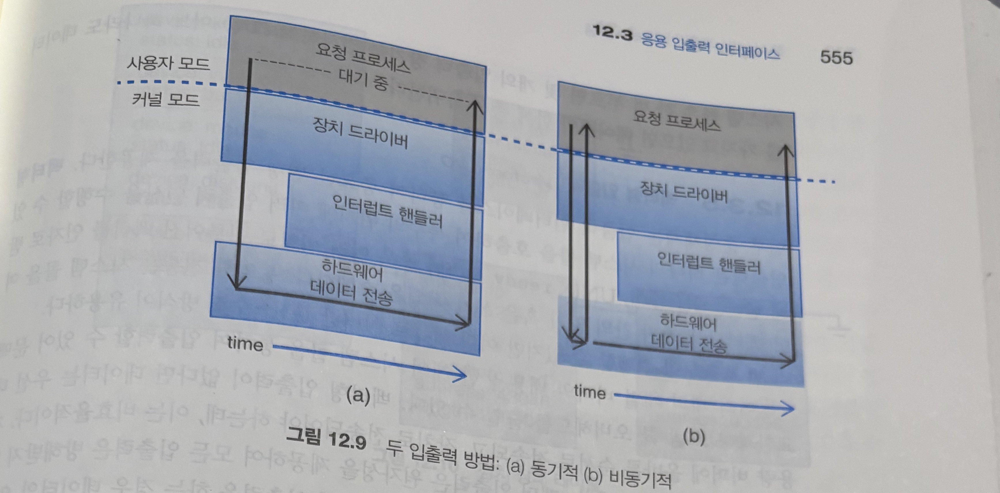

# 입출력 시스템 (12.1 ~ 12.3.5)

> **이어지는 맥락**
> 지금까지(10장 가상 메모리, 11장 대용량 저장장치)는 "데이터를 *어디에* 두고 어떻게 관리하나"를 봤다. 그런데 그 메모리·디스크·키보드·네트워크가 실제로 CPU와 **어떻게 신호를 주고받는가**는 아직 안 봤다.
> 이 장이 바로 그 연결선 — **입출력(I/O)** 그 자체다.
> 흐름은 셋이다. ① 하드웨어가 물리적으로 어떻게 붙고 신호를 주고받나(**12.2**) → ② 그 잡다한 하드웨어를 OS가 어떻게 **한 줌의 표준 인터페이스**로 추상화해 응용에 보여주나(**12.3**) → (다음 범위) 커널이 제공하는 입출력 서비스(12.4~).
> 핵심 질문 하나로 꿰면 된다: **"수천 종류의 장치를, 응용 프로그램은 어떻게 똑같은 방식으로 다룰 수 있나?"**

---

## 12.1 개관 (Overview)

컴퓨터의 두 가지 주요 작업은 **계산(computing)** 과 **입출력(I/O)** 이다. 그리고 많은 경우 **주인공은 입출력 쪽**이다 — 웹 페이지를 편집할 때 우리가 실제로 하는 일은 대부분 정보를 읽고 기록하는 것이지, 무거운 연산이 아니다.

이때 운영체제의 역할은 **입출력 작업과 입출력 장치를 관리·제어**하는 것. 이 장에서 다루는 것:

- 입출력 **하드웨어의 기본 원리** (12.2)
- OS가 제공하는 입출력 서비스와, 그것을 응용에 노출하는 **응용 인터페이스** (12.3)
- 하드웨어 인터페이스와 응용 인터페이스 **사이의 간극을 OS가 어떻게 메우나**
- (이후 범위) STREAMS, 입출력 성능

---

## 12.2 입출력 하드웨어 (I/O Hardware)

### 장치는 많지만, 알아야 할 개념은 셋뿐

세상의 장치는 크게 — **저장장치**(디스크·테이프), **전송장치**(네트워크·블루투스), **사용자 인터페이스 장치**(스크린·키보드·마우스·오디오)로 나뉜다. 조이스틱 같은 특수 장치까지 더하면 끝이 없다. 하지만 이들이 **어떻게 붙고 어떻게 제어되는지**를 이해하는 데는 **세 개의 개념**이면 충분하다. 한 문장으로 미리 요약하면 — **장치는 〈포트〉라는 꽂는 자리를 통해, 〈버스〉라는 공용 전선을 타고, 〈컨트롤러〉라는 두뇌의 통역을 거쳐** 컴퓨터와 대화한다.

#### ① 포트(port) — "장치를 꽂는 그 구멍"

장치가 컴퓨터와 신호를 주고받는 **물리적 연결점(접속구)**. 노트북 옆면의 USB 구멍, 예전 PC 뒤의 직렬 포트가 바로 port다. "여기에 꽂으면 컴퓨터와 통신이 시작되는 그 자리"라고 보면 된다.

> 비유: **벽의 콘센트 구멍**. 콘센트 자체는 전기를 만들지도, 무슨 기계인지 알지도 못한다. 그냥 "여기 꽂으면 연결된다"는 **접점**일 뿐이다.

#### ② 버스(bus) — "여러 장치가 같이 쓰는 공용 전선 + 통신 규칙"

장치 하나마다 컴퓨터까지 전용선을 까는 건 낭비다. 그래서 **여러 장치가 공유하는 한 묶음의 전선(wire)** 을 깔고 거기에 다 같이 붙인다 — 이게 bus. 단, 여럿이 한 전선을 쓰니 **"언제 누가 말할지, 신호(전압 패턴)를 어떤 의미로 해석할지"** 정하는 약속이 반드시 필요한데, 이 약속이 **프로토콜(protocol)** 이다. 즉 **버스 = 공용 전선(하드웨어) + 프로토콜(규칙)**.

> 비유: **여러 집이 함께 쓰는 복도(전선)** 와, 복도에서 지켜야 할 **통행 규칙(프로토콜)**. 전선만 있고 규칙이 없으면 신호가 뒤엉켜 아무 의미도 못 만든다.

- **데이지 체인(daisy chain)**: 모든 장치를 컴퓨터에 직접 꽂는 대신, **A를 컴퓨터에, B를 A에, C를 B에** 줄줄이 잇는 연결 방식. 이렇게 사슬처럼 엮인 장치들도 **하나의 버스처럼** 동작한다. (옛 SCSI 장치들을 줄줄이 연결하던 방식이 대표적.)

#### ③ 컨트롤러(controller) — "포트·버스·장치를 실제로 작동시키는 두뇌"

포트(꽂는 자리)와 버스(전선)가 있어도, **전기 신호를 실제로 만들고 해석해서 장치를 움직이는 전자회로**가 있어야 한다. 그게 controller — CPU가 "이거 해라"라고 보낸 명령을 받아 장치가 알아듣는 신호로 바꿔주고, 장치의 응답을 다시 CPU가 읽을 수 있는 형태로 돌려주는 **중간 통역·실행자**다.

> 비유: 콘센트(포트)와 복도(버스)는 있어도, 실제로 **모터를 돌리고 신호를 해석하는 회로**가 있어야 기계가 움직인다. 그 회로 뭉치가 컨트롤러다.

컨트롤러는 단순할 수도(직렬 포트 = 칩 하나), 복잡할 수도 있다(아래 FC 컨트롤러 = 보드 한 장). CPU가 이 컨트롤러와 **어떻게 대화하는지**가 바로 다음 절(12.2.1)의 주제다.


#### 이 그림(12.1)이 말하려는 것 — "버스는 하나가 아니라, 속도별로 여러 층이다"

방금 본 port·bus·controller가 실제 PC에서 어떻게 배치되는지 보여주는 게 그림 12.1이다. 여기서 얻을 핵심 통찰 하나: **모든 장치를 같은 버스에 붙이지 않는다.** 빠른 장치와 느린 장치를 **속도가 다른 버스로 나눠** 단다. 왜? 느린 장치 하나가 공용 전선을 점유하면 빠른 장치까지 같이 느려지기 때문이다.

- **PCIe 버스 (고속 도로)** — 프로세서·메모리 같은 **빠른 핵심부**와 그래픽·디스크 컨트롤러 같은 **빠른 장치**를 잇는 버스. 그림에서 한가운데를 가로지르는 굵은 선이 이거다.
- **확장 버스 (이면 도로)** — 그 PCIe 버스에 매달려, 키보드·직렬 포트·USB처럼 **느린 장치**들을 모아 붙이는 버스. 느린 애들끼리 따로 묶어 둬서 고속 도로(PCIe)를 안 막는다.

> 정리하면 — 그림 12.1은 "**빠른 버스 ↔ 느린 버스를 계층으로 나누고, 장치를 속도에 맞는 버스에 꽂는다**"는 한 가지를 보여주는 그림이다.

#### (보충) PCIe가 "빠른" 비결 — 레인(lane)

PCIe가 고속인 이유를 한 꺼풀 더 보면 **레인(lane)** 개념이 나온다. 레인 하나 = **양방향 동시 통신이 가능한 신호선 한 쌍**이고, 이 레인을 **여러 개 묶을수록 대역폭이 비례해서 커진다** (찻길의 차선을 늘리는 것과 똑같다).

- 링크는 `x1, x2, x4, x8, x16, x32`처럼 레인 수를 가질 수 있다. 숫자가 클수록 빠르다.
- 표기 읽는 법: `PCIe gen3 x8` = **3세대(gen3) PCIe를 8레인(x8)으로** 쓴다는 뜻 → 최대 처리량 약 **8 GB/s**.
- → 그래서 대역폭을 많이 먹는 그래픽 카드는 `x16`, 일반 장치는 `x1~x4`를 쓰는 식으로 **필요한 만큼 차선을 배정**한다.

#### (보충) 컨트롤러는 단순할 수도, 보드 한 장만큼 복잡할 수도

앞서 컨트롤러를 "장치를 작동시키는 두뇌"라고 했는데, 그 **두뇌의 덩치가 장치마다 천차만별**이라는 점도 알아두면 좋다.

| | 단순한 컨트롤러 | 복잡한 컨트롤러 |
|---|---|---|
| 예 | **직렬 포트** 컨트롤러 | **광섬유 채널(FC)** 컨트롤러 |
| 형태 | **칩 하나**로 끝 | **호스트 버스 어댑터(HBA)** 라는 **별도 회로 보드** |
| 속내 | 단순 신호 변환만 | 프로토콜이 복잡해 **마이크로코드 + 전용 메모리 + 프로세서**까지 내장(작은 컴퓨터 수준) |

> 즉 컨트롤러는 "칩 한 조각"부터 "거의 작은 컴퓨터"까지 스펙트럼이 넓다 — 다룰 프로토콜이 복잡할수록 컨트롤러도 비대해진다.

### 12.2.1 메모리 맵드 입출력 (Memory-Mapped I/O)

**질문:** CPU는 명령어와 데이터를 컨트롤러에 **어떻게 전달**하나? → 컨트롤러는 **레지스터**를 갖고 있고, CPU가 그 레지스터에 비트를 읽고 쓰면 된다. 그 "읽고 쓰는" 방법이 두 가지다.

| 방식 | 설명 |
|---|---|
| **특별한 입출력 명령어** | 한 바이트/워드를 **입출력 포트 주소**로 보내는 전용 명령어 사용 |
| **메모리 맵드 입출력** | 장치 제어 레지스터를 **CPU의 주소 공간(메모리 주소)에 사상**. CPU는 그냥 **일반 메모리 읽기/쓰기 명령**으로 장치를 제어 |

> 그래픽 컨트롤러가 대표적 — 기본 제어는 입출력 포트로 하지만, 스크린에 뿌릴 내용은 **큰 메모리 맵드 영역**에 기록한다. 수백만 바이트를 쓸 땐 메모리에 직접 쓰는 게 입출력 명령보다 **훨씬 빠르기** 때문. 그래서 오늘날 대부분의 I/O는 메모리 맵드 방식이다.

**컨트롤러의 네 가지 레지스터**

| 레지스터 | 방향 | 역할 |
|---|---|---|
| **입력(data-in)** | 호스트가 읽음 | 장치 → 호스트로 들어오는 데이터 |
| **출력(data-out)** | 호스트가 씀 | 호스트 → 장치로 내보낼 데이터 |
| **상태(status)** | 호스트가 읽음 | 명령 완료됐나·읽을 바이트 있나·오류 났나 |
| **제어(control)** | 호스트가 씀 | 명령 내리거나 모드 변경(예: 쌍방향/단방향, 패리티, 7/8비트) |

데이터 레지스터는 보통 1~4바이트. 갑자기 데이터가 몰릴 때를 대비해 **FIFO 칩**으로 버퍼를 키우기도 한다.

<details>
<summary>📖 책에 없는 내용 — 안드로이드/리눅스에서 MMIO와 그래픽 버퍼</summary>

이 절의 "장치 레지스터를 메모리 주소로 사상한다"가 안드로이드(=리눅스 커널) 드라이버에서 매일 일어나는 일이다.

- **`ioremap()`** — 리눅스 드라이버는 장치의 물리 레지스터 영역을 `ioremap()`으로 **커널 가상 주소에 매핑**한 뒤 `readl()`/`writel()`로 접근한다. 책의 메모리 맵드 입출력 그 자체. (`/proc/iomem`을 보면 각 장치가 차지한 물리 주소 범위가 보인다.)
- **프레임버퍼·`dma-buf`** — 화면에 뿌릴 픽셀은 "큰 메모리 맵드 영역"이라는 책의 설명 그대로, 안드로이드는 GPU/디스플레이가 공유하는 큰 버퍼(`ION`→현재 `dma-buf`)를 두고 거기에 픽셀을 쓴다. `SurfaceFlinger`가 이 버퍼를 합성해 디스플레이 컨트롤러로 넘긴다.
- 핵심 공통점: **"조금 제어하는 레지스터"는 작은 MMIO로, "대량 데이터(픽셀)"는 큰 메모리 영역으로** — 책이 그래픽 컨트롤러를 예로 든 이유가 모바일 그래픽 스택에서 그대로 재현된다.

</details>

### 12.2.2 폴링 (Polling)

호스트↔컨트롤러 사이의 핸드셰이킹. 두 비트가 핵심이다 — 상태 레지스터의 **busy 비트**, 명령 레지스터의 **command-ready 비트**. (비트를 **설정(set)** = 1을 쓴다, **소거(clear)** = 0을 쓴다.)

**출력 한 바이트의 협상 순서**

1. 호스트가 busy 비트가 **소거될 때까지 반복해서 읽음** (← 이게 폴링)
2. 호스트: 제어 레지스터에 write 비트 설정 + data-out에 바이트 씀
3. 호스트: command-ready 비트 설정
4. 컨트롤러: command-ready를 보고 자신의 busy 비트 설정
5. 컨트롤러: 명령 읽고(write), data-out 읽어 장치로 출력
6. 컨트롤러: command-ready·오류·busy 비트 소거 → 끝

**문제 — 바쁜 대기(busy-waiting)**

1번에서 호스트는 비트가 바뀔 때까지 **계속 돌며 검사**한다. 장치가 빠르면 괜찮다(폴링 한 번 = CPU 명령 3개: 레지스터 읽기 → 논리곱으로 비트 추출 → 분기). 하지만 **장치가 느린데 폴링을 반복하면** CPU가 헛돌며 다른 유용한 작업이 밀린다.

> → 그래서 "준비되면 장치가 **먼저 알려주게**" 하는 게 낫다. 그 하드웨어 메커니즘이 **인터럽트**.

### 12.2.3 인터럽트 (Interrupts)

**기본 골격:** CPU에 **인터럽트 요청 라인(IRQ line)** 이 있고, CPU는 **매 명령어 실행 후 이 선을 검사**한다. 컨트롤러가 이 선에 신호를 보내면(=인터럽트 야기) → CPU가 알아차리고 상태를 저장한 뒤 **인터럽트 핸들러 루틴으로 점프** → 처리 후 **인터럽트 복귀(return from interrupt)** 로 원래 작업 재개.


> **규모 감각** — macOS의 `latency` 명령으로 보면, **아무 일도 안 하는** 데스크톱이 10초 동안 약 **23,000개**의 인터럽트를 처리한다. 인터럽트는 예외적 사건이 아니라 시스템의 평상시 호흡이다.

**현대 OS가 추가로 요구하는 것 4가지**

1. 특정 상황에서 인터럽트를 **잠시 미루는** 능력
2. 어느 장치가 인터럽트했는지 **폴링 없이 알아내는** 방법
3. 긴급도에 따라 먼저 응답하는 **다수준 인터럽트(우선순위)**
4. 페이지 폴트·0으로 나누기처럼 OS 개입이 필요한 일을 (입출력과 별개로) **트랩(trap)** 으로 처리

이를 위한 하드웨어 장치들:

| 메커니즘 | 내용 |
|---|---|
| **두 개의 IRQ 라인** | **마스크 불가(nonmaskable)** = 회복 불가 메모리 오류 등 / **마스크 가능(maskable)** = 주요 명령 시퀀스 전에 CPU가 잠시 꺼둘 수 있음. 장치 컨트롤러는 이쪽 사용 |
| **인터럽트 벡터** | 작은 정수(주소)로 **벡터 테이블의 오프셋**을 가리켜 핸들러 주소를 바로 찾음 → 모든 장치를 뒤질 필요 없음 |
| **인터럽트 사슬화(chaining)** | 장치가 벡터 칸 수보다 많을 때, 각 벡터 원소가 **여러 핸들러의 리스트**를 가리킴 |
| **우선순위 수준** | 높은 우선순위 인터럽트가 낮은 것을 **선점(preempt)** — 일일이 마스크 오프 안 해도 됨 |

> **그림 12.5 (Intel Pentium 이벤트-벡터 테이블)**: `0~31`번은 **마스크 불가** — 0으로 나누기(0), 페이지 폴트(14), 위치 정렬 체크(17), 부동소수점 오류(16) 등 시스템 크래시·디버깅용. `32~255`번은 **마스크 가능** — 장치가 생성하는 인터럽트용.

**예외(exception)도 같은 메커니즘** — 0으로 나누기, 없는 메모리 접근, 허용 안 된 특권 명령 시도 등은 모두 OS 루틴 수행을 요구하므로 인터럽트로 처리한다.

**FLIH / SLIH — 인터럽트 핸들러를 둘로 쪼개는 이유**

인터럽트 처리는 시간·자원이 제한돼 한 번에 다 하기 부담스럽다. 그래서 둘로 나눈다:

- **1차 인터럽트 처리기(FLIH)**: 문맥 교환, 상태 저장, **할 일을 큐에 넣는 것**까지만 — 빠르게 끝낸다.
- **2차 인터럽트 처리기(SLIH)**: 별도로 스케줄되어 **실제 작업**을 수행.

**다른 용도로도 쓰이는 인터럽트**

- **페이지 폴트** = 인터럽트의 일종. CPU가 하던 일 미루고 폴트 핸들러로 달려가 프로세스를 wait 큐로 보냈다가, 페이지가 올라오면 ready 큐로 옮긴다.
- **시스템 콜** = 응용이 라이브러리 루틴 호출 → **소프트웨어 인터럽트(트랩)** 실행 → 커널 모드로 전환. 트랩은 디스크·네트워크만큼 급하지 않으므로 **장치 인터럽트보다 낮은 우선순위**를 가진다.

**Solaris 방식** — 각 인터럽트를 **우선순위 가진 커널 스레드**에 대응시킨다. 높은 우선순위 핸들러 스레드가 낮은 것을 선점하고, 다중 처리기에서는 여러 핸들러가 **병렬로** 실행된다.

> 정리: **인터럽트 구동 I/O는 폴링보다 훨씬 일반적**이지만, **높은 처리량 I/O에는 폴링이 유리**할 때도 있다. 어떤 드라이버는 **발생률이 낮으면 인터럽트, 높아지면 폴링으로 전환**한다.

<details>
<summary>📖 책에 없는 내용 — FLIH/SLIH = 리눅스의 top-half / bottom-half (안드로이드 터치 한 번의 여정)</summary>

책의 FLIH/SLIH 분리가 안드로이드가 깔고 앉은 **리눅스 커널의 인터럽트 처리 구조** 그 자체다.

| 책 용어 | 리눅스/안드로이드 |
|---|---|
| **FLIH** (빠르게, 큐에만 넣음) | **top-half** (hardirq) — IRQ 비활성 상태에서 최소한만. 오래 끌면 안 됨 |
| **SLIH** (나중에 실제 작업) | **bottom-half** — softirq / tasklet / **threaded IRQ(`request_threaded_irq`)** 로 미뤄 수행 |

- **터치 한 번**: 터치 컨트롤러가 IRQ 발생 → top-half가 "데이터 왔다"만 기록하고 즉시 반환 → 실제 좌표 읽기·`InputReader` 전달은 bottom-half/스레드에서. 책이 말한 "FLIH는 큐에 넣기만, SLIH가 처리"가 손가락 끝에서 벌어진다.
- 왜 쪼개나: top-half가 길어지면 **그동안 다른 인터럽트가 막혀** 시스템 반응성이 무너진다 → 책의 "시간·자원 제한" 그대로.
- 안드로이드 성능 이슈로 유명한 **`ksoftirqd`** 가 바로 이 bottom-half(softirq)를 처리하는 커널 스레드. 네트워크 패킷이 폭주하면 여기서 CPU를 먹는다.

</details>

### 12.2.4 직접 메모리 접근 (DMA, Direct Memory Access)

**문제:** 디스크처럼 데이터가 많은 장치를, 비싼 범용 CPU가 **매 바이트 전송을 일일이 제어**(상태 비트 검사하며 1바이트씩 옮김 = **PIO, Programmed I/O**)하는 건 낭비다.

**해법:** **DMA 컨트롤러**에게 일을 위임한다.

1. 호스트가 메모리에 **DMA 명령 블록**을 쓴다 — `{소스 포인터, 목적지 포인터, 전송할 바이트 수}`.
2. CPU는 이 블록의 주소를 DMA 컨트롤러에 알려주고 **다른 일을 한다.**
3. DMA가 **직접 메모리 버스를 통해** 전송을 수행, 끝나면 CPU에 인터럽트.

- **분산-수집(scatter-gather)**: 한 DMA 명령으로 **연속되지 않은 여러 위치**를 한꺼번에 전송.
- 핸드셰이킹은 **DMA-request / DMA-acknowledge** 두 선으로.
- **사이클 스틸링(cycle stealing)**: DMA가 메모리 버스를 잠깐 점유하면 그동안 CPU는 (캐시는 써도) **주메모리 접근은 못 한다.** CPU를 살짝 늦추지만 전체 입출력 성능은 올라간다.
- **DVMA(direct virtual-memory access)**: 가상 주소로 DMA를 수행 → CPU·주메모리 개입 없이 두 메모리 맵드 장치 간 직접 전송.


> **보호 모드의 원칙** — 일반 프로세스는 장치 컨트롤러에 **직접 명령을 못 내린다.** 접근 제어를 보호하고, 잘못된/악의적 프로그램이 시스템을 크래시 내는 걸 막기 위해서다. 대신 커널이 안전한 저수준 함수를 제공한다.

<details>
<summary>📖 책에 없는 내용 — 안드로이드의 zero-copy와 dma-buf</summary>

DMA의 진짜 가치는 모바일에서 **"복사를 없애는 것(zero-copy)"** 으로 나타난다.

- **카메라 → 화면**: 카메라 센서가 찍은 프레임을 CPU가 한 바이트씩 옮기면 전력·발열 폭탄이다. 실제로는 DMA가 센서 버퍼를 곧장 ISP/GPU 버퍼로 옮기고, **`dma-buf`** 핸들(fd)만 프로세스 간에 넘긴다 — 픽셀 데이터는 **단 한 번도 복사되지 않는다.** 책의 scatter-gather + DVMA 발상의 실전판.
- **`MediaCodec`·`SurfaceTexture`** 가 버퍼 핸들만 주고받는 이유, 영상 재생 시 CPU 사용률이 낮은 이유가 이 DMA 기반 zero-copy다.
- 책의 "범용 CPU가 매 바이트를 제어하면 낭비"라는 한 문장이, 모바일에선 **배터리 수명과 발열**이라는 가장 체감되는 비용으로 직결된다.

</details>

### 12.2.5 입출력 하드웨어 요약 (Summary)

전자회로까지 내려가면 복잡하지만, OS 입장에서 알아야 할 개념은 이게 전부다:

- **버스** · **컨트롤러** · **입출력 포트와 레지스터**
- 호스트↔컨트롤러 간 **핸드셰이킹**
- 그 핸드셰이킹을 **폴링** 또는 **인터럽트**로 수행
- 큰 데이터 전송은 **DMA 컨트롤러**로 넘김

---

## 12.3 응용 입출력 인터페이스 (Application I/O Interface)

### 핵심 질문 — "수천 종류 장치를 어떻게 똑같이 다루나"

응용 프로그램은 디스크가 **어느 회사 무슨 모델인지 몰라도** 그 위의 파일을 열 수 있어야 하고, 새 디스크가 나와도 OS에 혼란을 주지 않고 추가돼야 한다. 답은 다른 소프트웨어 공학 문제와 같다 — **추상화·캡슐화·계층화(layering)**.


- **장치 드라이버(device driver)** = 각 장치의 구체적 차이를 숨기고, 커널 I/O 서브시스템에는 **똑같이 생긴 표준 인터페이스**로 보이게 하는 계층.
- 그래서 **새 장치 = 새 드라이버 하나만** 쓰면 OS 코드를 크게 안 고쳐도 붙는다. (단, **OS마다 드라이버 규격이 달라** Windows·Linux·AIX·macOS용을 각각 만들어야 하는 게 문제.)

**장치를 가르는 차원들 (그림 12.8)**

| 특성 | 종류 | 예 |
|---|---|---|
| 데이터 전송 모드 | 문자 / 블록 | 터미널 / 디스크 |
| 접근 방법 | 순차 / 임의 | 모뎀 / CD-ROM |
| 전송 스케줄 | 동기 / 비동기 | 테이프 / 키보드 |
| 공유 | 전용 / 공유 가능 | 테이프 / 키보드 |
| 장치 속도 | 지연·탐색시간·전송률·연산 간 지연 | — |
| I/O 방향 | 읽기전용 / 쓰기전용 / 읽기-쓰기 | CD-ROM / 그래픽 컨트롤러 / 디스크 |

**escape(back-door) 시스템 콜 — `ioctl()`**

표준 인터페이스로 안 잡히는 장치 고유 기능은? UNIX의 **`ioctl()`** 이 뒷문이다. 새 시스템 콜을 만들 필요 없이 **임의의 드라이버 기능**을 호출하게 해준다. 세 인자:

```
ioctl(장치 식별자(fd), 명령 정수, 포인터)
```

**장치 식별자 = (메이저, 마이너) 튜플** — 메이저는 **장치 유형**, 마이너는 **그 유형의 인스턴스**. `ls -l /dev/sda*` 하면 `brw-rw---- root disk 8, 0 .../sda` 처럼 메이저 `8`(이 디스크 종류), 마이너 `0,1,2,3`(파티션별 인스턴스)이 보인다.

### 12.3.1 블록 장치와 문자 장치 (Block and Character Devices)

| | **블록 장치 인터페이스** | **문자 스트림 인터페이스** |
|---|---|---|
| 단위 | 블록(고정 크기 덩어리) | 바이트 한 글자씩 |
| 기본 명령 | `read()`, `write()`, `seek()` | `get()`, `put()` |
| 대상 | 디스크 등 블록 지향 장치 | 키보드·마우스·모뎀·프린터·오디오 |
| 접근 | 보통 **파일 시스템**을 통해 | 도착 시점이 **예측 불가**한 입력에 적합 |

- **비공식 입출력(raw I/O) / 직접 입출력(direct I/O)**: 파일 시스템의 버퍼링·잠금 서비스를 **건너뛰고** 장치 제어권을 응용에 직접 넘김. 데이터베이스처럼 자체 버퍼링·잠금을 하는 응용이 OS의 중복 기능을 피하려 쓴다.
- **메모리 맵드 파일 접근**: 블록 장치 위층에 구현. 파일을 **가상 메모리에 사상**해 두고, `read`/`write` 대신 **메모리를 읽고 쓰듯** 파일에 접근. 내부적으로 **요구 페이징**을 쓰므로 효율적이고, 프로그래머에게도 편하다. (실행 파일 적재, 스왑 공간 접근에도 이 방식이 쓰인다.)

<details>
<summary>📖 책에 없는 내용 — 안드로이드는 메모리 맵드 파일 위에 서 있다</summary>

이 절의 "메모리 맵드 파일 = `read/write` 대신 메모리처럼 접근, 요구 페이징으로 효율적"이 안드로이드 런타임의 근간이다.

- **APK / `.dex` / `.so` 가 전부 `mmap`** — 앱의 코드·리소스는 파일에서 메모리 매핑(read-only)된다. 실제로 **참조되는 페이지만** 요구 페이징으로 올라오므로, 안 쓰는 코드는 메모리를 안 먹는다. (10장 정리의 "mmap된 clean page는 메모리 압박 시 그냥 버리고 회수"와 직접 연결.)
- **`MemoryFile` / `ashmem`** — 프로세스 간 큰 데이터(비트맵 등)를 공유 메모리로 매핑해 **복사 없이** 주고받는다. 책의 메모리 맵드 접근을 IPC에 응용한 것.
- **`ioctl()` 의 안드로이드 1순위 사용처 = Binder** — 안드로이드 IPC의 심장인 `/dev/binder`는 전부 `ioctl()`로 명령을 주고받는다. 책이 "표준 인터페이스로 안 잡히는 기능은 ioctl로"라 한 그 뒷문이, 안드로이드에선 **모든 앱-시스템 통신의 정문**이 됐다.

</details>

### 12.3.2 네트워크 장치 (Network Devices)

네트워크 입출력은 디스크의 `read-write-seek`와 **너무 달라서** 별도 인터페이스를 쓴다 — **소켓(socket) 인터페이스** (UNIX, Windows NT).

> **비유:** 소켓 = 벽의 전기 콘센트. 응용이 소켓을 만들어 로컬 소켓을 원격 주소에 연결(=내 소켓을 상대 소켓에 꽂음)하고, 연결되면 패킷을 주고받는다.

- **`select()`** — 네트워크 서버 구현의 핵심. "어느 소켓이 **받을 패킷이 와 있나**, 어느 소켓이 **보낼 여유가 있나**"를 알려준다. → 응용이 네트워크 상태를 **폴링하거나 바쁜 대기 할 필요가 없어진다.**
- 네트워크 세부사항을 캡슐화해, 임의의 하드웨어·프로토콜 스택 위에서 분산 응용을 개발할 수 있게 한다.
- 그 외 IPC/네트워크 방편: Windows는 NIC용·프로토콜용 인터페이스를 따로, UNIX는 **FIFO, full-duplex 파이프, STREAMS, 메시지 큐, 소켓** 등 풍부하게 제공.

### 12.3.3 클록과 타이머 (Clocks and Timers)

하드웨어 클록·타이머가 제공하는 **3가지 기본 기능**:

1. **현재 시각** 제공
2. **지난(경과) 시간** 제공
3. `T` 시각이 되면 **오퍼레이션 X 실행**

- **벌 타이머(programmable interval timer)** — 경과 시간 측정 + 주기적/일회성 인터럽트 발생. 쓰임새: 스케줄러의 **타임 슬라이스**, 주기적 **디스크 캐시 flush**, 네트워크 혼잡 처리.
- **virtual clock(타이머 추상화)** — 하드웨어 타이머 채널 수보다 **훨씬 많은 타이머 요청**을 지원하려고, 커널이 요청된 시각들을 **마감 시간 순으로 정렬**해 두고 가장 가까운 것으로 하드웨어 타이머를 설정. 만료되면 요청자에게 신호 보내고 다음으로 재설정.
- **HPET(고성능 이벤트 타이머)** — 최신 PC, ~10 MHz. 저장값과 일치할 때 트리거.
- **NTP(네트워크 시간 프로토콜)** — 시계 부정확성을 정교한 지연 계산으로 보정, **원자시계 수준**으로 유지.

<details>
<summary>📖 책에 없는 내용 — 안드로이드 타이머: 어느 시계를 쓰느냐가 버그를 가른다</summary>

이 절의 "현재 시각 vs 경과 시간"과 "virtual clock(요청을 마감순으로 모아 하드웨어 하나로 처리)"이 안드로이드 API에 그대로 있다.

- **`currentTimeMillis()` (벽시계) vs `elapsedRealtime()` (경과 시간)** — 책의 1번 vs 2번. 벽시계는 사용자가 바꾸거나 NTP로 점프할 수 있어 **경과 시간 측정에 쓰면 버그**(음수 간격 등). "얼마나 지났나"는 반드시 `elapsedRealtime`/`SystemClock`을 써야 한다 — 책이 둘을 구분한 이유의 실증.
- **`AlarmManager` = virtual clock 그 자체** — 수많은 앱의 알람 요청을 OS가 **마감 시간 순으로 모아**, 배터리를 위해 비슷한 시각의 알람을 **묶어서(batching)** 하드웨어 타이머를 최소 횟수로 깨운다. 책의 "요청들을 마감순 정렬 → 가장 가까운 것으로 설정"의 모바일 전력 최적화판.
- **Doze / `setExactAndAllowWhileIdle`** — 화면이 꺼지면 타이머를 더 공격적으로 묶어 깨우는 횟수를 줄인다. 타이머 추상화가 곧 배터리 정책이 된 사례.
- 네트워크 시간 보정은 안드로이드에선 **NITZ(통신사 시각)** 또는 NTP로 이뤄진다.

</details>

### 12.3.4 봉쇄형과 비봉쇄형 입출력 (Blocking and Nonblocking I/O)

세 가지 호출 방식을 구분하는 게 핵심이다.

| 방식 | 동작 | 비유 |
|---|---|---|
| **봉쇄형(blocking)** | 호출 스레드가 **봉쇄 상태로** — 실행 큐에서 대기 큐로 이동, I/O 끝나면 복귀. 작성이 **쉬움** | "끝날 때까지 기다림" |
| **비봉쇄형(nonblocking)** | **즉시 복귀**하되, **그 순간 가능한 만큼**(전체든 일부든)의 바이트만 주고 옴 | "지금 있는 것만 줘" |
| **비동기식(asynchronous)** | 호출 즉시 복귀, 스레드는 **자기 코드 계속 수행**. I/O가 끝나면 **나중에** 변수 세팅·시그널·콜백으로 알려줌 | "다 되면 그때 알려줘" |

**비봉쇄 vs 비동기의 결정적 차이** (헷갈리기 쉬움):

- **비봉쇄형 read**: *그 시점에* 가진 데이터를 (전체든 일부든) **즉시** 반환.
- **비동기식 read**: 입력이 **완전히 끝난 후**(시간이 좀 걸려도) **완전한 데이터**를 전송해 달라고 요청 → 스레드는 그동안 다른 일.

> **비봉쇄가 필요한 예** — 스크린에 데이터를 그리는 **중에** 키보드·마우스 입력을 받는 UI, 또는 영상 파일을 읽으며 동시에 압축 풀고 화면에 뿌리는 비디오 앱. (다중 스레드로도 비슷하게 짤 수 있다.)

> **비동기가 기본인 곳** — 보조저장장치/네트워크 **쓰기**는 보통 비동기. OS가 요청을 버퍼에 넣고 즉시 응용으로 돌아간 뒤, 여력이 생기면 실제로 기록한다. (일부 UNIX는 버퍼를 **30초마다** 디스크로 flush.)



> **`select()` 는 비봉쇄의 좋은 예** — 최대 대기 시간을 인자로, `0`이면 봉쇄 없이 **폴링만**. 단 `select()`는 "입출력이 **가능한지만** 검사"하므로, 실제 전송하려면 뒤에 `read()`/`write()`가 따라와야 한다(추가 오버헤드).

<details>
<summary>📖 책에 없는 내용 — 안드로이드의 NetworkOnMainThreadException, 그리고 Coroutine</summary>

이 절의 "봉쇄형은 짜기 쉽지만 스레드를 멈춘다"가 안드로이드에서 **앱 죽음(ANR)** 의 1번 원인이다.

- **메인 스레드 = UI 스레드는 봉쇄되면 안 된다** — 메인 스레드에서 봉쇄형 네트워크 `read()`를 하면 안드로이드는 아예 **`NetworkOnMainThreadException`** 으로 막아버린다. 5초 이상 봉쇄되면 **ANR(Application Not Responding)** 다이얼로그. 책의 "봉쇄형은 스레드를 대기 큐로 보낸다"가 UI에서 일어나면 화면이 얼어붙기 때문.
- **세 방식의 안드로이드 대응**:
  - 봉쇄형 → 별도 스레드(`Thread`, `Executor`)에서만.
  - 비동기/콜백 → 예전 `AsyncTask`, `OkHttp.enqueue(callback)` — 책의 "끝나면 콜백으로 알림" 그대로.
  - 오늘날 표준 → **Kotlin Coroutine** (`suspend` + `withContext(Dispatchers.IO)`). **코드는 봉쇄형처럼 순차적으로 읽히지만**, 실제로는 스레드를 점유하지 않고 양보(suspend)한다 — "작성은 봉쇄형이 쉽다"는 책의 장점과 "스레드를 안 멈춘다"는 비봉쇄의 장점을 합친 형태.
- **`select()` → 안드로이드/리눅스의 `epoll`** — 앱의 메인 루프인 **`Looper`** 가 `epoll`로 메시지 큐·입력·타이머 fd를 한꺼번에 감시한다. 책의 "select로 어느 소켓이 준비됐나 폴링 없이 안다"의 고성능 후신.

</details>

### 12.3.5 벡터형 입출력 (Vectored I/O)

**한 번의 시스템 콜로, 여러 위치에 대한 여러 입출력을 수행**하는 방식.

- 예: UNIX의 **`readv`** — 하나의 시스템 콜에 **여러 버퍼로 이루어진 벡터**를 인자로 줘서, 한 번의 전송으로 여러 곳을 채운다. = **분산-수집(scatter-gather)** 방식.
- **왜 좋은가:**

| 이점 | 설명 |
|---|---|
| **오버헤드 절감** | 여러 번 호출할 일을 **한 번의 시스템 콜**로 → 문맥 교환·시스템 콜 비용을 한 번으로 |
| **불필요한 복사 제거** | 벡터형이 없으면 데이터를 임시 버퍼에 모아 올바른 순서로 재배열해야 함 → 비효율. 벡터형은 곧장 제 위치로 |
| **원자성(일부 구현)** | 모든 입출력이 **방해받지 않음**을 보장 → 다른 스레드가 같은 버퍼를 건드려도 데이터 오염 회피 |

> 한 줄로: **시스템 콜 한 번에 여러 버퍼를 묶어** 처리량을 올리고 시스템 오버헤드를 줄이는 기법. 가능하면 프로그래머는 scatter-gather를 쓰는 게 이득이다.

---

> **여기까지가 12.3.5 범위.** 다음(12.4 커널 입출력 서브시스템)부터는 — 지금까지 본 "하드웨어(12.2) → 응용 인터페이스(12.3)"의 **사이에서 커널이 실제로 제공하는 서비스**(스케줄링·버퍼링·캐싱·스풀링·오류 처리)로 이어진다.
