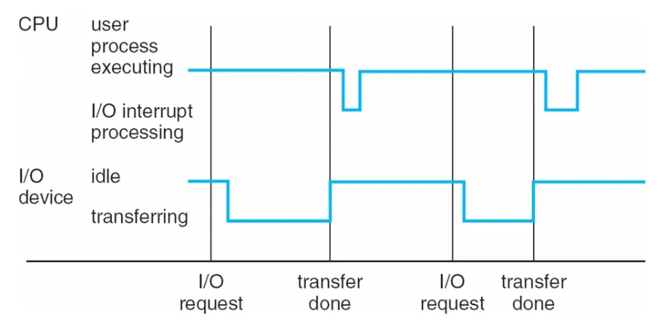
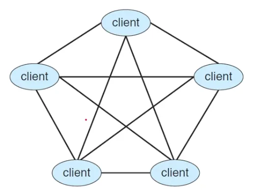

# 운영체제 스터디 1주차

Status: 진행중

운영체제란?

컴퓨터 시스템을 운영하기 위한 소프트웨어

컴퓨터

- 범용성 (universality)
    - not, and, or 게이트만으로 모든 계산을 할 수 있다.
    - nand 게이트만으로 모든 계산을 할 수 있다.
- 계산가능성 (computability)
    - turing-computable: 튜링 머신으로 계산 가능한 것
    - Halting Problem (정지 문제): 튜링 머신으로 풀 수 없는 문제

폰 노이만

→ stored-program 을 처음 만듦. (폰 노이만 아키텍처, ISA)

instruction-execution cycle을 폰 노이만 아키텍처라고 함.

- 컴퓨터에 내릴 수 있는 명령을 instruction set 으로 정의
- 이 set으로 정의된 프로그램을 메모리에 로딩
- 메모리의 명령어를 CPU가 fetch하고 execute 하는 사이클

운영체제

- 컴퓨터에서 항상 실행 중인 프로그램
- 시스템 서비스를 애플리케이션 프로그램에 제공해줌.
- 프로세스, 리소스, 유저 인터페이스 등을 관리

커널

: 운영체제에서 하드웨어와 소프트웨어를 연결하고 자원을 관리하는 프로그램

전통적인 컴퓨터 시스템

- CPU, device controller - bus 로 연결됨.

bootstrap 프로그램

컴퓨터 실행시 가장 먼저 실행되어 운영체제를 로드함.

Interrupts

I/O 디바이스와 CPU가 통신하는 방식

ex.) 키보드를 툴렀을 때 누른 동작을 CPU에 알려줄 때 Interrupts 방법으로 알려줌.

Multiprogramming

(program → instruction set)

메모리에 여러 개의 프로그램을 동시에 올리는 것

→ CPU 사용 효율을 높일 수 있음.

Multitasking (multiprocessing)

CPU 가 여러 처리를 돌아가면서 수행할 수 있도록 하는 것

CPU scheduling이 필요

user mode, kernel mode 로 나눔.

kernel mode 일 때만 하드웨어에 직접 접근할 수 있도록 함.

Virtualization

하나의 하드웨어에 여러 OS를 실행하는 것

최근의 컴퓨팅 환경 속의 OS

- traditional computing
- mobile computing
- client-server computing
- Peer-to-Peer computing → 나아가 블록체임

  n:n

  

- cloud computing (edge computing)