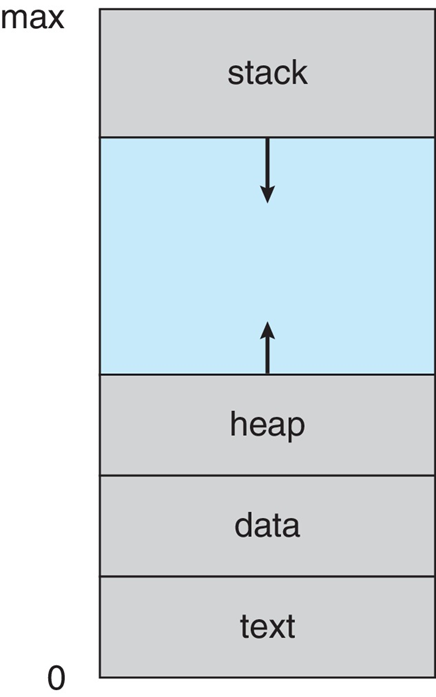
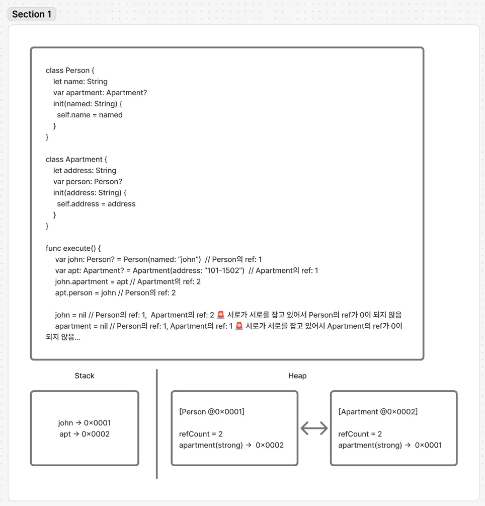
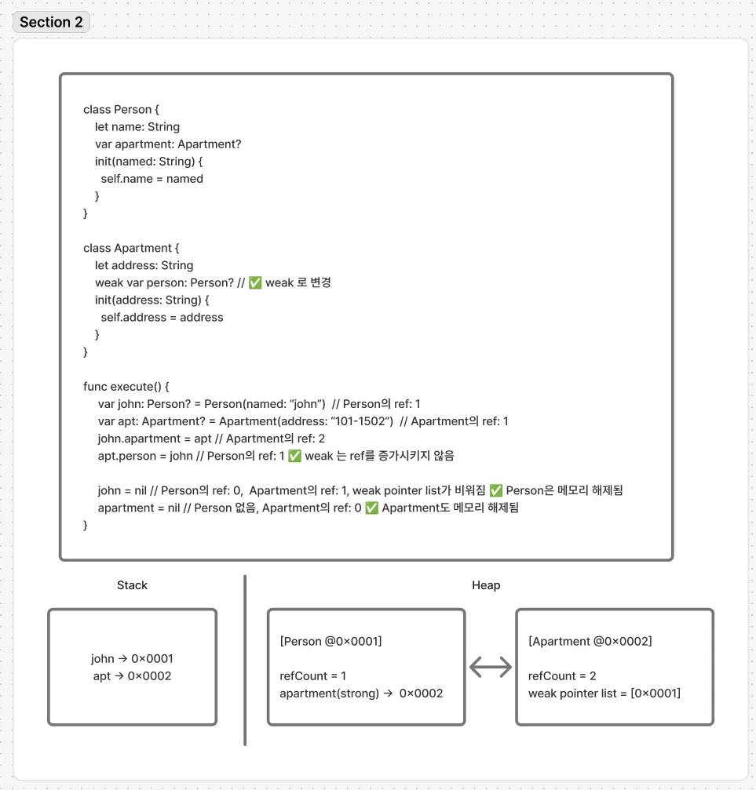

# iOS에서는 어떻게 변수를 메모리에 저장할까?




## [Stack]
- LIFO. 잠깐 쌓아두고 버리는 공간
- 컴파일 시점에 함수 호출시마다 Stack frame을 만들고 함수가 끝나면 메모리에서 해제됨 (OS가 자동으로 해제합니다)
- 접근이 빠르고 메모리 크기가 작음
- 값 타입이 저장됨 (Struct, Enum, Tuple)
- 핵심 이슈: Stack overflow

## [Heap]
- 런타임에 필요한 공간만큼 요청해서 사용 (수동으로 **ARC**가 관리
    - ARC (Automatic Reference Counting)
        - Swift 컴파일러의 기능으로, 컴파일 타임에 적절히 retain, release를 넣어줌
- 참조 타입이 저장됨 (class 인스턴스, Array, String, 클로저..)
- 접근이 느리지만 메모리 크기가 stack에 비해 상대적으로 큼
- 핵심 이슈: Memory Leak

## [ARC의 메모리 관리 방식과 memory leak 발생 과정]

ARC는 모든 heap 객체마다 아래처럼 메타 데이터를 붙임


- strong refCount: 정수 형태의 강한 참조 개수 (ex. 3)
- weak reference table entry: weak 포인트 리스트 (ex. [pnt1, pnt2…])

### Memory leak 예시 (순환 참조)



### Memory leak 발생하지 않는 예시 (weak)




## [Swift struct가 Heap으로 Escape하는 경우]
- 보통 struct와 같은 값타입은 stack에 저장되지만 컴파일러가 struct를 stack에 둘 수 없다고 판단하면 heap으로 escape 시킴
- 비동기적으로 실행되어 언제 실행될지 모르는데 stack에 있으면 함수가 종료되었을 때 메모리에서 해제되기 때문에 값을 안전하게 하기 위해 heap에 임의로 저장함


### 1. @escaping closure에서 캡처될 때
closure는 경우에 따라 함수가 종료된 후에도 실행될 수 있기 때문에, ARC는 안전을 위해 struct를 stack->heap으로 복사하고 클로저에서 heap에 있는 것을 참조시킴
```Swift
struct User {
    var name: String
}

func doSomething(_ closure: @escaping () -> Void) {
    DispatchQueue.global().async {
        closure()
    }
}

func test() {
    var user = User(name: "Haneul")

    doSomething {
        print(user.name)  // user 캡처
    }
}
```

### 2. inout 매개변수로 전달될 때
inout은 호출시 실제 메모리 주소를 참조하도록 하는 것인데, 함수 내부에서 그 변수를 비동기(async)로 접근하면
함수가 끝난 뒤에도 그 메모리를 참조할 위험이 있음
ARC는 heap 객체를 만들어서 참조 카운트를 올리는 방식으로 관리함 
```Swift
struct User { var age: Int }

func modify(_ u: inout User) {
    DispatchQueue.global().async { // 아래 클로저 내부 코드들을 modify 함수 내부에서 비동기적으로 실행시킨다고 보면 됨
        print(u.age) // u를 다른 스레드에서 접근
    }
}

func test() {
    var user = User(age: 27)
    modify(&user)
}
```

### 3. Captured mutable struct
c가 변경 가능한(mutating)상태로 클로저에 캡쳐되면 heap에 올려둬야 나중에 안전하게 closure를 실행할 수 있음
```
struct Counter {
    var count: Int = 0
    mutating func increase() { count += 1 }
}

var c = Counter()

let closure = {
    c.increase() // mutating captured variable
}
```
