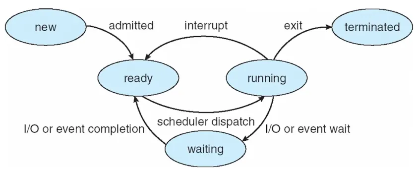
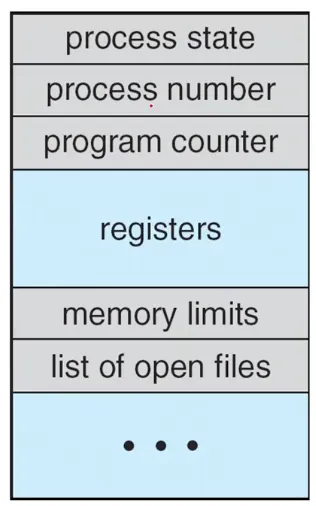
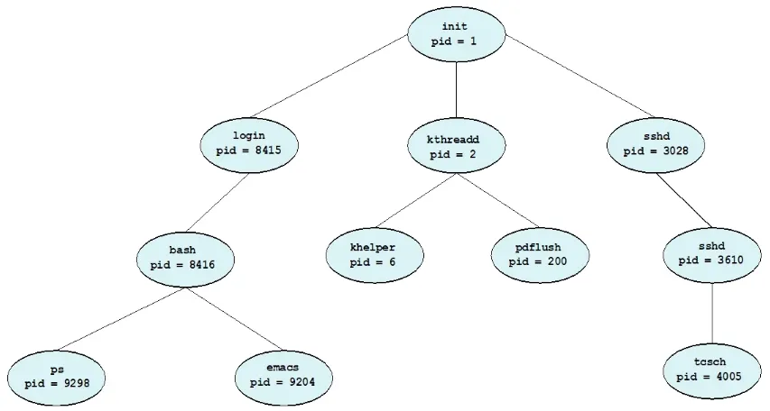
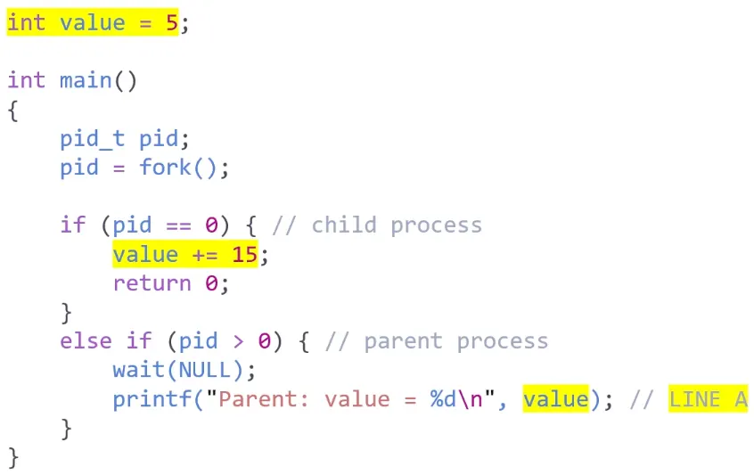
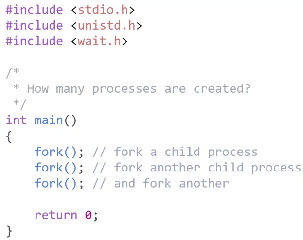

# 운영체제 스터디 2주차 강의 정리

강의 섹션 3 1~2파트

## Process
실행중인 프로그램

- OS에서 작업의 단위
- CPU time, memory, file, I/O 디바이스 사용

→ OS는 프로세스를 관리하는 일을 해야 함.

## Memories of Process

- Text section
- Data section
- Heap section
- Stack section

## States of Process

- New
- Running
- Waiting
- Ready
- Terminated

## PCB(Process Control Block)

또는 TCB(Task Control Block)

: 프로세스가 가져야 하는 정보들을 저장

- 저장되는 정보들
    - Process state
    - Program counter
    - CPU registers
    - CPU-scheduling info
    - Memory-management info
    - Accounting info
    - I/O status info

## Multi Process

- CPU를 효율적으로 사용하기 위함.

### Scheduling Queue

- ready queue
- wait queue

### Context Switch
process 의 state 가 변경되는 것

- context 는 PCB에 저장됨.
- CPU를 다른 프로세스에 할당해주는 것
    - 기존 프로세스의 state 를 저장하고, 다른 프로세스의 state 를 restore 함.

## Tree of Process

- 프로세스 실행 방법
    - parent, children 이 동시에 실행
    - children이 terminated될 때 까지 parent가 wait.t

- address-space 복제
    - parent 를 복제
    - 새로운 프로그램을 로드

### Orphan process
parent process 가 wait 하지 않고 terminate 됨.

### Zombie process
child process 가 terminate 됐지만, parent process 가 아직 wait 이 아님.

## UNIX like OS

- fork()로 프로세스 생성
- child 프로세스는 parent 프로세스의 address space를 복사
- fork()의 return
    - child process: 0
    - parent process: 0이 아닌 child process의 pid

<예제 1>

- 결과
  Parent: value = 5
- child process의 value가 처음에는 parent process와 같은 메모리를 공유하지만, 데이터를 바꾸려하는 시점에 복사되어 child process의 PCB에 별도로 저장됨.
  → child process와 parent process의 전역 변수 값 자체를 공유하지는 않음.

<예제 2>

- 결과
  8개
- 맨 처음: 1개
    - 1번 fork(): 2개
        - 2번 fork(): 4개
            - 3번 fork(): 8개