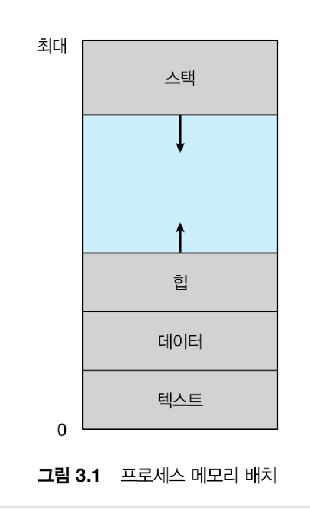
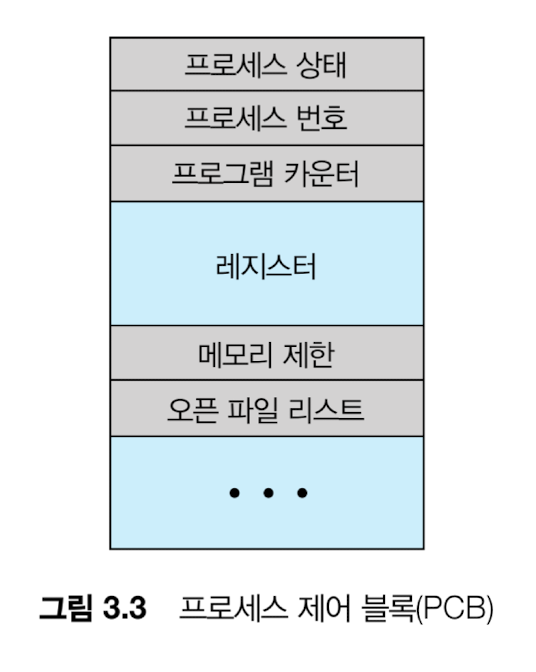
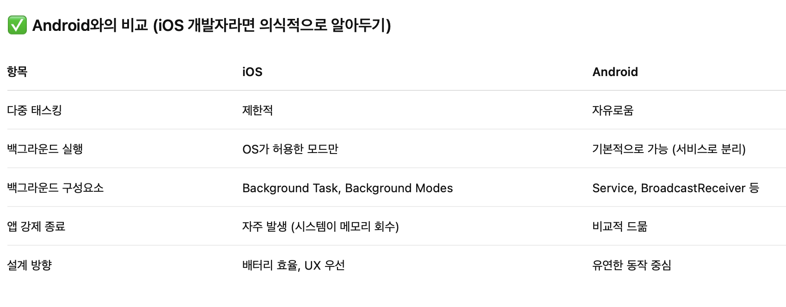
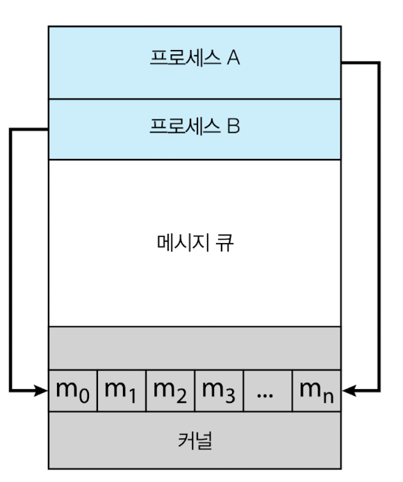
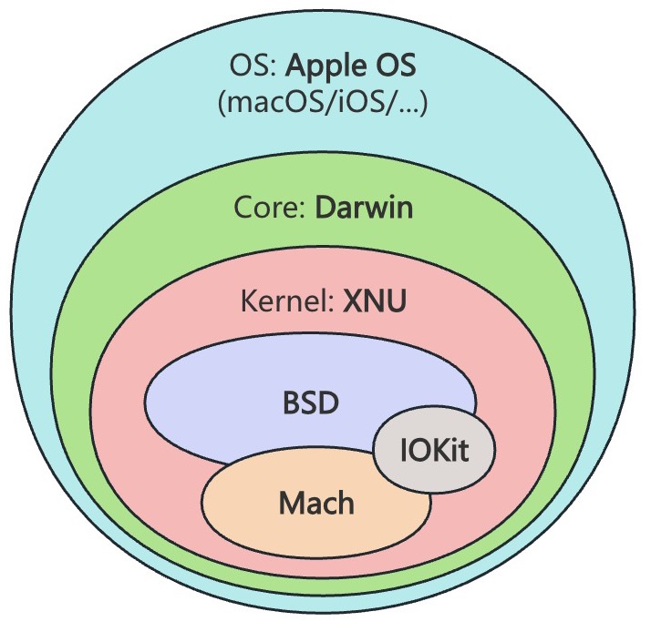
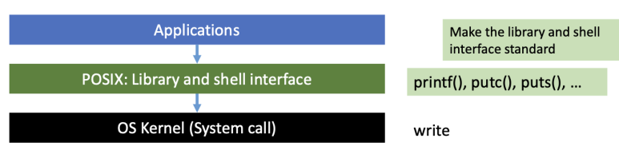
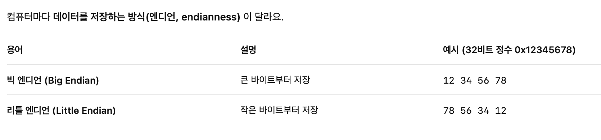

- 멀티 프로세스: 서로 다른 메모리 주소 갖고 실행되는 프로세스를 동시에 실행하는 흐름
- 멀티 스레딩: 한 프로세스 내에서 같은 메모리를 공유하며 동시에 실행하는 흐름. (스택은 별도)
- 멀티 태스킹: 프로세스나 스레드를 오가며 CPU에서 점유하도록 하는 CPU 스케줄링

## 프로세스의 요소

## 프로세스 상태

⇒ os 커널 영역 메모리에 PCB(process control block)를 저장함

레지스터에는 CPU 안의 레지스터 값(PC, SP, 누산기 등)을 저장 → 다시 CPU 할당 후(context switch)에 이어서 작업하기 위함

## 프로세스 스케줄링 (시분할, Context Switch)

- I/O 바운드 프로세스: 계산보다 I/O에 더 많은 시간 소비
- CPU 바운드 프로세스: I/O보다 계산에 더 많은 시간을 사용

- ready queue, waiting queue: 헤더에 리스트의 첫번째 PCB에 대한 포인터가 저장. 각 PCB에는 다음 PCB를 가리키는 포인터 필드가 포함
    - I/O완료나 인터럽트. 자식 프로세스가 끝나기를 기다리는 동안 waiting queue로 들어갔다가 완료되면 ready queue로 이동하는 방식을 반복
- 과거 프로세스 문맥을 PCB에 저장하고 새 프로세스의 문맥을 복구한다.

iOS는 앱을 백그라운드에 오래 두면 webview process가 메모리에서 자동으로 날라감.. 앱 열었을 때 웹뷰 로드를 다시 해도 로컬스토리는 복구되지 않음

## IPC (프로세스간 통신)

### 생산자-소비자 문제

생산자는 데이터를 만들어서 버퍼에 넣고 소비자는 그걸 꺼내씀. 소비자가 빠르게 소비하지 못해서 생산자가 더 이상 저장하지 못하거나, 데이터가 없는데 소비자가 소비하려고 하는 등의 문제 발생

### 공유 메모리

협력 프로세스간 공유하는 메모리 영역을 구축하여 사용한다. 구축에만 시스템콜을 이용한다.

### 메시지 전달

협력 프로세스간 공유하는 메시지를 통해 이루어짐. 시스템콜을 이용하기 때문에 공유메모리보다 더 많은 시간이 걸린다. 

- direct: 딱 두 프로세스에만 링킹
- undirect: 메일박스에 담아두고 필요한 프로세스가 가져가는 방식
- async: send, receive 명령을 하고 기다리지 않고 다른 작업을 이어감
- sync: send, receive 명령을 하고 끝날 때 까지 기다림

### POSIX 공유 메모리

POSIX: 유닉스(Darwin이나 Linux)의 API. 애플리케이션에서 시스템콜을 할 때 사용

### 파이프

두 프로세스간 통신을 허용하는 단방향 통신 형태. 하나의 기계 내에 존재해야 한다.

다른 기계와 통신하려면 소켓을 사용해야 한다.

### 소켓

클라이언트-서버 구조를 사용하며, 서버는 지정된 포트에 크라이언트 요청을 수신받아 연결 수락한다. 모든 연결은 유일하다.  구조화되지 않은 바이트 스트림만을 통신한다. 이 원시적인 데이터를 해석하는 것은 클라이언트와 서버의 책임이 된다.

### 소켓의 대안, 원격 프로시저 호출(RPC: remote procedure call)

메시지 전달 방식. (OS를 지속적으로 이용하는 방식)

- 스텁(stub): RPC를 가능하게 해주는 대리자. 클라이언트 스텁, 서버 스텁이 있어서 네트워크 통신을 대신해줌
- XDR (External Data Representation): 모든 기종이 이해할 수 있는 표준 데이터 표현 방식

송신 측은 XDR 형식으로 변환해서 보내고, 수신 측은 해석해서 자기 CPU가 이해할 수 있는 방식으로 바꾼다.

- 실행 의미(semantics): 네트워크 오류나 중복 때문에 여러 번 실행될 수 있는 상황을 규제할 방식을 미리 정해놓고 OS가 이를 보장해줌
    
    
    
    예시
    
    ⇒ 타임스탬프나 요청 Id를 저장해두었다가 그 이상으로 요청이 오면 무시함
