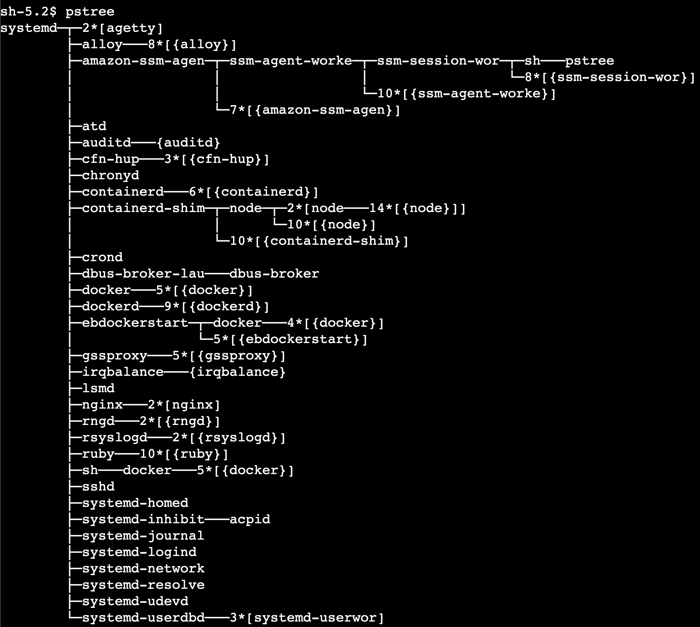

# 운영체제 스터디 3주차 키워드

실제 서비스 환경에서의 `pstree`를 찍어보자!

# Docker

## dockerd

- Docker 데몬 (도커 엔진)
- 이미지 관리, 컨테이너 실행 요청, 네트워크 볼륨 등 전체 orcestration 담당

## containerd

- 도커 내부의 하위 런타임
- 실제 컨테이너 생성·삭제·리소스 관리 담당

## containerd-shim

- Node.js 컨테이너가 실행될 때 실제 부모 프로세스가 containerd-shim이다.
- 왜 shim이 필요한가?
    - 컨테이너 내부 앱이 종료되어도 containerd가 죽지 않도록 분리
    - stdout/stderr를 shim이 잡아서 docker logs로 전달
    - re-parenting 문제 해결 (좀비 프로세스 회수)
    - containerd가 컨테이너의 lifecycle에 너무 깊이 관여하지 않도록 중간 계층을 제공

---

# Node.js

## node

- 실제 Node.js 서버 메인 프로세스
- 컨테이너 안에서는 PID 1일 가능성이 매우 높음.

## 14*[{node}]

- Node.js가 생성한 worker thread, event loop 내부 helper threads → v8 엔진 및 libuv가 내부적으로 사용하는 스레드들
- n*[{name}]인 경우 name이 생성한 스레드의 개수가 n개 있다는 뜻
- Node.js가 보통 생성하는 스레드
    - 1 main thread: JavaScript 실행 / 이벤트 루프
    - 4 FS threadpool: libuv file I/O 스레드 (fs.readFile 등)
    - V8 background threads: GC, compiler 작업
    - Node internal threads: DNS lookup 등)

---

# 기타

## ststemd

- 모든 프로세스의 최상위 부모
    - 서비스 시작/중지
    - 로그 수집
    - 네트워크/스토리지 초기화
    - 데몬 관리

## nginx

- nginx—2*[nginx]
  : 자식 프로세스가 2개 존재한다는 의미
  - nginx는 주로 1개의 master 프로세스와 여러 개의 worker 프로세스를 가짐.
  - master process에서 설정을 읽고 worker에 fork 하면 여러 개의 worker process가 HTTP 요청을 처리함.
  - 리버스 프록시: 80, 443 포트로 들어온 요청을 Node 컨테이너에 전달
  - 정적 파일 제공
  - Keep-alive 관리
  - HTTP connection 관리
  - SSL/TLS termination

## sshd

- SSH 접속 프로세스
- 로그인/권한 관리