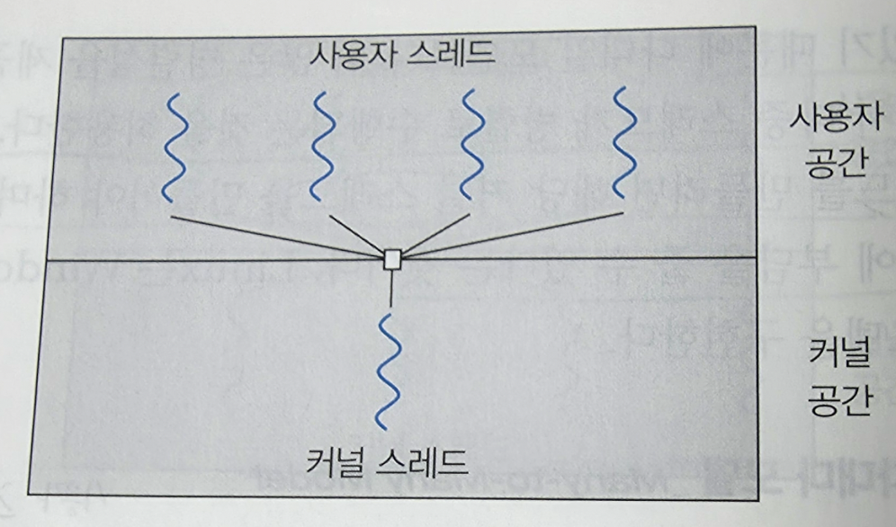
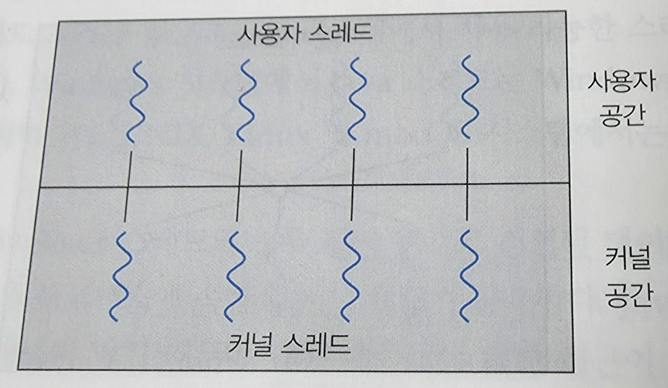
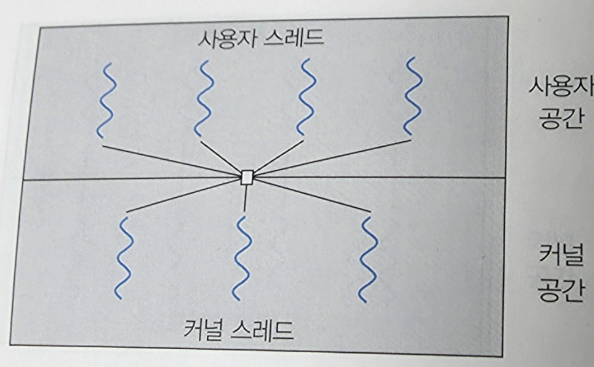

# 운영체제 스터디 4주차 정리

Chapter 4. 스레드와 병행성

프로세스 생성 작업은 매우 많은 시간을 소비하고 많은 자원을 필요로 하는 일이다.

프로세스 안에 여러 스레드를 만드는 것이 더 효율적이다.

웹 서버가 다중 스레드화 되면, 서버는 클라이언트의 요청을 llisten 하는 별도의 스레드를 생성한다.

Linux 시스템 - 시스템을 부트하는 동안 여러 커널 스레드가 생성된다.

장치 관리, 메모리 관리, 인터럽트 처리 같은 작업을 수행

ps -ef 명령으로 커널 스레드를 표시할 수 있음.

## 장점

### 응답성 (responsiveness)

- 응용 프로그램의 일부분이 봉쇄되거나 긴 작업을 수행하더라도 프로그램의 수행이 계속되는 것을 허용함으로써 사용자에 대한 응답성을 증가시킨다.
- 시간이 오래 걸리는 연산이 별도의 비동기적 스레드에서 실행된다면 응용은 여전히 사용에게 응답할 수 있다.

### 자원 공유 (resource sharing)

- 스레드는 자동으로 그들이 속한 프로세스의 자원들과 메모리를 공유한다.
- 코드와 데이터 공유의 이점은 한 응용 프로그램이 같은 주소 공간 내에 여러 개의 다른 작업을 하는 스레드를 가질 수 있다는 점이다.

### 경제성 (economy)

- 자신이 속한 프로세스의 자원들을 공유하기 때문에 스레드를 생성하고 문맥 교환하는 것이 더 경제적이다.
- 스레드 생성은 프로세스 생성보다 시간과 메모리를 덜 소비한다.
- 문맥 교환은 일반적으로 스레드 사이에서가 더 빠르다.

### 규모 적응성 (scalability)

- 다중 처리기 구조에서는 각각의 스레드가 다른 처리기에서 병렬로 수행될 수 있다. → 다중 처리기 구조에서 다중 스레드의 이점이 더 극대화된다.

### 다중 코어

단일 컴퓨팅 칩에 여러 컴퓨팅 코어를 배치하는 것
→ 각 코어는 OS에 별도의 CPU로 보인다.

각 코어에 별도의 스레드를 할당할 수 있기 때문에 일부 스레드가 병렬로 실행될 수 있음을 의미함.

### 다중 스레드 프로그래밍

여러 컴퓨팅 코어를 보다 효율적으로 사용하고 병행성을 향상시키는 기법을 제공

### 병행 시스템

모든 작업이 진행되게 하여 둘 이상의 작업을 지원한다.
(두 작업이 번갈아 진행되면서 같이 진행됨.)

### 병렬 시스템

둘 이상의 작업을 동시에 수행할 수 있다.
(두 개의 코어에서 각각의 작업이 동시에 수행)

⇒ 병렬성 없이 병행성을 가질 수 있다.

ex.) CPU 스케줄러가 프로세스 간에 빠르게 전환해 각 프로세스가 진행되도록 하여 병렬성의 환상을 제공 = 병행하게 실행되지만, 병렬로 실행된 것은 아님.

## 다중 코어 시스템 프로그래밍의 도전 과제

### 1. 태스트 인식

독립된 병행 가능 태스크로 나눌 수 있는 영역을 찾는 작업이 필요하다.

이상적으로 태스크는 서로 독립적이고 개별 코어에서 병렬 실행될 수 있어야 한다.

### 2. 균형

전체 작업에 균등한 기여도를 가지도록 태스크로 나누는 것도 매우 중요하다.

### 3. 데이터 분리

태스크가 접근하고 조작하는 데이터 또한 개별 코어에서 사용할 수 있도록 나눠져야 한다.

### 4. 데이터 종속성

태스크가 접근하는 데이터는 둘 이상의 태스크 사이에 종속성이 없는지 검토되어야 한다.

### 5. 테스팅 및 디버깅

병행 프로그램에는 다양한 실행 경로가 존재할 수 있기 때문에 테스트하고 디버깅하는 것이 단일 스레드보다 훨씬 어렵다.


## 병렬 실행의 유형

### 데이터 병렬 실행

동일한 데이터의 부분집합을 다수의 계산 코어에 분배한 뒤 각 코어에서 동일한 연산을 실행하는 데 초점을 맞춘다.

### 태스크 병렬 실행

태스트(스레드)를 다수의 코어에 분배한다.

스레드들은 개별 코어에서 병렬로 실행되지만 각각 고유한 연산을 수행한다.

⇒ 두 병렬 처리 방법은 상호 배타적이지 않으며 실제 응용 프로그램은 이 두 전략을 혼합해 사용할 수 있다.

## 다중 스레드 모델

- 사용자 스레드
  : 커널위에서 지원되며 커널의 지원 없이 관리된다.

- 커널 스레드
  : 운영체제에 의해 직접 지원되고 관리된다.


### 다대일 모델

\: 많은 사용자 수준 스레드를 하나의 커널 스레드로 사상한다.

- 스레드 관리: 사용자 공간의 스레드 라이브러리에 의해 행해진다.
- 한 번에 하나의 스레드만이 커널에 접근할 수 있기 때문에, 봉쇄형 시스템 콜을 할 경우 전체 프로세스가 봉쇄된다.
  → 병렬 실행 불가



### 일대일 모델

\: 각 사용자 스레드를 각각 하나의 커널 스레드로 사상한다.

- 봉쇄적 시스템 콜을 호출하더라도 다른 스레드가싱행될 수 있기 때문에 다댕리 모델보다 더 많은 병렬성을 제공한다.
- 사용자 스레드를 만들려면 해당 커널 스레드를 만들어야 하며 많은 수의 커널 스레드가 시스템 성능에 부담을 줄 수 있다.
- 대부분의 운영체제에서 사용

  


### 다대다 모델

\: 여러 개의 사용자 수준 스레드를 그보다 작거나 같은 수의 커널 스레드로 멀티플렉스 한다. (사용자 ≥ 커널)

- 개발자가 필요한 만큼 많은 사용자 수준 스레드를 생성할 수 있고, 상응하는 커널 스레드가 다중 처리기에서 병렬로 수행될 수 있다.
- 봉쇄형 시스템 콜을 발생시켰을 때 커널이 다른 스레드의 수행을 스케줄 할 수 있다.



### 스레드 라이브러리

\: 프로그래머에게 스레드를 생성하고 관리하기 위한 API를 제공한다.


### 구현 방법


1. 사용자 공간에서만 라이브러리를 제공
    - 모든 코드와 자료구조가 사용자 공간에 존재
    - 사용자 공간의 지역 함수를 호출하게 된다는 것을 의미
2. 운영체제에 의해 지원되는 커널 수준 라이브러리를 구현
    - 코드와 자료구조는 커널 공간에 존대
    - 커널 시스템 콜을 부르는 결과를 낳는다.


### 비동기 스레딩

\: 부모가 자식 스레드를 생성한 후 부모는 자신의 실행을 재개

- 서로 독립적으로 병행하게 실행된다.
- 데이터 공유는 거의 없다.

### 동기 스레딩

\: 부모 스레드가 하나 이상의 자식 스레드를 생성하고 자식 스레드 모두가 종료될 때까지 기다렸다가 자신의 실행을 재개

- 부모가 생성한 스레드는 병행하게 실행되지만, 부모는 자식들의 자업이 끝날 때까지 실행을 계속할 수 없다.
- 모든 자식 스레드가 조인한 후에야 실행을 재개할 수 있다.
- 상당한 양의 데이터 공유를 수반한다.

## 암묵적 스레딩 (Implicit Threading)

\: 스레딩의 생성과 관리 책임을 응용 개발자로부터 컴파일러와 실행시간 라이브러리에게 넘겨주는 것이다.

- 응용 프로그램 개발자가 병렬로 실행할 수 있는 스레드가 아닌 작업을 식별해야 한다.
- 보통 함수로 작성되며, 다대다 모델을 사용
- 장점
    - 개발자는 병렬 작업만 식별하면 되고, 라이브러리는 스레드 생성 및 관리에 대한 특정 세부 사항을 결정한다.

## 스레드 풀

\: 프로세스를 시작할 때 아예 일정한 수의 스레들을 미리 풀로 만들어두는 것

- 평소에는 하는 일 없이 일감을 기다린다.
- 서버는 스레드를 생성하지 않고 요청을 받으면 스레드 풀에 제출하고 추가 요청 대기를 재개한다.
- 풀에 사용 가능한 스레드가 없으면 생길 때까지 작업이 대기된다.
- 풀에 제출된 작업을 비동기적으로 실행할 수 있는 경우 스레드 풀이 제대로 작동한다.

### 스레드 풀이 필요한 이유

- 웹 서버는 요청을 받을 때마다 그 요청을 위해 새로운 스레드를 만들어 준다. → 스레드를 생성하는 데 시간이 소요된다.
- 시스템에서 동시에 실행할 수 있는 최대 스레드 수가 몇 개까지 가능할 수 있는 것인지 한계를 정해야 한다.
  → 스레드를 무한정 만들면 CPU 시간, 메모리 공간 같은 시스템 자원이 고갈된다.

## fork-join 모델

- 메인 부모 스레드가 하나 이상의 자식 스레드를 생성(fork)한 다음 다음 자식의 종료를 기다린 후 join하고 그 시점부터 자식의 결과를 확인하고 결합할 수 있따.
- 이 동기식 모델은 명시적 스레드 생성으로 특정지어지지만, 암시적 스레딩에도 사용될 수 있다.
  → 암시적 스레딩의 상황에서, fork 단계에서는 스레드가 직접 구축되지 않고 대신 병렬 작업이 식별된다.
- 라이브러리는 생성되는 스레드 수를 관리하며 스레드에 작업 배정을 책입진다.
- 라이브러리가 생성할 실제 스레드 수를 결정하는 동기 버전의 스레드 풀이다.

## 스레드와 관련된 문제들

### 1. fork() 및 exec() 시스템 콜

다중 스레드 프로그램에서는 fork()와 exec()의 의미가 달라질 수 있다.

```
fork()를 호출하면 새로운 프로세스는 모든 스레드를 복제해야 하는가?

한 개의 스레드만 가지는 프로세스여야 하는가?
```

- 두 가지 버전 fork()를 다 제공하기도 한다.
- exec() 시스템 콜은 보통 프로세스에서와 동일하게 매개변수로 지정된 프로그램이 모든 스레드를 포함한 전체 프로세스를 대체시킨다.
- 두 버전의 fork() 중 어느 것을 택할지는 응용 프로그램에 달려있다.

### 2. 신호 처리

신호: 어떤 이벤트가 일어났음을 알려주기 위해 사용된다.

- 동기식 신호: 불법적인 메모리 접근, 0으로 나누기 등이 발생했을 때
- 비동기식 신호: 신호가 실행 중인 프로세스 외부로부터 발생 (예시: control+C, 타이머가 만료되는 경우)

- 모든 신호마다 커널이 실행시키는 디폴트 신호 처리기가 있고, 이는 사용자 정의 처리기에 의해 대체될 수 있다.

<신호 전달 방법>

- 동기식 신호: 그 신호를 야기한 스레드에 전달되어야 하고 다른 스레드에 전달되면 안 된다.
- 비동기식 신호: 그 프로세스 내 모든 스레드에 전달되어야 한다.

### 3. 스레드 취소

\: 스레드가 끝나기 전에 강제 종료 시키는 작업

- 목적 스레드: 취소되어야 할 스레드

- 비동기식 취소: 한 스레드가 즉시 목적 스레드를 강제 종료시킨다.
- 지연 취소: 주기적으로 자신이 강제 종료되어야 할지를 점검한다. → 목적 스레드가 질서정연하게 강제 종료될 수 있는 기회가 만들어진다.

### 4. 스레드-로컬 저장장치 (TLS, thread-local storage)

\: 한 프로세스에 속한 스레드들은 그 프로세스의 데이터를 모두 공유하는데 스레드 자기만 액세스할 수 있는 데이터를 의미

### 5. 스케줄러 액티베이션

사용자 스레드 라이브러리와 커널 스레드 간의 통신 방법 중 하나

- 스레드 라이브러리와 커널의 통신 문제
    - 통신의 조정은 응용 프로그램이 최고의 성능을 보이도록 보장하기 위해 커널 스레드의 수를 동적으로 조절하는 것을 가능하게 한다.

- 경량 프로세스 (LWP)

  \: 다대다 또는 두 수준 모델을 구현하는 많은 시스템이 사용자와 커널 스레드 사이에 두는 중간 자료구조

    - 각 LWP는 하나의 커널 스레드에 부속되어 있으며 물리 처리기에서 스케줄 하는 대상은 바로 이 커널 스레드이다.
    - 입출력이 완료되기를 기다리는 동안 같이 커널 스레드가 봉쇄되면 LWP도 같이 봉쇄된다.
      → LWP에 부속된 사용자 수준 스레드도 역시 봉쇄된다.

- 커널은 응용에 가상 처리기(LWP)의 집합을 제공하고, 응용은 사용자 스레드를 가요한 가상 처리기로 스케줄 한다.
- 커널은 응용에게 특정 이벤트에 대해 알려줘야 한다. → `upcall`이라고 부른다.
- upcall은 응용 스레드가 봉쇄하려고 할 때 발생한다.