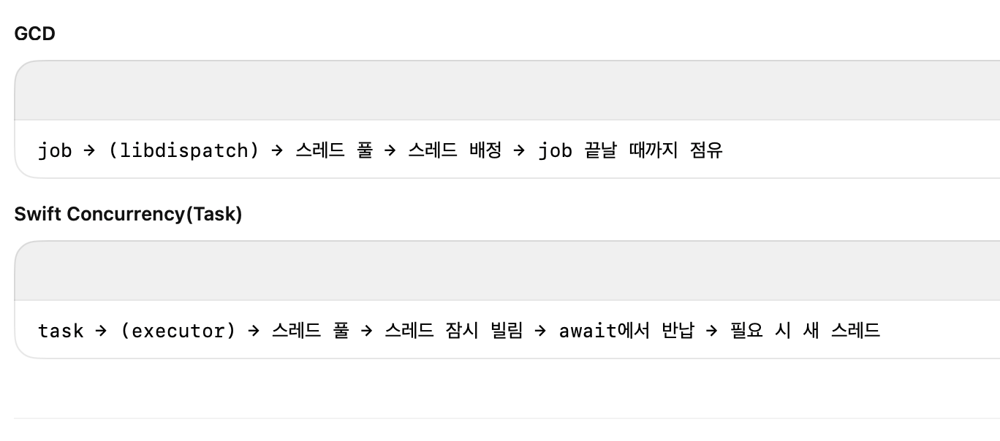

# **GCD(Grand Central Dispatch) 정리**

iOS의 모든 동시성 실행은 커널 스레드 위에서 수행된다.

GCD는 이 커널 스레드를 직접 다루지 않고 작업을 큐에 담으며 동시성을 표현하도록 설계된 고수준 API

실제 어떤 스레드가 작업을 실행할지는 libdispatch가 시스템 전역 스레드 풀에서 스레드를 빌려와 자동으로 할당한다.

Serial Queue는 “동시에 1개만 실행됨”을 보장할 뿐, 작업이 같은 스레드에서 실행됨을 보장하지는 않는다.

연속된 작업이 서로 다른 스레드에서 실행될 수도 있고, 그 반대로 우연히 같은 스레드에서 연달아 실행될 수도 있다.

libdispatch는 항상 “idle 스레드를 찾아 작업을 붙이는” 방식으로 동작하기 때문이다.

## **GCD가** Swift Concurrency에 비해 **스레드를 오래 점유하는 이유**

GCD의 실행 단위는 **block(job)** 이고 “job을 스레드에 붙여서 끝날 때까지 실행시키는 모델”을 갖고 있다.

job(block)은 **중단(suspend)** 될 수 있는 구조가 아니기 때문에 한 번 어떤 스레드에서 block의 실행이 시작되면 그 block이 끝날 때까지 해당 스레드는 그 block에 귀속된다. CPU-bound 작업이든, sleep이든, I/O blocking이든 스레드를 그대로 붙잡고 있는 구조.

이런 것을 “스레드 점유 모델(thread-hogging model)”이라 한다.

# **Swift Concurrency(async/await, Task) 정리**

Swift Concurrency는 GCD와 달리 job이 아니라 **Task(코루틴)** 중심 모델이다.

Task는 실행 중 await을 만나면 즉시 suspend되며, 그 순간 스레드를 완전히 반납하고 resume 시점에는 다시 스레드를 배정받는다.

Swift Concurrency의 스케줄링은 **Swift Executor**가 담당하며,

스레드 점유를 최소화하는 방향으로 설계되어 동시에 더 많은 task를 처리한다.

---

## **1) iOS에서 GCD는 어떻게 스레드를 할당하고 관리하나요?**

global 풀을 사용하여 이미 생성된 풀을 libdispatch 스케줄러가 QoS, idle thread를 고려하여 커널 스레드에 그때그때 배정하는 방식.

개발자가 직접 스레드 할당을 할 일은 없고 Queue에 넣으면 전역 풀로 관리된다

작업이 끝나면 스레드는 사라지지 않고 풀로 반환되어 재사용된다.

## **2) Serial Queue가 순서를 보장하지만 스레드 고정(thread affinity)은 보장하지 않는 이유는?**

작업 순서만 순차적으로 실행해주는거고 libdispatch스케줄러는 idle 상태인 스레드를 배정하기 때문에 같은 큐에 있더라도 다른 스레드로 배정될 수 있다.

## **3) GCD는 왜 스레드를 오래 점유하게 되나요?**

**GCD는** job단위로 스레드에 들어가고 coroutine 형태가 아니라 suspend가 없기 때문에 해당 job이 끝나기까지 스레드를 점유하게됨

## **4) Swift Concurrency(Task)는 왜 스레드를 오래 점유하지 않을까? (GCD와의 결정적 차이)**

concurrency는 코루틴 형태라 suspend가 되면 스레드를 반납하여 다른 task가 해당 스레드를 사용할 수 있음

## **5) Swift Executor는 어떤 역할을 하며, GCD와 어떻게 다르게 스케줄링하나요?**

Swift concurrency는 swift executor를 이용하여 task를 스레드에 배정한다. 

GCD는 libdispath를 통해 job을 스레드에 배정한다
