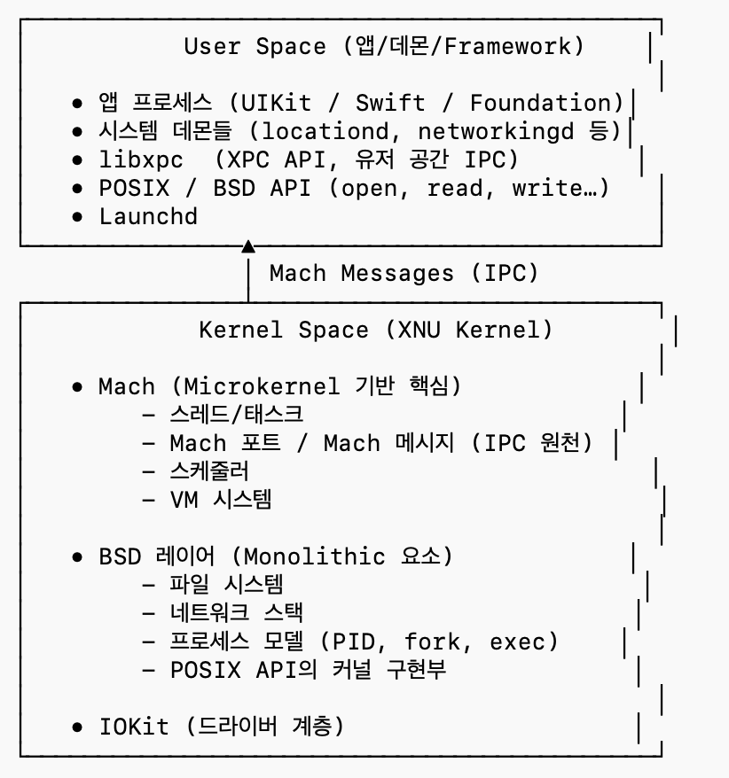
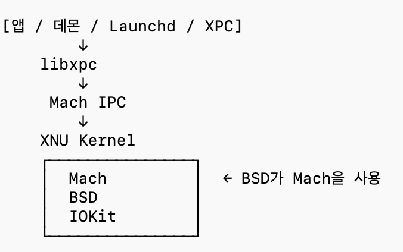
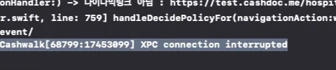

멀티코어에서는 CPU별로 독립된 per-CPU run Queue를 유지하는 구조라서 부팅시 커널 CPU 개수만큼(코어 개수만큼..) 생성해서 커널 내부에 저장해둔다.

Apple 디바이스는 XNU 커널의 고유한 스케줄러를 사용하고 우선순위 기반+Timesharing + Real-time 클래스가 결합된 구조

XNU 스케줄러는 스레드 우선순위를 가장 중요한 결정 요소로 사용하는데, 각 CPU의 run queue안에는 64단계(과거에는 128)의 우선순위 버킷 형태가 있고  이 중에 가장 높은 우선순위 버킷의 스레드를 꺼낸다.

```swift
[CPU0 RunQueue]
  priority 0: [ ... thread ... ]
  priority 1: [ ... thread ... ]
  ...
  priority 63: [ ... thread ... ]

[CPU1 RunQueue]
  priority 0: [ ... ]
  ...
```

1. 스레드가 runnable 상태로 바뀌면 해당 스레드의 우선순위 계산
2. 해당 버킷에 push
3. 스케줄러가 가장 높은 우선순위 큐를 탐색하고 CPU에 배정 (하나의 버킷 안에서는 FIFO)

- **대칭 다중 처리 (SMP)**
- 다단계 피트백 큐 일부 개념 차용

### 그래서 각 버킷에는 스레드가 어떤 형태로 들어가는 것인가

버킷에는 스레드를 가리키는 포인터(thread_t)가 linked list 형태로 들어감(FIFO이기 때문에 오버헤드를 줄이기 위해)

같은 버킷 안에서는 FIFO임

### 스레드 내부 필드 (struct Thread)

- 스레드 priority
- 최근 CPU 사용량
- 스케줄링 weight / mode (timeshare, fixed, realtime)
- 상태(RUNNABLE / BLOCKED 등)
- 소유한 Mach port
- QoS (개발자가 지정한, 또는 디폴트로 들어간 task 우선순위)
- 스레드가 속한 task(프로세스)

### 내 맥이 코어를 사용하는 방식 (우선순위)

총 코어 개수: 14(10 성능 및 4 효율) ⇒ 이기종 다중 처리(HMP)

- 성능코어: 고성능 연산 담당. 우선순위 높은 작업을 배정 (Xcode 빌드, 머신러닝, UI 랜더링 등)
- 효율코어: 저전역 연산 담당. 배터리 절약을 위해 사용 (백그라운드  작업, 웹서핑, 파일 다운로드 등)

## XNU 커널?





### XNU (X is Not Unix ㅋㅋ)

- Darwin의 macOS/iOS/watchOS 등에서 사용하는 하이브리드 커널 (아래 구성요소를 결합해서 하이브리드!)
- 구성요소
    1. Mach 커널 (마이크로채널 커널.. 기초 인프라): 스레드/태스크, IPC, 가상메모리
        1. Mach Message, Match port, thread handoff, send/receive
    2. BSD 레이어 (모놀리식 커널 요소.. 개발자가 쓰는 실제 OS 기능): POSIX API, 프로세스 모델, 네트워크, 파일시스템 (Mach 커널이 제공하는 기능을 사용)
    3. I/O kit (C++ 기반 드라이버 플레임워크): 애플이 만든 객체지향 드라이버 구조

### XPC

- Mach IPC 위에서 동작하는 고수준 IPC **프레임워크**
- 프로세스 A가 Mach port를 가지고 있으면 그 포트로 메시지를 보낼 수 있는 권한이 있는 것을 의미함
- 각 프로세스간 Mach port를 만들어서 message passing 방식을 사용
- **BackgroundTask 나 Push Notification Service Extension**
    
    
    

### **시스템 데몬(system daemon)**

운영체제가 백그라운드에서 항상 실행해두는 시스템 전용 프로세스. OS 저수준 작업을 대신 수행해주는 프로세스들인데, 앱과 시스템 데몬과 통신할 때 XPC를 사용함
