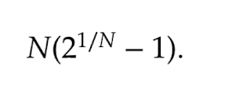
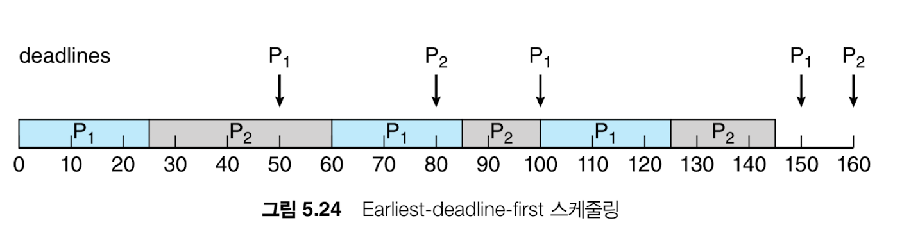

## 경성 실시간 vs 연성 실시간

| 구분 | 경성 실시간 (Hard RT) | 연성 실시간 (Soft RT) |
| --- | --- | --- |
| 마감 시간 | **절대적** | **권장사항** |
| 마감 실패 | ❌ 시스템 오류 | ⭕ 성능/품질 저하 |
| 시간 기준 | **최악 시간(Worst-case)** | 평균/체감 시간 |
| 인터럽트 지연 | 매우 엄격 | 비교적 관대 |
| 디스패치 지연 | 엄격한 상한 필요 | 유연 |
| 설계 목표 | 결정성 | 사용자 경험 |
| 예 | 제동, 항공, 의료 | UI, 오디오, 비디오 |
|  | 단순한 스케줄링 사용 | 복잡한 스케줄링. 캐시, 가상메모리 활용 |

### 인터럽트 지연 시간

하드웨어 인터럽트가 발생하여 현재 명령어를 완료하고 ISR 실행 준비하고 현재 실행 중인 프로세스 상태 저장 후 ISR 실행하기까지의 시간

- ISR 진입 시 상태 저장 ⇒ 여기서는 이것만 포함됨
    - CPU 레지스터
    - 프로그램 카운터
    - 일부 실행 상태
    
    👉 **하드웨어/커널이 자동으로 저장**
    
    👉 이건 **“태스크 전환용 컨텍스트 스위치”가 아님**
    
- 디스패처에서의 컨텍스트 스위치
    - 프로세스/스레드 전체 문맥
    - 주소 공간
    - 스택 교체

### 디스패치 지연시간

실행 준비 완료된 프로세스가 스케줄링 디스패처에 의해 실제로 CPU에서 실행되기까지의 시간

- 스케줄링 결정 후 대기 시간 (Critical Section 포함)
- 디스패처 실행 시간
- 컨텍스트 스위치 시간

### 우선순위 기반 스케줄링 (항공 우주 분야에서 많이 씀)

- 우선순위 부여 후 더 높은 우선순위를 가진 프로세스가 들어오면 선점된다
- 0 ≤ 수행 시간 ≤ 마감시간 ≤ 주기
- 자신의 마감시간을 스케줄러에게 알려야한다. 승인제어 알고리즘을 이용해 스케줄러가 마감시간 내 끝낼 수 있는 프로세스만 실행을 허가한다. 시간을 예측하는 것이 중요하다
    - 최악으로 오래걸릴 시간을 명시하는 방식. 보통 개발자가 상한 시간을 지정하는데 소스 코드 + CPU 모ㄷ델을 이용해 **이론적으로 가능한 최악의 실행 경로**를 계산하는 방법도 있음

### Rate-Monotonic 스케줄링

주기가 짧을 수록 높은 우선순위를 가진다.

CPU 사용량이 낮아도 우선순위에 따라 실패할 수 있다.

최적의 우선순위 알고리즘이지만 CPU를 100퍼센트 써도 항상 마감시간을 보장하진 않아서 보장한계를 계산해서 이하여야 완료할 수 있다.

### Earliest-Deadline-First  스케줄링

마감시간에 따라 우선순위를 동적으로 부여하는 방식. 마감시간이 빠를수록 우선순위가 높아짐

새로 실행하게된 작업의 마감시간에 맞춰 우선순위 재부여

P1의 두번째 주기 기준으로 마감 시간이 100이기 때문에 P2가 더 급함

이론상 CPU이용률도 100이 되어도 수행에 문제 없으나, context switch 때문에 100은 불가

### 일정 비율의 몫 스케줄링

각 프로세스가 시간 몫을 할당받아 사용하고, 새로운 작업이 들어왔을 때 시간 몫이 부족하면 시스템 진입 거부

ex) 총 시간몫 100인데 A프로세스가 50, B는 20이면 각각 모든 처리기 시간의 50%, 20%를 할당받음

## 운영체제 사례들

---

### Linux

- CFS(Completely Fair Scheduler): vruntime(가상 실행 시간. 지금까지 CPU 사용한 시간)을 기록해두고 이 값이 가장 적은 테스크를 우선 배치. 완전 공평 스케줄러
- Nice: vruntime의 증가 속도 조절. 높은 우선순위는 vruntime을 천천히 증가시켜 우선 배정되도록 한다

⇒ 즉 우선순위는 Nice 속도 차이가 반영된다

- 목표 지연 시간: 모든 테스크가 이 시간 안에 한 번씩은 실행되도록 강제한다
- 레드-블랙 트리: 실행 가능한 테스크들을 vruntime 기준으로 정렬한다. O(1)수준
- I/O 테스크가 자연스럽게 우선 실행되는데, I/O는 잠깐 CPU를 쓰고 바로 반환하니 vruntime이 거의 증가하지 않기 때문
- 실시간(SCHED_FIFO, SCHED_RR), 일반(CFS)
- 부하 균등: SMP(Symmetric Multi-Processing: 여러 CPU 코어가 동등한 권한으로 하나의 메모리와 os를 공유하는 구조)에서 코어간 부하를 균등하게 하기 위해
    1. 스케줄링 도메인 구조: 코어끼리는 같은 메모리를 공유하는 근처 코어가 있는데, 이 코어 집합은 부하를 균등하게 맞추는데 이용한다. 그래도 안되면 점점 확장하여 부하를 분산시키는 구조
    2. NUMA간 이동은 최후의 수단. 심한 불균형이 일어났을 때만 다른 NUMA 노드로 스레드 이주

### Windows

- 우선순위 기반 선점 스케줄링. 더 높은 우선순위 스레드가 준비되면 즉시 선점하는 강한 선점형 os
- 공평함보다는 응답성에 집중
- 프로세스 우선순위 + 스레드 상대 우선순위 ⇒ 최종 스레드 우선순위
- 포그라운드 프로세스에 특혜를 준다. 타임 퀀텀을 약 3배 더 줘서
- 실시간 우선순위: 잘못쓰면 시스템이 멈출 수 있음.. 총 0~31단계 중에 16~31 사이
- UMS (User-Mode Scheduling): 커널 말고 유저가 스레줄링해도 되게 하자

### Solaris 스케줄링

- 우선순위 기반 + 스케줄링 클래스
- 우선순위와 time quantum는 반비례
- 시분할 →  다단계 피드백 큐
- CPU 많이 쓰면 time quantum를 다쓰니까 우선순위 하락, I/O 기다리다 깨어나면 우선순위 상승
- 시스템 스케줄링 클래스는 커널 스레드 전용이고 데몬이나 인터럽트 처리를 한다. 우선순위 고정..
- FSS (Fair Share Scheduler): CPU 사용량에 따라 그룹을 나누어서 스케줄링

## 알고리즘 평가

---

### 결정론적 모델링

- 분석적 평가(주어진 작업 부하에 대한 알고리즘의 성능을 평가하는 공식이나 값을 생성하기 위해 주어진 알고리즘과 시스템 작업 부하를 이용) 중 하나.
- 정의된 특정 작업 부하를 받아들여 각 알고리즘 성능 정의

### 큐잉모델

- 특정 CPU 버스트의 확률을 기술하는 수학적 공식(지수 평균으로 기술됨)을 얻을 수 있음
- 이 영역에 대한 연구가 큐잉 네트워크 분석. 이용률, 평균대기 시간 등등..

### 모의 실험

- 실제 시스템에서 측정하여 프로세스, CPU 버스트 시간, 도착, 출발에 대한 확률 분포를 뽑아내고 이걸로 모의 실험을 진행한다.
- 추적 파일: 위에서 뽑은 데이터들에는 이벤트간 순서에 대한 내용이 없어서 변수가 발생할 수 있는데 이를 방지하고자 이벤트 순서를 기록하는 파일을 따로 만들어서 사요함

### 구현

- 실제 코드로 자성해 운영체제에 넣고 실행해보는 방향. 하지만 알고리즘이 사용되는 환경이 변할 수 있다

→ 특정 응용에 맞춰 스케줄링 알고리즘을 조정하는게 최선
