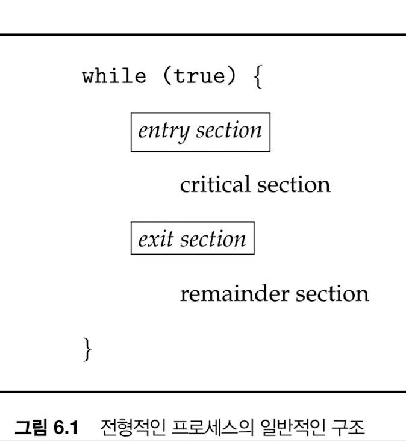
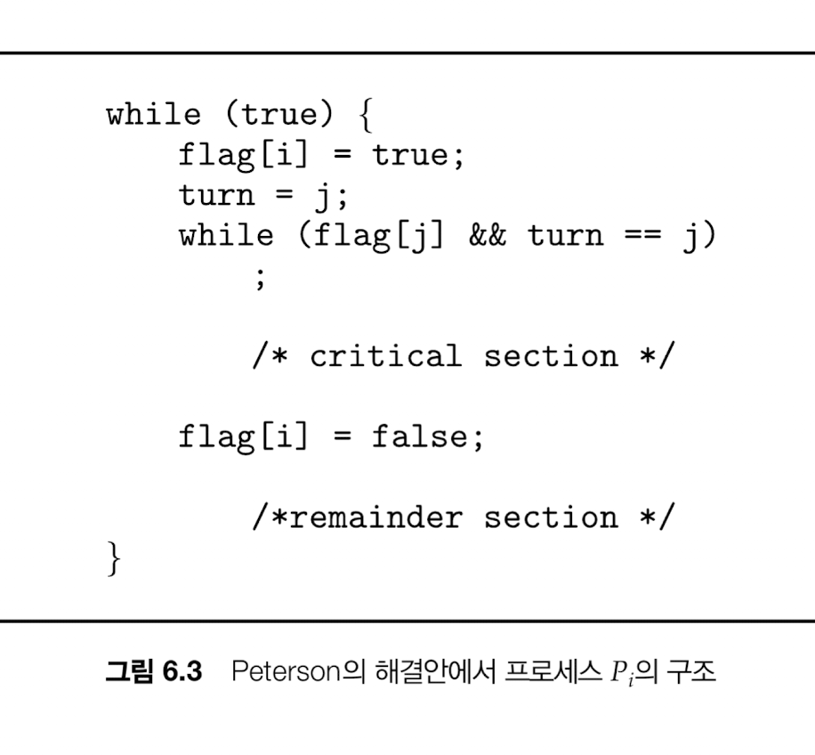
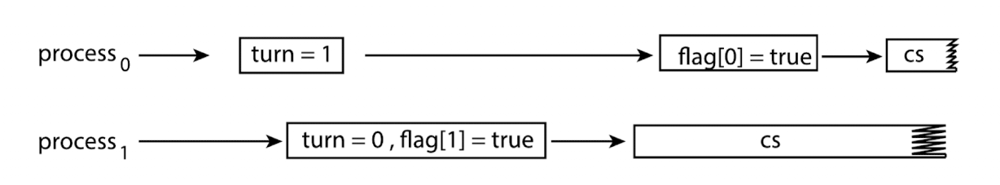
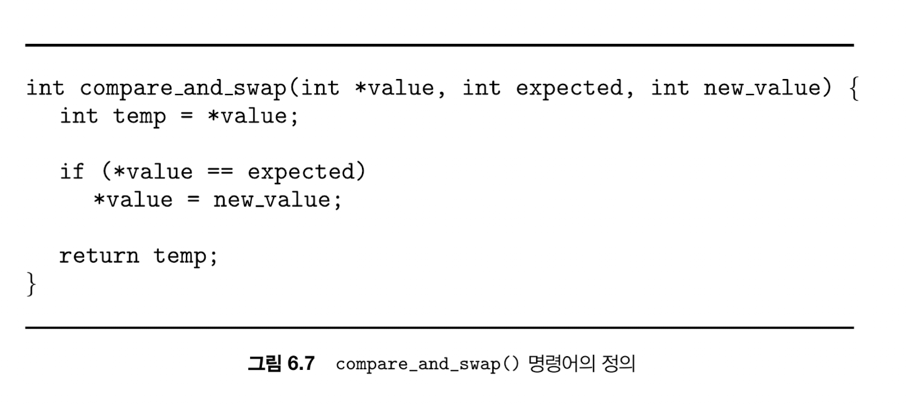
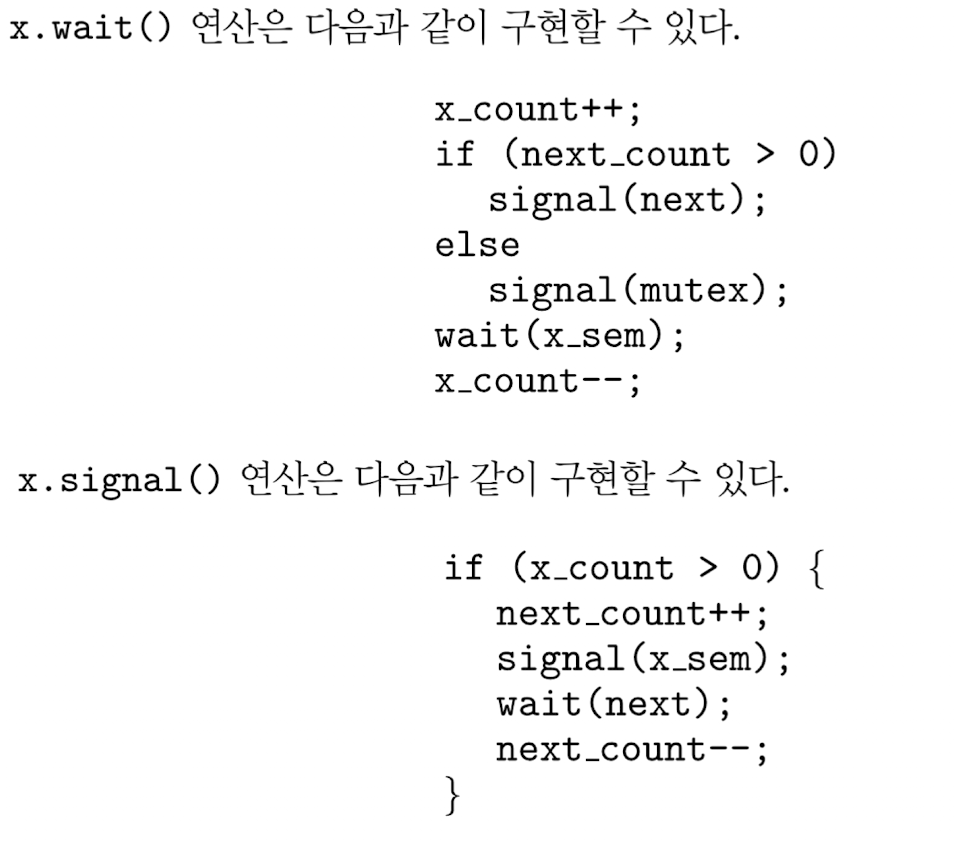
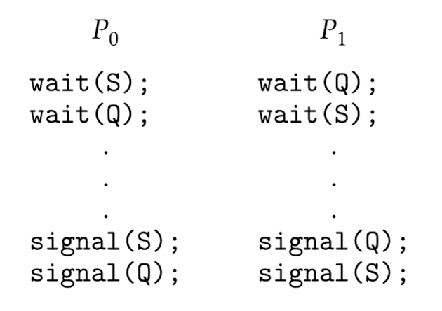

race condition을 방지하기 위해 동기화 문제를 해결해야 한다.



각 프로세스는 각자의 임계구역이 있다.

### 임계구역 문제

프로세스들이 데이터를 공유하기 위해 동기화에 사용하는 프로토콜 설계 ⇒ 임계구역을 어떻게 지킬건지에 대한 프로토콜

### 임계구역 문제 해결안 조건

1. 상호 배제: 하나의 프로세스가 본인의 임계구역을 실행 중이라면 다른 프로세스들은 자신의 임계구역을 실행할 수 없음
2. 진행: 임계구역을 돌리고 있는 프로세스가 없는데도 누가 들어갈지 결정 안나서 멈춰있으면 안되고 계속 진행해야한다~~
3. 한정된 대기: 임계구역 진입 요청을 한 상태라면 다른 프로세스는 임계구역을 진입하는 횟수에 제한을 둬야한다. 다른 프로세스들이 임계구역을 들어가는걸 영원히 기다려줄 수 는 없으니..

커널 자료구조에서는 아래에서 자주 경쟁 조건 발생

- 메모리 할당을 관리하는 자료구조: 여러 군데서 할당 요청이 오니까
- 프로세스 리스트를 유지하는 자료구조: 새 프로세스 생성 요청이 계속 오니까
- 인터럽트 처리를 위한 자료구조: 인터럽트 요청이 여러 군데서 오니까…

## SW기반 해결책 - Perterson 해결안 (현대 아키텍처에서 사용 불가)




공유하는 데이터

1. int turn: 다음으로 진입할 수 있는 프로세스
2. boolean flag[2]: 임계구역 진입할 준비가 된 프로세스

순서

1. flag[i] = true  // i 준비됐음!
2. turn = j // 다음으로는 j 프로세스 진입할 수 있다 (양보의 의미!)
3. 임계구역 작업 중~~
4. flag[j] = true // j 프로세스 준비됐음!
5. i의 while문 종료되어 임계구역 작업 끝
6. flag[i] = false /// i 작업 끝남
7. turn = i // j 프로세스 돌아가면서 다음 실행될 프로세스로 i를 지정

나중에 i 프로세스가 다시 임계구역 들어가고 싶어서 flag[i] = true 다시 본인이 임계구역 탈취할 수 있음

⇒ 한정된 대기

---

하지만 현대 아키텍쳐에서는 정확히 프로세서가 flag[i] = true 값 처리 후에 turn = j 를 실행하지 않는다. 두 변수간 종속성이 없기 때문에 무엇이 먼저 실제 값이 변경될지는 모르는 것.. (작업 재정렬)



1. 프로세스 i가 임계구역 실행 중에(flag[i] == true, turn == j 상태)
2.  j프로세스가 실행되어 turn 이 먼저 i로  바뀌고 (flag[i] == true, turn == i라서 여전히 i는 임계구역 실행)
3. flag[j] = true 값 세팅된 후에 j 도 임계구역 진입~ (flag[j] == true, turn == i라서 여전히 i는 임계구역 실행)

⇒ 두 프로세스 모두 임계구역 실행 중.. 상호배제가 지켜지지 않음

⇒ 결국 동기화 도구를 사용해야만 한다.

## 동기화를 위한 HW지원

### 1. 메모리 장벽

- 메모리 모델
    - 컴퓨터 아키텍처가 프로그램에게 제공하는 메모리 접근시 보장되는 사항을 결정한 것
    - 강한순서/약한순서: 프로세서 메모리 변경 결과가 다른 프로세서들에게 즉시 보이거나 즉시 보이지 않는 방식
- 메모리 장벽
    - 메모리 변경 결과를 다른 프로세서에게 보이게 해서 작업 재정렬을 피할 수 있다

### 2. 하드웨어 명령어

1. test_and_set(&lock)


test_and_set은 이전 값을 반환하고 true로 바꾸는 로직.

test_and_set(&lock) 처음에 lock 값이 false였으면 여전히 false니까 임계구역을 돌릴 수 있다. 한번 돌아간 후에 다시 체크하면 true니까 종료되고 lock은 false로 변경된다.

즉 이미 임계구역을 돌리고 있는 로직을 있으면 lock 상태는 true니까(==잠겼으니까) 들어가지 못한다

⇒ 상호배제

1. compare_and_swap()




이것도 항상 이전 값을 반환하고 특정 값과 기존 값이 일치하면 값을 바꾸는 로직인데,

똑같이 lock이 처음에 false니 임계구역 실행하고 lock=false로 세팅되어 while문 종료된다.

임계구역 실행 중에는 compare_and_swap 메서드를 통해 lock이 true로 세팅될거라 다른 프로세스가 인계구역에 진입할 수 없다 ⇒ 상호배제. 한정대기는 보장 못하는게, 누가 다음으로 임계구역에 진입하냐는 요청 타이밍에 달려있음.


1. i 프로세스가 임계구역에 들어가려는 과정: i는 waiting[i] = true, key = 1로 진입하겠다는 표시를 하고, while (waiting[i] && key == 1) 동안 compare_and_swap(&lock, 0, 1)을 반복해서 락을 잡으려 한다.
이 루프를 빠져나오는 경우는 두 가지다:
	•	CAS 성공 → lock이 0→1로 바뀌고 key가 0이 되어(이전 lock값) key==1이 깨져서 탈출
	•	누군가가 waiting[i] = false로 턴을 넘겨줌 → waiting[i]가 false가 되어 탈출
    탈출하면 waiting[i] = false로 표시를 지우고 임계구역에 진입한다.
2. 다른 프로세스 j가 진입할려고 할 때 첫 while조건 두 가지 다 만족 못하니 임계구역 진입하지 못함(wating[j] = true, key는 1이 됨) ⇒ 상호 배제
3. i 프로세스는 원형큐 돌려가면서 기다리고 있는 프로세스를 찾고, j 프로세스를 찾아 wailing을 false로 바꿔주며 임계구역 진입을 허가함 ⇒ 한정된 대기

직접 사용되진 않고 다른 도구르 위한 구성요소로 사용됨

### 원자적 변수

```swift
void increment(automic_int *v) {
    do {
        temp = *v;
    } while (temp != compare_and_swap(v, temp, temp+1));
}
```

다른 프로세스가 이미 v 값을 올렸으면 temp 와 일치하지 않기 때문에 더하기 연산하지 않음

하지만 이 로직도 생산자-소비자 문제에서 여러 소비자가 버퍼 count가 0 이상이길 기대하다가 1이 되었을 때 동시에 소비하게 되는 경쟁 문제를 해결할 수는 없다

## SW기반 해결책 - Mutex lock


```swift
acquire () {
    while (!available) // 여기서 spin (바쁜 대기)
    ; 1* busy wait */
    available = false;
}

release() {
  available = true;
}
```

스핀락: 락을 사용할 수 있을 때까지 락 사용 가능 여부 조회를 반복하는 것 → 다중 코어 시스템에서 사용

스핀락을 할지 말지에 대한 기준은, 문맥교환을 두번 하는 시간보다 락이 유지되는 기간이 짧다면 스핀락을 사용하게 된다. (대기상태로 돌리지 않고 기다림)

## 세마포

```swift
wait (S) {
    while (S <= 0)
    ; 11 busy wait
    S--;
}

signal (S) {
    S++;
}
```

두 연산은 CAS 나 스핀락같은 방식을 사용해 원자적 실행를 보장해야 한다.

여전히 바쁜대기는 존재하고, 하나라도 호출되지 않거나 signal → wait 순으로 호출되면 상호배제가 불가하거나 프로세스가 진행되지 못하고 얼어버린다.

사용 예시 - 생산자 소비자 문제(동시에 생산자와 소비자가 돌면 버퍼가 다 찼는데 또 넣으려고 하거나 없는데 또 소비하려는 문제 발생)

- empty (카운팅 세마포어): **빈 칸 수**
    - 초기값 = BUFFER_SIZE
- full (카운팅 세마포어): **채워진 칸 수**
    - 초기값 = 0
- mutex (뮤텍스): **버퍼 자체 + 인덱스(in/out) + count 같은 공유 데이터 보호**

```swift
// 생상자 코드
produce(item);

sem_wait(empty);   // 빈칸을 하나 줄임. empty가 0이면 대기
lock(mutex);

buffer[in] = item;
in = (in + 1) % N;

unlock(mutex);
sem_post(full);    // 한칸 채워졌음

// 소비자 코드
sem_wait(full);    // 채워진 칸 하나 줄임 (full이 0이면 대기)
lock(mutex);

item = buffer[out];
out = (out + 1) % N;

unlock(mutex);
sem_post(empty);   // 빈칸 하나 추가

consume(item);
```

바쁜대기 대신 아래와 같이 대기큐 들어가는 것도 가능

wait 시도 →  0이라 대기큐 들어감 → 다른 프로세스에서 signal → wake up 연산 → 준비완료큐로 이동 → 스케줄링되면 wait 재시도

## 모니터

공유데이터와 그 데이터를 다루는 함수를 제공하는 고수준 동기화 개념

모니터 안의 메서드가 실행되면 자동으로 락하는 형태

x.signal()이 호출되어야 x.wait()가 실행될 수 있는데, 하나의 프로세스만 모니터에 존재할 수 있기 때문에 

P 프로세스가 x.signal()을 호출한다 치면 그 이후 로직은 돌릴 수가 없음. 그래서 아래 두 방법 사용

1. **Signal and wait** 
- P가 signal()을 하는 순간 모니터를 Q에게 즉시 넘기고 P는 모니터 밖에서 잠깐 기다림
- Q가 모니터 안에서 바로 실행을 이어감

1. **Signal and continue**
- P가 signal()해도 P가 모니터를 계속 잡고 남은 코드를 실행
- Q는 깨어나서 runnable 상태가 되지만, 모니터 락을 다시 얻을 때까지 대기
- 그래서 Q가 실제로 다시 들어왔을 땐 조건이 다시 거짓이 되었을 수도 있음

### 세마포를 이용해 모니터를 구현하는 방법

mutex라는 이름의 이진 세마포가 정의되고 초기값은 1.

모니터로 들어가기 전에 wait → 나온 후에 signal

signal and wait 사용하는데, signal 호출하고 나오는 스레드도 다시 재개해야하기 때문에 next라는 이진 세마포(0으로 초기화)를 사용한다.



## 라이브니스 실패

임계구역에 진입하기 위해 무기한 대기하는 현상. 실행, 유한대기 실패

1. 교착상태
    
    
    
2. 우선순위 역전

높은 우선순위 프로세스가 낮은 우선순위 프로세스에 의해 접근되는 데이터를 변경할 필요가 있을 때 

스케줄링에 어려움이 생기는데 기 문제를 우선순위 역전이라 한다.



L < M < H 우선순위를 가진 프로세스가 있다고 하면 H는 L에 있는 자원을 사용하려고 해도 M부터 실행되길 기다려야 하는데, 이를 해결하기 위해 우선순위 상속 프로토콜이 상용된다.

임시로 L이 H의 높은 우선순위를 상속받는 것! M의 선점을 방지할 수 있다.
