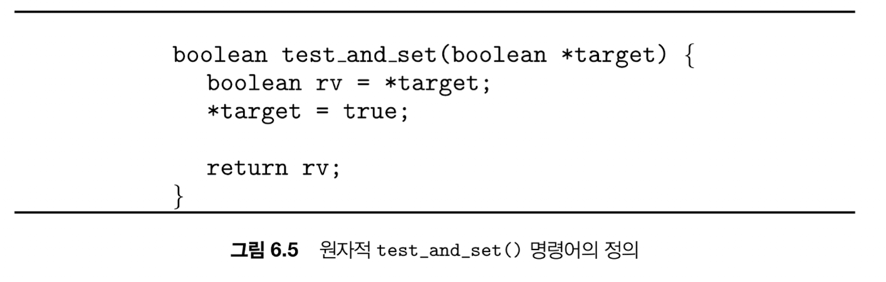
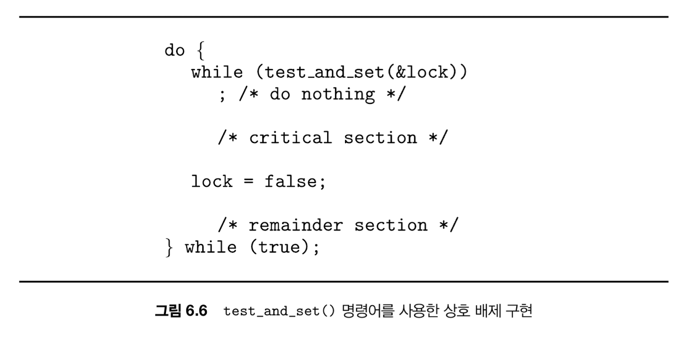
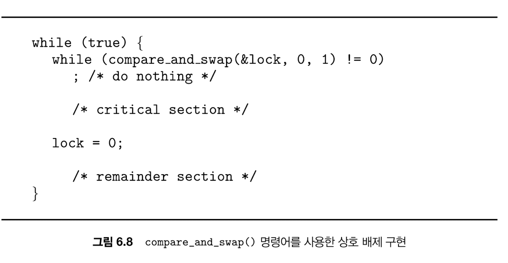
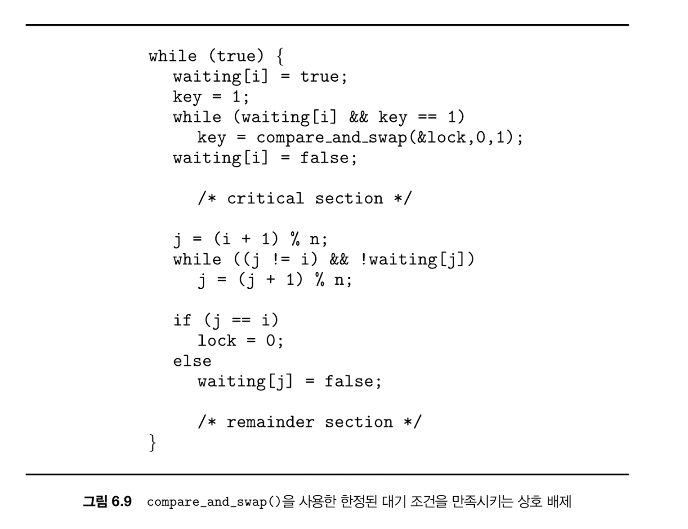
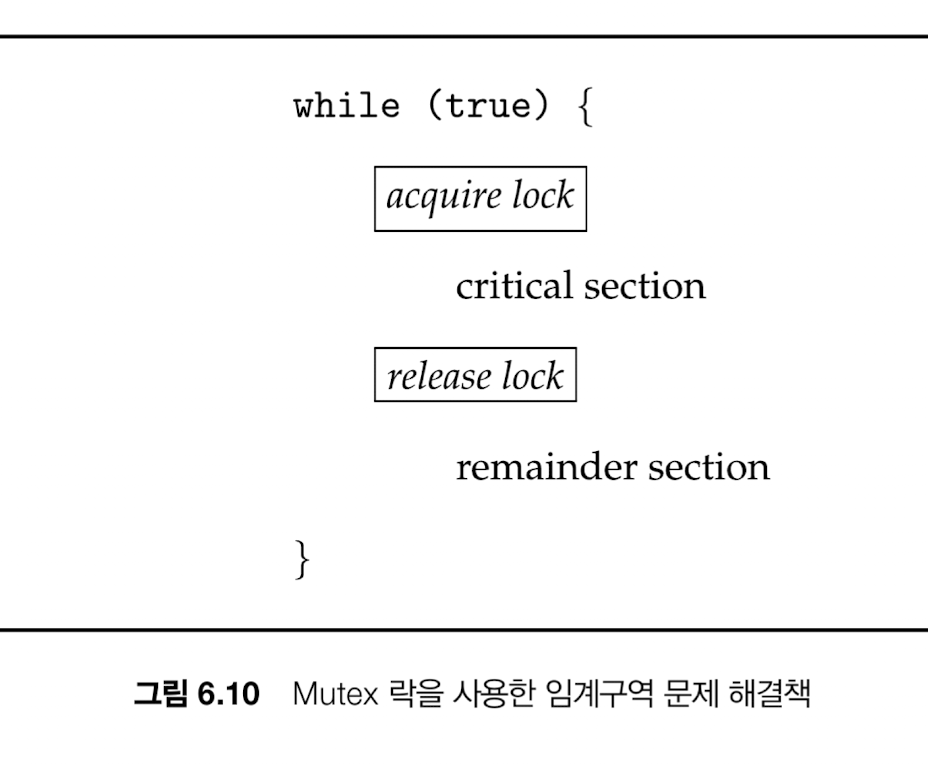

## 동기화를 위한 HW지원

### 1. 메모리 장벽

- 메모리 모델
    - 컴퓨터 아키텍처가 프로그램에게 제공하는 메모리 접근시 보장되는 사항을 결정한 것
    - 강한순서/약한순서: 프로세서 메모리 변경 결과가 다른 프로세서들에게 즉시 보이거나 즉시 보이지 않는 방식
- 메모리 장벽
    - 메모리 변경 결과를 다른 프로세서에게 보이게 해서 작업 재정렬을 피할 수 있다

### 2. 하드웨어 명령어

<details>
  <summary>왜 원자적 명령어를 써야할까? -> race condition이 발생해서 임계구역에 여러 프로세스가 진입하는 것을 막기 위해</summary>
  ```
  do {
    while(&lock) { }    // 1
    lock = true        // 2
    // critical section
    lock = false;
  } while  (true);
  ```
  대충 이렇게 쓰면 안될까 했는데, 
  lock==false 상태에서 A와 B가 위 로직이 동시에 돌아가서  둘 다 while을 통과하면 둘 다 임계구역에 진입해서 race condition이 발생함. 그래서 lock 체크와 true 세팅을 원자적으로 해야 한다.
</details>


1. test_and_set(&lock)





test_and_set은 lock 걸려있는 상태면 while문을 계속 타면서 대기하다가 

false가 되는 순간 빠져나와 임계구역을 진입할 수 있게 하는 로직

즉 이미 임계구역을 돌리고 있는 로직을 있으면 lock 상태는 true니까(==잠겼으니까) 들어가지 못한다

⇒ 상호배제

2. compare_and_swap()





문이 열려있을 때만 들어가서 문을 닫음. 문이 닫겨있으면 열릴 때까지 기다림

다른 프로세스가 임계구역을 실행하고 lock을 풀어야만 나도 lock을 하고 임계구역을 실행할 수 있기 때문에  그 동안 다른 프로세스가 인계구역에 진입할 수 없다

 ⇒ 상호배제. 한정대기는 보장 못하는게, 누가 다음으로 임계구역에 진입하냐는 요청 타이밍에 달려있음. 먼저 compare_and_swap 체크하는 놈이 들어감



**임계 구역 진입 방법 2가지**

1. 현재 임계구역 실행 중인 프로세스 입장에서 다음으로 지목할 임계구역 실행 프로세스가 없는 경우
    1. if (j == i) { lock = 0; } 
2. 현재 임계구역 실행 중인 프로세스로부터 지목된 경우
    1. waiting[j] = false

**진입방법 2 진행 과정**

1. 나는 i 프로세스고 lock 이 true 상태라고 가정. 나는 첫번째 while문을 돌면서 기다림
2. 다른 프로세스가 임계구역 실행 끝나고 나를 지목해서 waiting[i] = false 하면 내가 임계구역 진입
3. 프로세스가 더이상 없거나 임계구역 진입을 기다리는 다음 프로세스를 찾을 때까지 계속 원형 큐를 돌리면서 다음 프로세스를 찾음
    1. 내가 마지막 프로세스인 경우(프로세스가 더이상 없는 경우) lock 해제
    2. 다음 프로세스를 지정해서 임계구역 진입 권한을 넘김

⇒ CAS는 lock이 풀리는 순간 임계구역 진입 기다리는 프로세스끼리 경쟁하게 되고, 지는 프로세스는 starvation이 발생할 수 있지만, 이 로직에서는 다음 프로세스를 지목하게 되어있음

⇒ 한정된 대기 충족.

⇒ 이것들 모두 직접 사용되진 않고 다른 도구(아래 나오는 원자적 변수같은 것..)를 위한 구성요소로 사용됨

### 원자적 변수

```
void increment(automic_int *v) {
    do {
        temp = *v;
    } while (temp != compare_and_swap(v, temp, temp+1));
}
```

v 값을 읽고 더하는 순간 race condition이 발생할 수 있기 때문에 v값을 원자적으로 보호하기 위해 더하는 연산은 원자적 명령어로 실행함

하지만 이 로직도 생산자-소비자 문제에서 여러 소비자가 버퍼 count가 0 이상이길 기대하다가 1이 되었을 때 동시에 소비하게 되는 경쟁 문제를 해결할 수는 없다

<details>
<summary>왜 원자적 명령어를 사용해도 race condition을 막을 수 없나?</summary>
    
    ```
        // 소비자
        if (count > 0) {      // (A) 확인
            item = buffer[out]; // (B) 꺼내기
            out++;
            count--;            // (C) 감소
        }
    ```

    count 를 원자적 명령어라고 한다면, 여러 코어에서 count를 동시에 read 하는 것 자체는 보호할 수 있지만 

    위 같은 소비자 로직에서 count가 1인 경우 여러 프로세스가 동시에 count > 0를 체크해서 버퍼를 소비할 수 있기 때문.
</details>


## SW기반 해결책 - Mutex lock




```
acquire () {
    while (!available) // 여기서 spin (바쁜 대기)
    /* busy wait */
    available = false;
}

release() {
  available = true;
}
```

스핀락: 락을 사용할 수 있을 때까지 락 사용 가능 여부 조회를 반복하는 것 → 다중 코어 시스템에서 사용

스핀락을 할지 말지에 대한 기준은, 문맥교환을 두번 하는 시간보다 락이 유지되는 기간이 짧다면 스핀락을 사용하게 된다. (대기상태로 돌리지 않고 기다림)

## 세마포

```
wait (S) {
    while (S <= 0)
    ; 11 busy wait
    S--;
}

signal (S) {
    S++;
}
```

두 연산은 CAS 나 스핀락같은 방식을 사용해 원자적 실행를 보장해야 한다.

여전히 바쁜대기는 존재하고, 하나라도 호출되지 않거나 signal → wait 순으로 호출되면 상호배제가 불가하거나 프로세스가 진행되지 못하고 얼어버린다.

바쁜 대기(spin) 없이, 레이스 없이 조건이 될 때까지 어떻게 기다릴 것인가??

→ 바쁜 대기를 안하면 어떻게 대기 상태일 때 다시 재개할 수 있을까?

→ 대기열에 추가하고 대기 상태로 들어가고 재개가 가능해지면 대기열에 있는 애 중 하나를 깨움

### 사용 예시 - 생산자 소비자 문제(동시에 생산자와 소비자가 돌면 버퍼가 다 찼는데 또 넣으려고 하거나 없는데 또 소비하려는 문제 발생)

- empty (카운팅 세마포어): **빈 칸 수**
    - 초기값 = BUFFER_SIZE
- full (카운팅 세마포어): **채워진 칸 수**
    - 초기값 = 0
- mutex (뮤텍스): **버퍼 자체 + 인덱스(in/out) + count 같은 공유 데이터 보호**

```swift
// 생상자 코드
produce(item);

sem_wait(empty);   // 빈칸을 하나 줄임. empty가 0이면 대기
lock(mutex);

buffer[in] = item;
in = (in + 1) % N;

unlock(mutex);
sem_post(full);    // 한칸 채워졌음

// 소비자 코드
sem_wait(full);    // 채워진 칸 하나 줄임 (full이 0이면 대기)
lock(mutex);

item = buffer[out];
out = (out + 1) % N;

unlock(mutex);
sem_post(empty);   // 빈칸 하나 추가

consume(item);
```

바쁜대기 대신 아래와 같이 대기큐 들어가는 것도 가능

sem_wait 시도 →  empty가 0이라 대기큐 들어감 → 다른 프로세스에서 sem_post 호출해서 empty 늘리고 기기다리던 애들에게 wake up 연산 → 준비완료큐로 이동 → 스케줄링되면 wait 재시도

## 모니터

공유데이터와 그 데이터를 다루는 함수를 제공하는 고수준 동기화 개념

모니터 안의 메서드가 실행되면 자동으로 락하는 형태

프로세스 Q가 조건 x와 연관된 일시중지 상태고, 프로세스 P는 x.signal()을 통해 Q를 실행 재개하도록 만들어줘야 할 때, 프로세스 P는 x.signal()을 호출하고 나서 대기해야 한다. Q가 실행 중이기 때문에..

그래서 아래 두 방법 사용

1. **Signal and wait** 
- P가 signal()을 하는 순간 모니터를 Q에게 즉시 넘기고 P는 모니터 밖에서 잠깐 기다림
- Q가 모니터 안에서 바로 실행을 이어감

1. **Signal and continue**
- P가 signal()해도 P가 모니터를 계속 잡고 남은 코드를 실행
- Q는 깨어나서 runnable 상태가 되지만, 모니터 락을 다시 얻을 때까지 대기
- 그래서 Q가 실제로 다시 들어왔을 땐 조건이 다시 거짓이 되었을 수도 있음

### 세마포를 이용해 모니터를 구현하는 방법

mutex라는 이름의 이진 세마포가 정의되고 초기값은 1.

모니터로 들어가기 전에 wait → 나온 후에 signal

signal and wait 사용하는데, signal 호출하고 나오는 스레드도 다시 재개해야하기 때문에 next라는 이진 세마포(0으로 초기화)를 사용한다.


## 라이브니스 실패

임계구역에 진입하기 위해 무기한 대기하는 현상. 실행, 유한대기 실패

1. 교착상태


    
2. 우선순위 역전

높은 우선순위 프로세스가 낮은 우선순위 프로세스에 의해 접근되는 데이터를 변경할 필요가 있을 때 

스케줄링에 어려움이 생기는데 기 문제를 우선순위 역전이라 한다.


L < M < H 우선순위를 가진 프로세스가 있다고 하면 H는 L에 있는 자원을 사용하려고 해도 M부터 실행되길 기다려야 하는데, 이를 해결하기 위해 우선순위 상속 프로토콜이 상용된다.

임시로 L이 H의 높은 우선순위를 상속받는 것! M의 선점을 방지할 수 있다.
