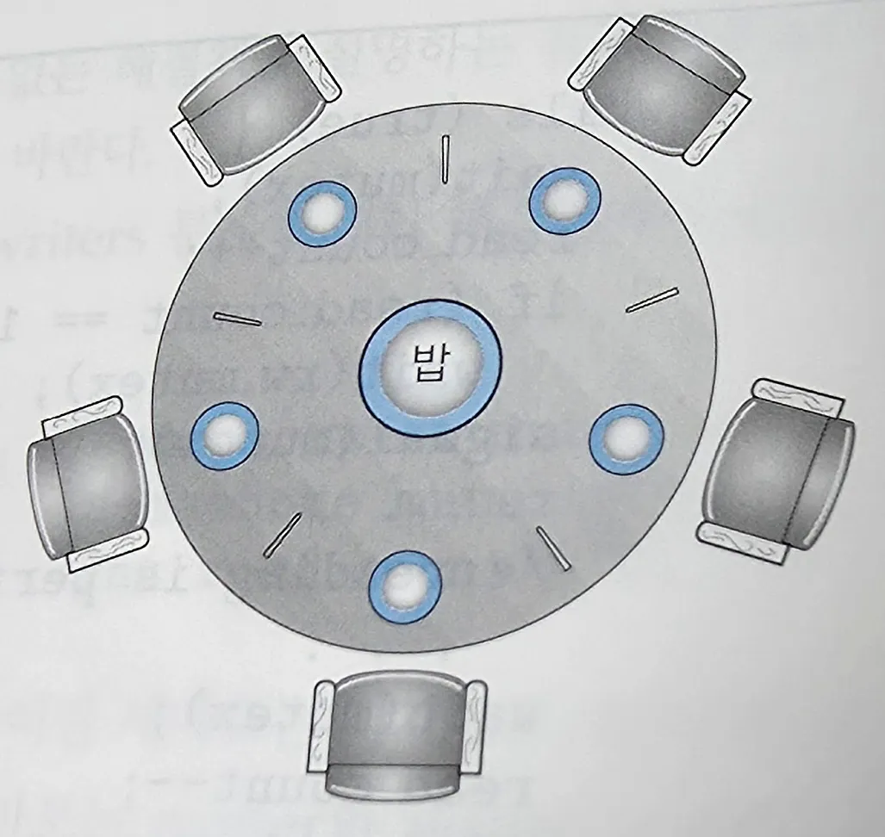

# 운영체제 스터디 9주차 정리

7장. 동기화 예제

## 유한 버퍼 문제

- n 개의 버퍼로 구성된 pool이 있으며 각 버퍼는 한 항목을 저장할 수 있다.

```c
int n;
semaphore mutex = 1; // 이진 세마포로 버퍼 pool 접근하기 위한 상호 배제 기능을 제공
semaphore empty = n; // 비어 있는 버퍼의 수
semaphore full = 0; // 꽉 찬 버퍼의 수
```

### 생산자 프로세스의 구조

```c
while (true) {
	// next_produced에 있는 아이템들 수행
	wait(empty);
	wait(mutex);
	// next_produced를 버퍼에 적재
	signal(mutex);
	signal(full);
}
```

⇒ 꽉 찬 버퍼를 생산

### 소비자 프로세스의 구조

```c
while (true) {
	wait(full);
	wiat(mutex);
	// 버퍼에서 next_consumed를 제거
	signal(mutex);
	signal(empty);
}
```

⇒ 빈 버퍼를 생산

## Readers-Writers 문제

\: writer와 (reader 또는 writer)가 동시에 데이터베이스에 접근하면 발생할 수 있는 문제

### readers-writers 문제의 변형들

1. 공유 객체를 사용할 수 있는 허가를 아직 얻지 못했다면, 어느 reader도 기다리게 해서는 안된다.
   → writer가 기아 상태에 빠질 수 있음.
2. writer가 준비되면 새로운 reader들은 읽기를 시작하지 못한다.
   → reader가 기아 상태에 빠질 수 있음.

```c
semaphore rw_mutex = 1; // 이진 세마포, reader와 writer가 함께 공유함.
semaphore mutex = 1; // read_count를 갱신할 때 상호 배제를 보장하기 위해 사용
int read_count = 0; // 현재 몇 개의 프로세스들이 객체를 읽고 있는지 나타냄.
```

### writer 프로세스의 구조

```c
while (true) {
	wait(rw_mutex);
	// write 실행
	signal(rw_muttex);
}
```

### reader 프로세스의 구조

```c
while (true) {
	wait(mutex);
	read_count++;
	if (read_count == 1)
		wait(rw_mutex); // 하나의 reader만 rw_mutex 사용
	signal(mutex);
	// read 실행
	wait(mutex);
	read_count--;
	if (read_count == 0)
		signal(rw_mutex);
	signal(mutex);
}
```

⇒ writer는 rw_mutex를 확보해야지만 실행 가능하고, reader는 rw_mutex에 상관없이 실행 가능함. 단, writer도 rw_mutex를 사용하지 않고 있다면 reader가 rw_mutex를 확보하고선 writer가 들어오지 못하게 함.

### 단점

- reader-writer 락을 설정하는데 드는 오버헤드가 세마포나 상호 배제 락을 설정할 때보다 큼.
  → reader의 개수가 많은 경우 병행으로 실행해 이 단점을 상쇄시킬 수 있음.

## 식사하는 철학자들 문제

\: 양 옆의 젓가락을 모두 확보해야 밥을 먹을 수 있는데 그러지 못해 발생할 수 있는 문제



### 1. 세마포를 사용한 해결법

```c
while (true) {
	wait(chopstick[i]);
	wait(chopstick[(i+1) % 5]);
	
	// 밥 먹음
	
	signal(chopstick[i]);
	signal(chopstick[(i+1) % 5]);
	
	// 생각함
}
```

- 문제점: 모두 한 쪽 방향의 젓가락을 동시에 집으면 교착 상태 발생
- 해결법
    - 젓가락은 5개, 철학자는 4명만 앉힘.
    - 한 철학자가 젓가락 두 개를 모두 집을 수 있을 때만 젓가락을 집도록 하나. (임계구역 안 에서만 젓가락을 집음.)
    - 비대칭 해결안 → 홀수 번호 철학자가 먼저 왼쪽 젓가락을 집고나서 오른쪽 젓가락을 집는다. 짝수 번호 철학자는 반대로 함.

### 2. 모니터를 사용한 해결법

```c
DiningPhilosophers.pickup(i);
// 밥 먹음
DiningPhilosophers.putdown(i);
```

```c
monitor DiningPhilosophers {
	enum { THINKING, HUNGRY, EATING } state[5];
	condition self[5];
	
	void pickup(int i) {
		state[i] = HUNGRY;
		test(i);
		if (state[i] != EATING) self[i].wait();
	}
	
	void putdown(int i) {
		state[i] = THINKING;
		test((i + 4) % 5);
		test((i + 1) % 5);
	}
	
	void test(int i) {
		if ((state[(i + 4) % 5] != EATING) &&
			(state[i] == HUNGRY) &&
			(state[(i + 1) % 5] != EATING)) {
				// 양 옆이 먹고 있지 않고, 내가 배고플 때만 진입
				state[i] = EATING;
				self[i].signal();
		}
	}
	
	initialzation_code() {
		for (int i = 0; i < 5; i++)
			state[i] = THINKING;
	}
}
```

- 문제점: 굶어 죽는 철학자가 생길 수 있음.
- 해결법: 우선순위 추가