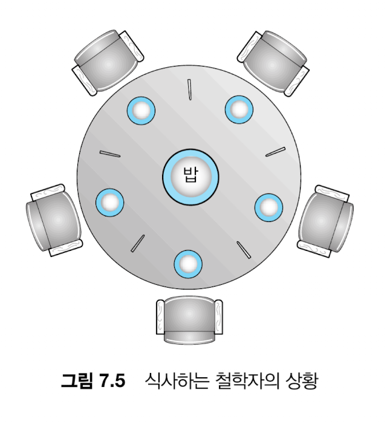
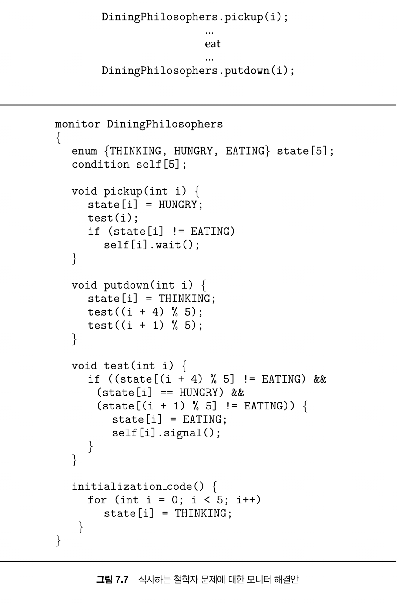
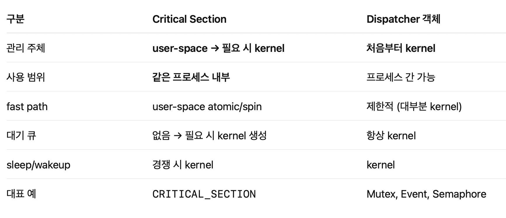
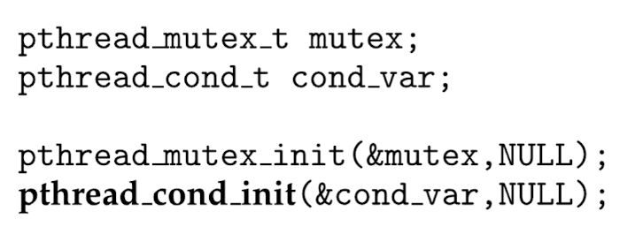
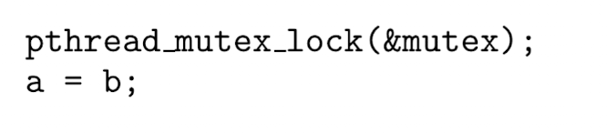
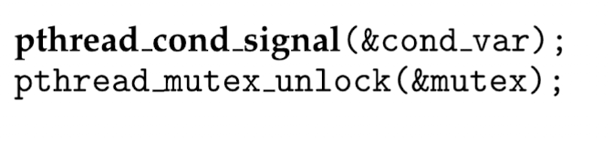
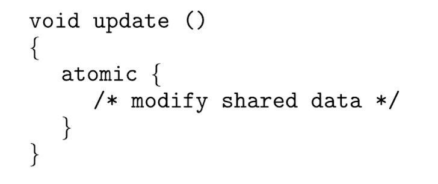

# Chapter 7. 동기화 예제

- 고전적 문제들과 이를 해결하기 위한 동기화 도구들 (뮤텍스, 세마포어..)
- Linux, UNIX, 윈도우 운영체제에서 사용되는 동기화 기법
- Java, POSIX api 세부 동기화

# 고전 동기화 문제

### 유한 버퍼 문제

버퍼에 넣고 빼는 동작에 대해 동기화가 되지 않으면

동시에 생산하거나 동시에 소비하는 문제가 있다. 

소비하기 위해 버퍼를 읽거나 생산하기 위해 빈자리를 찾을 때도 동기화가 필요하다

→ 어떻게 해결할거냐? 이진 세마포로 해결할 수 있다. 

```swift
wait(emtpy)
wait(mutex)

// 생산

signal(mutex)
signal(full)
```

생산자

```swift
wait(full)
wait(mutex)

// 소비

signal(mutex)
signal(emtpy)
```

소비자

### Readers-Writers 문제

read만은 괜찮은데 writer가 있으면 동시에 다른 프로세스에서 read, write를 하면 동기화가 깨진다. 

- 관련 문제 1(reader가 우선인 경우): writer가 기다리고 있어도 read는 기다리면 안된다
- 관련 문제 2(writer가 우선인 경우): writer가 준비되면 가능한 한 빨리 쓰기를 실행해야하니 reader는 들어오면 안된다

⇒ 각각 우선이 아닌 쪽은 기아 상태에 빠진다

→ 어떻게 해결할거냐????? reader가 중심인 경우 이진 세마포를 이용해서 reader가 writer의 접근을 막는다

첫번째 reader가 writer를 못오게 막고 마지막 reader가 writer가 들어올 수 있게 락 해제해줌

### 식사하는 철학자 문제



세마포[5] 로 하고 1로 초기화했을 각 젓가락의 상호 배제는 가능한데

모두 왼쪽걸 집으면 교착상태가 발생한다.

→ 모니터로는 양쪽 젓가락을 모두 얻을 수 있을 때만 젓가락을 집을 수 있게 햐는데,

그렇게 상호 배제를 지킬 수 있다. 하지만 소개된 방법에서는 무한 대기가 가능한데



이거 그냥 순서가 있는 배열을 만들어서 pickup에서 (순서가 있는 배열).push(i) 해주고

putdown에서 좌우 철학자들을 먹게 하지말고 순서가 있는 배열 맨 앞부터 test(순서가 있는 배열.pop) 해주면 된다

# 커널 내 동기화

### Windows에서의 동기화

윈도우는 짧은 코드에 대해서만 스핀락을 써서 인터럽트를 막고, 스핀락 걸려있는 스레드가 있다면 다른 스레드가 그걸 선점하지 않는다(기아 방지)

dispatcher 객체가 여러 기법을 써서 스레드 동기화를 하는데

뮤택스도 쓰고 다음 스레드를 통지하는 event, 타이머 라는 것도 쓴다.

dispatcher 객체는 nonsignaled(객체를 사용할 수 없고 객체를 얻으려고 하면 스핀락), signaled(객체 사용 가능하고 얻으려고 시도할 때 스핀락x)

nonsignaled는 실행 못해 상태.. dispatcher 객체에 접근하는 스레드는 대기큐에 들어가고, 

signaled 상태로 바뀌면 대기큐에 들어간 스레드 중 일부(디스패처가 mutex유형이면 1개, event유형이면 기다리고 있는 모든 스레드를 선택)가 준비상태로 바뀐다.

이외에도 critical section 객체가 있는데 커널 개입 없이 획득 방출할 수 있는 mutex다. 일단 스핀락하다가 넘 오래기다리면 포기하고 스레드를 sleep 해버린다. 원래는 락 관리를 사용자 공간에서 하는데 이때는 커널에게 관리를 넘겨버린다. 대기큐를 생성하고 스레드 슬립, 락 풀릴 때 wake up 모두 커널이 해줌!




⇒ 하나의 프로세스 내에서는 경쟁이 심하지 않을 것이라고 생각해서 유저플레이스에서 우선 관리하는듯?

### Linux에서의 동기화

락을 잡고 있는 동안은 선점되면 안된다 (락을 잡으면 preemption을 꺼버림 preempt_disable(); preempt_enable();)

원자적 변수 지원, 임계구역 보호를 위해 mutex 락도 사용. 

싱글코어에서는 스핀락을 사용하지 않고 선점 가능하도록 구현

멀티코어에서는 스핀락 사용, 비선점

### POSIX에서의 동기화

pthread에서 mutex 락 사용한다. 

- 기명 세마포:  sem_wait(sem) → sem_post(sem)
- 무명 세마포: 초기화시 공유 수준을 나타내는 플래그를 넣는데, 0으로 하는 경우 해당 세마포를 만든 프로세스 내에서만 세마포를 공유할 수 있고 0이 아닌 경우 공유메모리에 올려서 share 가능하다. sem_wait, sem_post는 동일

조건변수에 mutex락을 연결하여 보호하는 방법도 있다.

lock 얻을 때




lock 해제시





⇒ 이런 사용 패턴을 준수해야 한다.

### 자바에서의 동기화

모니터 지원

- synchronized 를 붙여서 메서드 실행을 보장한다
- 임계구역 진입 필요한 경우 entry set이라는 대기큐같은 것에 들어감
    
    → 락 해제될 때 임의로 여기서 선택된다고 하나 대부분의 VM은 FIFO
    
- 막상 락을 받아서 메서드를 실행하는데 실행 조건이 갖춰져 있지 않은 경우 (insert하려는데 버퍼가 full) 다시락을 해제하고 기다린다
    - 락을 해제하고 대기 집합에 들어갔다가 notify 가 호출되면 다시 entry set에 들어가 다른 스레드랑 락 경쟁을 한다
- 메서드 전체를 보장받지 않아도 된다면 아래같은 블록 동기화를 사용한다.
    
    ```swift
    public void someMethod() {
      synchronized(this) {
        
      }
    }
    ```
    

ReentrantLock

- synchronized 와 비슷하지만 공정성 매개변수(오래 기다린 스레드에게 락을 줄 수 있는..)같은 속성이 추가됨
- 락을 사용할 수 있거나 이미 해당 스레드가 lock을 소유한 경우 제어권을 준다

세마포, 조건변수에 ReentrantLock를 연결하는 방법도 있다.

# 대체 방안들

### 트랜잭션 메모리

- 읽기와 쓰기 연산의 원자적인 연속성 순서
- 한 트랜잭션의 모든 연산 이 완료되면 확정(commit)되지만 완료되지 못한 roll-back 해야 한다.




- STM: 트랜잭션 블록 안에 검사 코드(저수준 락 필요한 지점, 동시에 실행할 수 있는 지점 확인) 삽입
- HTM: 공유데이터 충돌을 해결, 관리

### OpenMP

컴파일러 지시문으로 병렬처리를 자동화해주는 공유 메모리 기반 병렬 프로그래밍 표준

```swift
#pragma omp critical // 이 뒤에 나오는 코드는 임계구역으로 지정
{
    sum += x;
}
```
